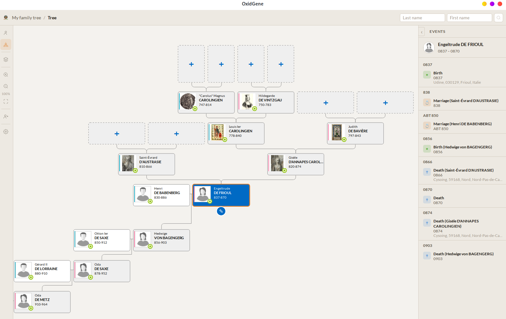
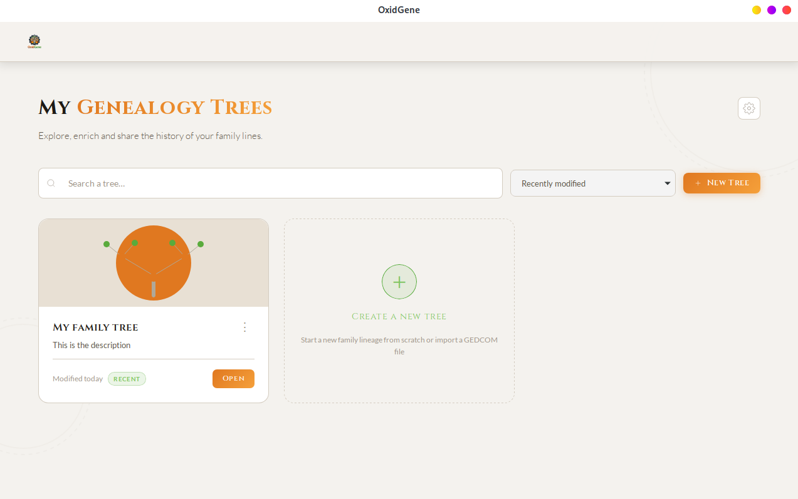
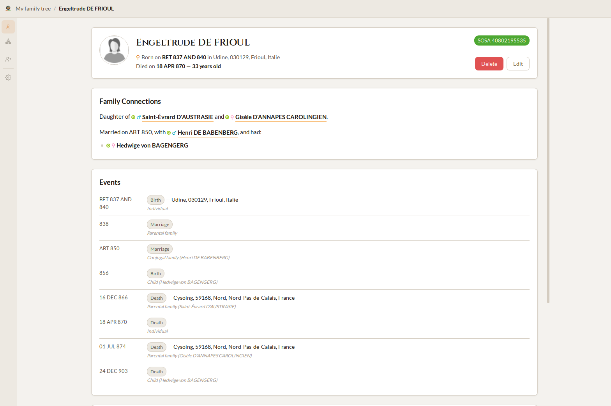

# OxidGene

<p align="center">
  
</p>

A modern, high-performance genealogy platform built entirely in Rust.

## Screenshots

<table>
  <tr>
    <td rowspan="2" width="68%">
      
    </td>
    <td width="32%">
      
    </td>
  </tr>
  <tr>
    <td width="32%">
      
    </td>
  </tr>
</table>

## Overview

OxidGene is a multiplatform genealogy application featuring:

- **Dual API**: REST + GraphQL with full feature parity
- **Cross-platform**: Web (WASM) and Desktop from a single Dioxus codebase
- **GEDCOM support**: Import/export GEDCOM 5.5.1 and 7.0 files
- **GeneWeb support**: Import GeneWeb `.gw` files, including the `gwplus` extension
- **Offline-capable**: Desktop app with embedded SQLite database
- **Performant**: Rust from top to bottom, closure table for fast tree traversal

## Documentation

Full specifications are available in [`docs/specifications/`](docs/specifications/index.md):

- [General](docs/specifications/general.md) — Vision, users, features, MVP scope
- [Architecture](docs/specifications/architecture.md) — Tech stack, crate layout, build, deployment
- [Data Model](docs/specifications/data-model.md) — Entities, enums, ERD
- [API Contract](docs/specifications/api.md) — REST & GraphQL endpoints
- [Roadmap](docs/specifications/roadmap.md) — EPICs & sprints
- UI specs: [Homepage](docs/specifications/ui-home.md) · [Tree View](docs/specifications/ui-genealogy-tree.md) · [Person Edit](docs/specifications/ui-person-edit-modal.md) · [Settings](docs/specifications/ui-settings.md)

## Prerequisites

- [Rust](https://rustup.rs/) (stable)
- [just](https://github.com/casey/just) (task runner)
- PostgreSQL 16+ or Docker Compose (for the web backend)
- The `wasm32-unknown-unknown` Rust target
- [Dioxus CLI](https://dioxuslabs.com/learn/0.7/getting_started/) 0.7.10
- `cargo-watch` (optional, for backend hot reload)

```bash
rustup target add wasm32-unknown-unknown
cargo install dioxus-cli --version 0.7.10 --locked
cargo install cargo-watch --locked
```

## Development

The development environment, prerequisites, and `just` command reference are
documented in [Development](docs/specifications/development.md).

## License

GNU Affero General Public License v3.0 - see [LICENSE](LICENSE) for details.
