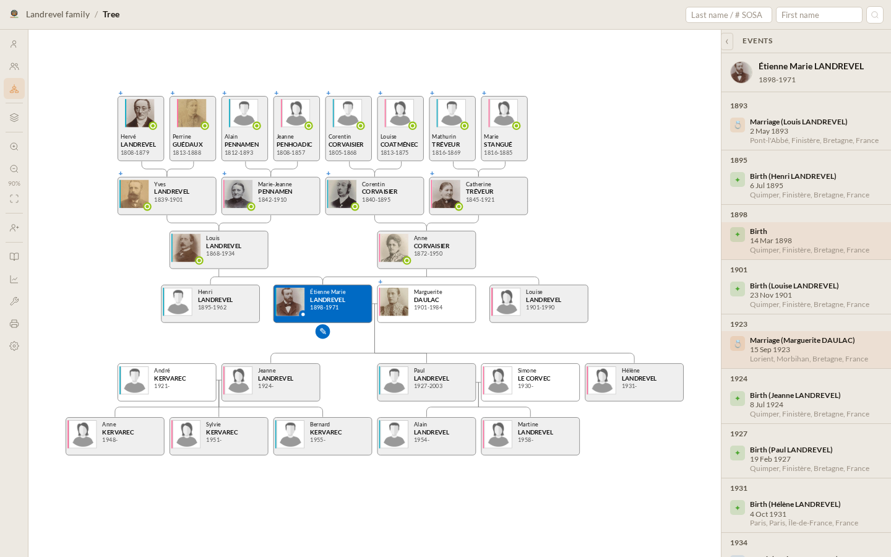
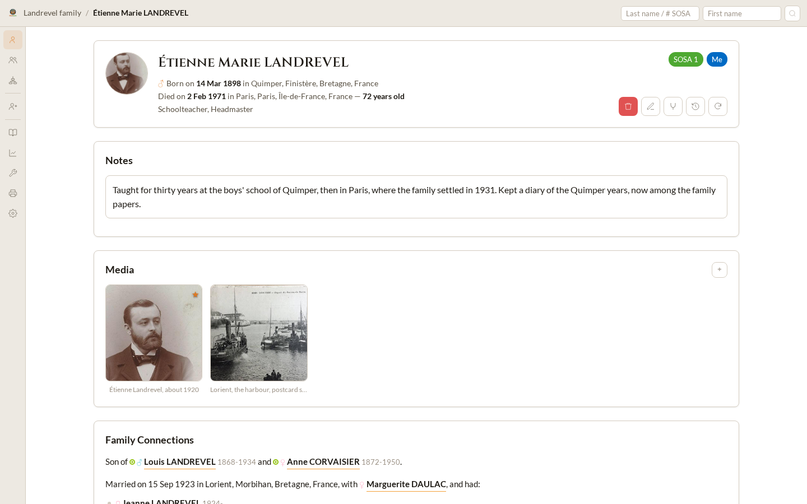
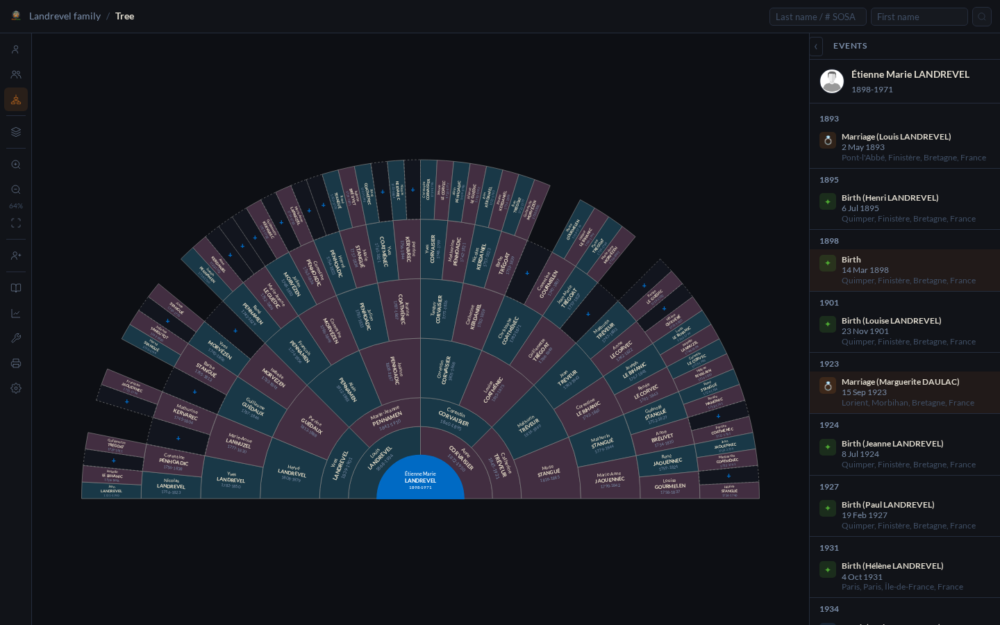
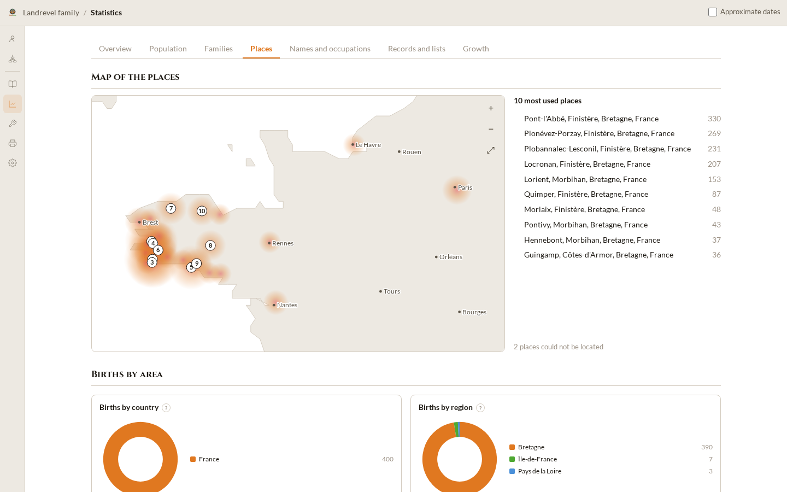
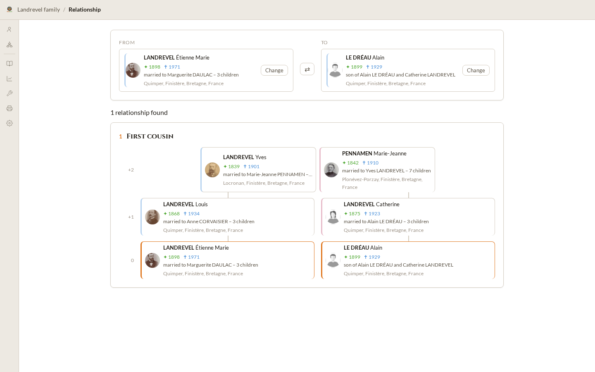
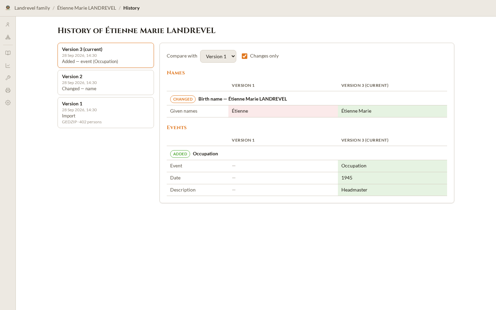

# OxidGene

	

OxidGene is a genealogy application written entirely in Rust. Bring your trees
in from GEDCOM, GEDZIP, GeneWeb or Geneanet, then explore, edit and question
them: pedigrees and fan charts with the family's photographs, profiles,
statistics on a map, consistency tools, kinship, cited registers opened on
the archives' own sites, and a history of every change. It runs as a desktop
application that works offline, or as a web deployment for your own server.

	

<table>
	<tr>
		<td width="33%"></td>
		<td width="33%"></td>
		<td width="33%"></td>
	</tr>
	<tr>
		<td></td>
		<td></td>
		<td></td>
	</tr>
</table>

The family shown is fictitious; the portraits are public-domain studio
photographs of anonymous sitters (<a href="e2e/fixtures/media/CREDITS.md">credits</a>).

## Highlights

- **Import everything, lose nothing**: GEDCOM 5.5.1 and 7.0, GEDZIP with its
	media, GeneWeb, and a guided recovery of a Geneanet tree's photos and their
	links to persons.
- **See the family**: an interactive pedigree with portraits, and eight other
	charts — wheels, fans, lineages, hourglass and bowtie — that all print.
- **Read the tree as a whole**: statistics with an offline heat map of the
	places, names, lifespans and unions period by period, and the tree's
	records.
- **Keep it consistent**: anomalies by rule, potential duplicates with a merge
	wizard, ancestry completeness, and every relationship between two persons.
- **Never lose a change**: an audit log of every write, and every version of a
	person compared side by side and restorable, even after a deletion.
- **Go back to the registers**: a cited source opens its register at the cited
	view on the archive's own site, for every French département but one,
	overseas included, however the citation is written, and a dialog completes
	a partial one.
- **Understand the records**: a built-in place dictionary of twelve countries,
	explanatory sheets for thousands of occupations and given names, four
	calendars, and dates written out in nine languages.
- **Make it yours**: colour themes, a medieval pedigree, eight interface
	languages, and per-tree date and entry options.
- **Integrate**: a REST API with its OpenAPI document; the web deployment also
	serves a GraphQL API strictly symmetric with it (the desktop serves REST
	only); and a read-only MCP server for AI assistants on the desktop.

The complete list is in [Features](docs/features.md).

## Quick start

- **Desktop**: build and run the application, which embeds its server and an
	SQLite database, with `just desktop`.
- **Web**: start the Docker Compose stack, or deploy the Helm chart to
	Kubernetes.

Requirements and every installation path are in the
[Quickstart](docs/quickstart.md).

## Documentation

The specifications in [`docs/`](docs/index.md) describe the product as it is:
architecture, data model, API contract, and one specification per page and
workflow. Delivery status and planned work are in the
[Roadmap](docs/roadmap.md).

## Development

The development environment, the `just` recipes, the tests and the guards are
described in [Development](docs/development.md).

## License

GNU Affero General Public License v3.0 — see [LICENSE](LICENSE).
