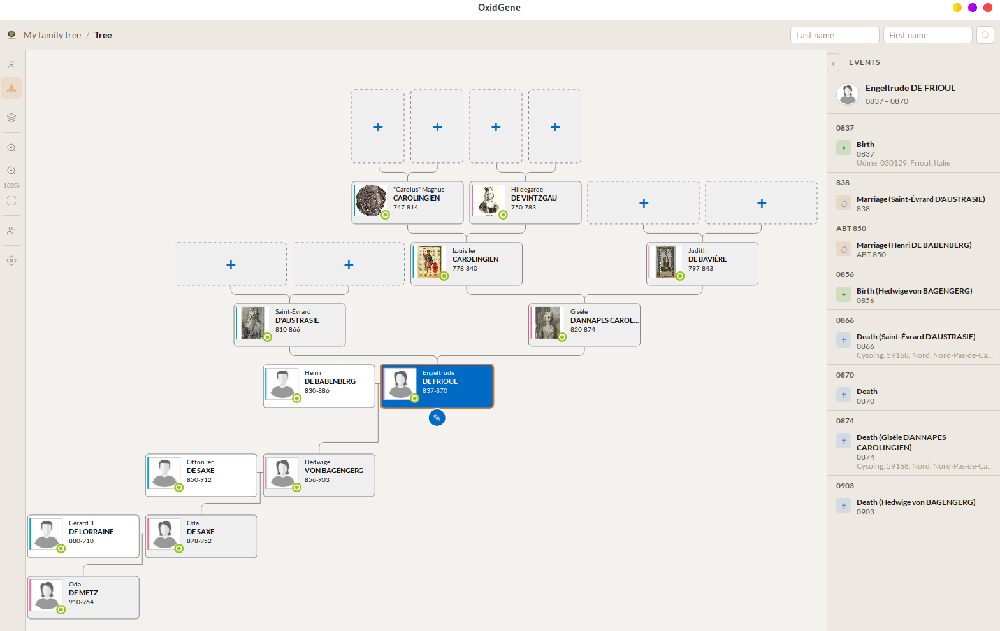
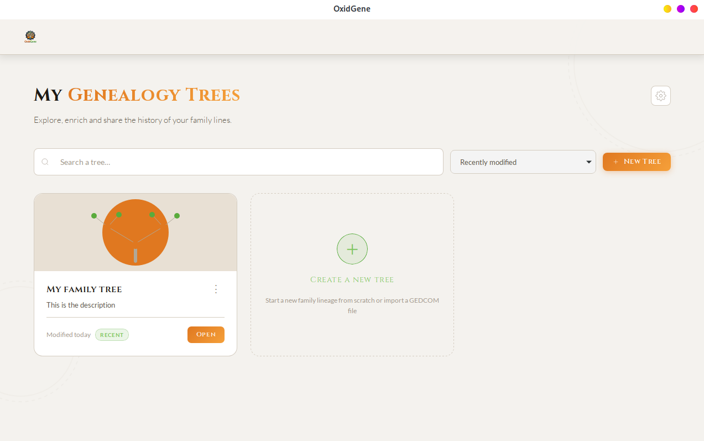
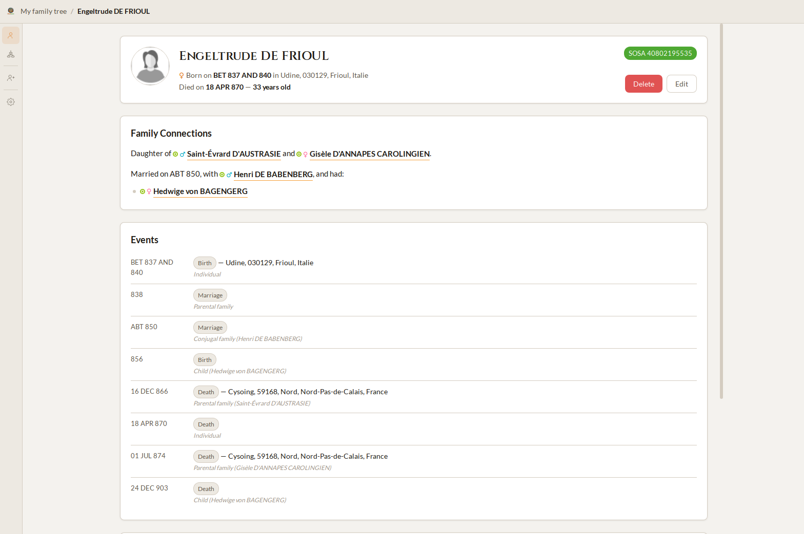

# OxidGene

	

A modern, high-performance genealogy platform built entirely in Rust.

Start with the [OxidGene Quickstart](docs/quickstart.md) to run
the desktop application, the Docker Compose stack, or a Kubernetes deployment.

## Screenshots

<table>
	<tr>
		<td rowspan="2" width="68%">
			
		</td>
		<td width="32%">
			
		</td>
	</tr>
	<tr>
		<td width="32%">
			
		</td>
	</tr>
</table>

## Overview

OxidGene is a multiplatform genealogy application featuring:

- **Bring your family history with you**: Import and export GEDCOM 5.5.1,
	GEDCOM 7.0, and GEDZIP archives, including their media
- **Reconnect your Geneanet archives**: Import GeneWeb `.gw` and `gwplus`
	trees, then use the guided desktop workflow to recover linked photos and
	documents without storing shared media twice
- **Explore and edit complete family trees**: Navigate interactive pedigrees,
	open a person or a couple on a full profile page, manage people, families,
	events, sources, places, notes, and media, and find records through
	dictionary views and a search that suggests matching people as you type
- **See how any two people are related**: Trace every path between two
	persons of a tree, through the ancestors they share or through unions when
	they share none
- **Read your tree as a whole**: A statistics page maps where the tree's
	events happened on an offline heat map and charts names, occupations,
	lifespans, unions, and children period by period, with the notable records
- **Catch duplicates as you go**: Saving a person who shares a name with
	someone else in the tree asks whether they are the same, so the two can be
	merged or confirmed as different people
- **Never lose a change**: Every write to a tree is recorded in an audit log,
	and every version of a person can be compared side by side and restored,
	even after a deletion
- **Enjoy genealogy on every screen**: Use the responsive WebAssembly frontend
	on desktop or mobile browsers, or run the native desktop application for
	Linux, Windows, and macOS built from the same Dioxus codebase
- **Keep working offline**: The desktop application embeds SQLite and stores
	your genealogy and media locally, with no server required
- **Type places the way the records name them**: Every place field suggests
	from a built-in place dictionary of France, the United Kingdom, Germany,
	Italy, Spain, Switzerland, Poland, the United States, Portugal, Belgium,
	Luxembourg and the Netherlands, with the
	municipalities merged away, their former names, and the subdivisions and
	regions they were filed under at the time, while still accepting any free
	text
- **Understand what the records say**: Explanatory sheets for more than 3,000
	historical occupations, including trades and offices particular to each
	covered country, and more than 2,000 given names with their meaning and
	feast day, in all eight interface
	languages and recognised whatever the language of the record, shown right
	beside the person
- **Ask your AI assistant about your tree**: The desktop application serves
	your trees read-only to Claude and any other Model Context Protocol client
- **Make the workspace your own**: Switch colour themes or add your own on the
	desktop, draw the pedigree in a classic or heraldic medieval style, and
	change between English, French, German, Spanish, Italian, Dutch, Polish and
	Portuguese without restarting the application
- **Integrate without compromise**: Build on REST and GraphQL APIs with full
	feature parity. Full OpenTelemetry instrumentation.
- **Stay fast as trees grow**: Rust powers the complete stack, backed by
	durable read projections and efficient family traversal

## Documentation

Full specifications are available in
[`docs/`](docs/index.md):

- [Quickstart](docs/quickstart.md) - installation and deployment
	paths.
- [General](docs/general.md) - vision, users, features, and MVP
	scope.
- [Architecture](docs/architecture.md) - technology stack,
	crate layout, build, and deployment.
- [Data Model](docs/data-model.md) - entities, enums, and ERD.
- [API Contract](docs/api.md) - REST and GraphQL endpoints.
- [Assistant Access (MCP)](docs/mcp.md) - the read-only Model Context
	Protocol server of the desktop application.
- [Place Dictionary](docs/place-dictionary.md) - the built-in places, their
	sources and how they are generated.
- [Geneanet Media Import](docs/geneanet-media-import.md) - recovering the
	links between people and photos that a Geneanet export drops.
- [Roadmap](docs/roadmap.md) - delivery status and milestones.
- UI specifications: [Homepage](docs/ui-home.md),
	[Tree View](docs/ui-genealogy-tree.md),
	[Person Profile](docs/ui-person-profile.md),
	[Couple Profile](docs/ui-couple-profile.md),
	[Person History](docs/ui-person-history.md),
	[Kinship](docs/ui-kinship.md), [Statistics](docs/ui-statistics.md),
	[Dictionary](docs/ui-dictionary.md), [Person Edit](docs/ui-person-edit-modal.md),
	[Import](docs/ui-import.md), [Settings](docs/ui-settings.md), and
	[App Settings](docs/ui-app-settings.md).

## Development

The development environment, prerequisites, and `just` command reference are
documented in [Development](docs/development.md).

## License

GNU Affero General Public License v3.0 - see [LICENSE](LICENSE) for details.
