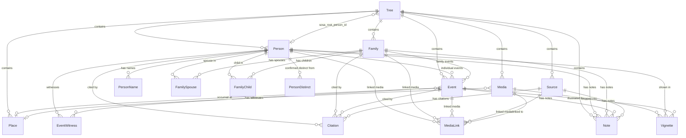

# Data Model

> Part of the [OxidGene Specifications](index.md).
> See also: [Architecture](architecture.md) · [API Contract](api.md)

Source of truth in code: `crates/oxidgene-core/src/types/` (domain structs), `crates/oxidgene-core/src/enums.rs` (enums), `crates/oxidgene-db/src/entities/` (SeaORM entities), `crates/oxidgene-db/src/migration/m20250101_000001_initial.rs` (the complete current schema).

While the product is unreleased, the migrator registers only this initial
migration, including all current tables, indexes, backend-specific search
storage, and background-job trace context; a schema change edits it.
Databases created with an earlier schema must be recreated and their genealogy
reimported; running the consolidated migration is not an in-place upgrade.
Once the product is released, changes ship as incremental migrations instead
([Architecture §9](architecture.md)). Runtime projection versioning remains
independent of this schema reset (see §4.1).

---

## 1. Entities

### Tree

| Column | Type | Notes |
|---|---|---|
| `id` | UUID v7 | PK |
| `name` | String | Required |
| `description` | String? | Optional |
| `default_privacy` | TreeDefaultPrivacy | Stored tree-wide intent (`Private` by default); not enforced in the current MVP |
| `entry_suggestions` | bool | Whether entry fields suggest values as the user types ([Common UI §4.4](ui-common.md)); `true` by default, set in [Settings](ui-settings.md) §10 |
| `sosa_root_person_id` | UUID v7? | FK → Person — SOSA 1 root for Sosa-Stradonitz numbering, set in [Settings](ui-settings.md) §7 |
| `self_person_id` | UUID v7? | FK → Person — person representing the current user, used only for the blue pedigree badge, set in [Settings](ui-settings.md) §7 |
| `created_at` | DateTime | Creation time. Native OxidGene records use the current time; a Geneanet import preserves the deposit's `date_create` when it is valid |
| `updated_at` | DateTime | Auto |
| `deleted_at` | DateTime? | Soft delete |

Displayed in: [Homepage](ui-home.md) (tree cards) · [Settings](ui-settings.md) (tree & roots section)

### Person

| Column | Type | Notes |
|---|---|---|
| `id` | UUID v7 | PK |
| `tree_id` | UUID v7 | FK → Tree |
| `sex` | Sex | Enum |
| `privacy` | Privacy | Enum — per-person privacy override (default `Default`) |
| `created_at` | DateTime | Auto |
| `updated_at` | DateTime | Auto |
| `deleted_at` | DateTime? | Soft delete |

Displayed in: [Tree View](ui-genealogy-tree.md) (person cards) · [Person Edit Modal](ui-person-edit-modal.md) (edit form)

### PersonDistinct

Two same-named persons the user has confirmed to be different people. Without
it, a father and a son bearing one name would be offered to each other as
homonyms after every edit of either.

| Column | Type | Notes |
|---|---|---|
| `id` | UUID v7 | PK |
| `tree_id` | UUID v7 | FK → Tree (cascade) |
| `person_id` | UUID v7 | FK → Person (cascade) — the lower ID of the pair |
| `other_person_id` | UUID v7 | FK → Person (cascade) — the higher ID of the pair |
| `created_at` | DateTime | Auto |

One row per unordered pair, stored lower ID first, unique on
`(person_id, other_person_id)`. The confirmation is tree data rather than
genealogy: it is not exported to GEDCOM, so a duplicated tree starts without
it.

Homonyms are the persons whose primary surname and primary given names fold
([Cross-cutting Rules §3.6](cross-cutting.md)) to the same values — the normalized columns of
`person_search_fts` (§4.3) — less the pairs recorded here. A person missing
either half of that name has none.

### Person merge

Merging keeps one person and soft-deletes the other, the duplicate, after
moving everything it carried onto the kept person:

| Data | Rule |
|---|---|
| Sex | The duplicate's when the user chose it; otherwise the kept person's, unless it is `Unknown` and the duplicate's is not |
| Portrait | The kept person's, unless they have none |
| Privacy | The kept person's |
| Names | The kept person's primary name stays primary; the duplicate's names become secondary names after theirs, except a name identical in every piece to one the kept person bears — ignoring case, not accents — which is dropped. When the kept person has no name at all, the duplicate's primary stays primary. When the user chose the duplicate's surname, given names or both, the primary name becomes that composition — an existing name promoted, or a new one — and the former primary stays secondary |
| Events, notes, citations, identification boxes | Re-pointed; the own events of either person the user left out are soft-deleted first. Nothing else is deduplicated |
| Family links | Re-pointed; a link to a family the kept person is already a spouse (or a child) of is dropped instead of doubled |
| Witness links | Re-pointed; dropped when the kept person already witnesses that event or the event is now their own |
| Media links | Re-pointed; dropped when the kept person is already linked to that media |
| Tree SOSA root and "self" person | Follow the duplicate onto the kept person |
| Distinct confirmations | The duplicate's move to the kept person — whoever differs from one differs from the other — and the pair joining the two is dropped |

A merge is refused when both are the same person, when they are spouses of the
same family, or when one is an ancestor of the other: each would leave somebody
married to, or descended from, themselves. It runs in one transaction with the
projection refresh of both persons' relatives.

### PersonName

| Column | Type | Notes |
|---|---|---|
| `id` | UUID v7 | PK |
| `person_id` | UUID v7 | FK → Person |
| `name_type` | NameType | Enum |
| `given_names` | String? | GEDCOM `GIVN`. Multiple given names stay in one string (`<given name 1> <given name 2>`) rather than becoming separate names |
| `surname` | String? | GEDCOM `SURN` — the surname **root**, particle excluded ("Cruz") |
| `surname_prefix` | String? | GEDCOM `SPFX` — the surname particle ("de la", "van der") |
| `prefix` | String? | GEDCOM `NPFX` — title of address ("Dr.", "Rév. Père") |
| `suffix` | String? | GEDCOM `NSFX` — generational ordinal or epithet ("Jr.", "III") |
| `nickname` | String? | GEDCOM `NICK` |
| `is_primary` | bool | Default true |
| `sort_order` | i32 | Display order among a person's secondary names; the primary name always comes first |
| `created_at` | DateTime | Auto |
| `updated_at` | DateTime | Auto |

**One row = one complete name the person bore**, not one name *piece*. The pieces
only mean anything relative to each other, which is why a birth name and a
married name are two rows rather than shared columns: splitting `given_names`
into its own table would lose which given names go with which surname.

**Particles are derived, not typed.** The UI keeps a single "surname" field and
calls `oxidgene_core::types::split_surname_particle` on save, showing the
detected split with a **Modifier** button beside it. Detection is a guess over a
fixed word list, so the override is part of the contract, not a nicety: someone
actually surnamed "Le", or a "Da Silva" that should file under D, clears the
particle to opt out, and an unusual particle can be declared by hand. The
override can only *cut* the single field, never add to it (`split_surname_at_head`):
the field's text is the complete surname, so a particle absent from it is
reported rather than applied — accepting it would inject a word the user never
typed, and clearing the particle afterwards could not remove it. GEDCOM import
uses the looser `split_surname_with`, since a file may legitimately state
`2 SPFX de la` beside a bare `2 SURN Cruz`. A stored particle that
detection disagrees with pins the override on load, so saving an unrelated field
never silently re-splits it. The per-name editor, already a multi-field form,
exposes `surname_prefix` as its own input instead. GEDCOM/GeneWeb import does the
same when the file carries no `SPFX`. Display always rejoins the two parts
(`PersonName::full_surname`), so a name entered as "de la Cruz" still reads
"de la Cruz" — only *filing* changes. Whether the particle counts when sorting is
a per-viewer preference (`/app-settings` → Noms), defaulting to "included".

### Family

| Column | Type | Notes |
|---|---|---|
| `id` | UUID v7 | PK |
| `tree_id` | UUID v7 | FK → Tree |
| `privacy` | Privacy | Per-family privacy intent (default `Default`); not enforced in the current MVP |
| `created_at` | DateTime | Auto |
| `updated_at` | DateTime | Auto |
| `deleted_at` | DateTime? | Soft delete |

Displayed in: [Tree View](ui-genealogy-tree.md) (connectors) · [Person Edit Modal](ui-person-edit-modal.md) (couple edit)

### FamilySpouse

| Column | Type | Notes |
|---|---|---|
| `id` | UUID v7 | PK |
| `family_id` | UUID v7 | FK → Family |
| `person_id` | UUID v7 | FK → Person |
| `role` | SpouseRole | Enum |
| `sort_order` | i32 | For ordering |

### FamilyChild

| Column | Type | Notes |
|---|---|---|
| `id` | UUID v7 | PK |
| `family_id` | UUID v7 | FK → Family |
| `person_id` | UUID v7 | FK → Person |
| `child_type` | ChildType | Enum |
| `sort_order` | i32 | For ordering |

### Event

| Column | Type | Notes |
|---|---|---|
| `id` | UUID v7 | PK |
| `tree_id` | UUID v7 | FK → Tree |
| `event_type` | EventType | Enum |
| `date_value` | String? | GEDCOM date phrase (free text, e.g. "ABT 1842") |
| `date_sort` | Date? | Normalized date for sorting: the Gregorian day the date stands for, whatever its calendar, and the first day of its period for a year or a month alone (the Republican year VII sorts from 22 September 1798) |
| `date_qualifier` | DateQualifier | Enum — precision/shape of the date (default `Exact`) |
| `date_value2` | String? | Second date, used by the `Or` and `Between` qualifiers |
| `calendar` | Calendar | Enum — calendar system the date was recorded in (default `Gregorian`) |
| `cause` | String? | Cause of event (GEDCOM `CAUS`), e.g. cause of death |
| `place_id` | UUID v7? | FK → Place |
| `person_id` | UUID v7? | FK → Person (individual event) — never set together with `family_id` |
| `family_id` | UUID v7? | FK → Family (family event) — never set together with `person_id` |
| `description` | String? | Free text; also holds occupation title for `Occupation` events |
| `created_at` | DateTime | Auto |
| `updated_at` | DateTime | Auto |
| `deleted_at` | DateTime? | Soft delete |

`Event::year()` / `oxidgene_core::types::year_from_date` provide the shared display-year logic (prefer `date_sort`, fall back to the first 4-digit token of `date_value`) used by pedigree cards, the person narrative, dictionary usage lists, and search results.

Displayed in: [Tree View](ui-genealogy-tree.md) (events sidebar) · [Person Edit Modal](ui-person-edit-modal.md) (event blocks)

### EventWitness

Join table mirroring GEDCOM's `ASSO`/`RELA` associations — a witness, godparent, or other role-holder linked to an event as a real `Person` in the tree.

| Column | Type | Notes |
|---|---|---|
| `id` | UUID v7 | PK |
| `event_id` | UUID v7 | FK → Event |
| `person_id` | UUID v7 | FK → Person |
| `relation` | String? | Free text (e.g. "Godmother", "Witness") |
| `sort_order` | i32 | For ordering |

Exposed via `GET/POST /events/{id}/witnesses` (REST) and `addEventWitness`/`removeEventWitness` (GraphQL). Round-trips through GEDCOM import/export as a top-level `ASSO` on the INDI record (see [API Contract](api.md) §3).

### Place

| Column | Type | Notes |
|---|---|---|
| `id` | UUID v7 | PK |
| `tree_id` | UUID v7 | FK → Tree |
| `name` | String | Required single free-text hierarchy, for example `<locality>, <postal code>, <region>, <country>` |
| `latitude` | f64? | Filled when selected from offline database or geocoding |
| `longitude` | f64? | Filled when selected from offline database or geocoding |
| `created_at` | DateTime | Auto |
| `updated_at` | DateTime | Auto |

The `name` is a single string. The recommended format is comma-separated from
most specific to least specific (see [Common UI §4.4](ui-common.md)), but any
text is valid.

### Source

| Column | Type | Notes |
|---|---|---|
| `id` | UUID v7 | PK |
| `tree_id` | UUID v7 | FK → Tree |
| `title` | String | Required |
| `author` | String? | |
| `publisher` | String? | |
| `abbreviation` | String? | |
| `repository_name` | String? | |
| `created_at` | DateTime | Auto |
| `updated_at` | DateTime | Auto |
| `deleted_at` | DateTime? | Soft delete |

### Citation

| Column | Type | Notes |
|---|---|---|
| `id` | UUID v7 | PK |
| `source_id` | UUID v7 | FK → Source |
| `person_id` | UUID v7? | FK → Person |
| `event_id` | UUID v7? | FK → Event |
| `family_id` | UUID v7? | FK → Family |
| `page` | String? | Where in the source |
| `confidence` | Confidence | Enum |
| `text` | String? | Extracted text |
| `created_at` | DateTime | Auto |
| `updated_at` | DateTime | Auto |

### Media

| Column | Type | Notes |
|---|---|---|
| `id` | UUID v7 | PK |
| `tree_id` | UUID v7 | FK → Tree |
| `file_name` | String | Original filename |
| `mime_type` | String | MIME type, decided from the file's magic bytes at upload |
| `file_path` | String | GEDCOM `OBJE.FILE` value — the producer's own path, kept verbatim so an export round-trips. Not where our copy lives |
| `storage_key` | String? | Key of the stored bytes in the media store. Null for a record that names a file we have never received — every GEDCOM import starts that way |
| `sha256` | String? | Hex SHA-256 of the stored bytes. Doubles as the HTTP `ETag` and as the deduplication key |
| `thumbnail_key` | String? | Key of the generated thumbnail. Null for PDFs and for byte-less records |
| `width` | i32? | Intrinsic pixel width, after applying any EXIF orientation. Decoded at upload for a file we hold; for a page held only as a URL, recorded from the browser that first displayed it |
| `height` | i32? | Intrinsic pixel height |
| `page_count` | i32 | Pages in the document; `1` for photos and single-page files |
| `file_size` | i64 | Bytes |
| `title` | String? | |
| `description` | String? | |
| `date_value` | String? | Date of the media (GEDCOM date phrase, same format as Event) |
| `date_sort` | Date? | Normalized date for sorting |
| `source_media_type` | Enum | What the medium physically is — GEDCOM's `SOURCE_MEDIA_TYPE`. Default `other` |
| `document_category` | Enum? | What kind of *record* it is. Null when unclassified |
| `tags` | String[] | Free-form labels. On a multi-page document, they belong to the document, not its pages |
| `place_id` | UUID v7? | FK → Place — where the media was created/taken |
| `created_at` | DateTime | Auto |
| `updated_at` | DateTime | Auto |
| `deleted_at` | DateTime? | Soft delete. Deleting a medium purges it instead — its rows, and the stored files no other medium of the tree uses — so nothing sets it, but every read still excludes a flagged row |

Displayed in: [Person Edit Modal](ui-person-edit-modal.md) (media section)

**Why two type columns.** GEDCOM has a field for this and its vocabulary is
fixed: `OBJE.FILE.FORM.TYPE` in 5.5.1, `FORM.MEDI` in 7.0, enumerating `PHOTO`,
`MANUSCRIPT`, `TOMBSTONE`, `FICHE`, `FILM`, `MAP`, `NEWSPAPER`, `BOOK`, `CARD`,
`MAGAZINE`, `AUDIO`, `VIDEO`, `ELECTRONIC`, `OTHER`. Supporting it exactly is
what makes an export readable by other genealogy software, so `SourceMediaType`
is GEDCOM's list and nothing else is ever written there.

But that vocabulary describes the *carrier*, not the record. A census return, a
marriage contract and a conscription register are all `MANUSCRIPT` to GEDCOM,
and to a genealogist they are three different things — the distinction
Geneanet's own media types draw. `DocumentCategory` holds it: `portrait`,
`group_photo`, `family_document`, `civil_record`, `parish_record`,
`notarial_archive`, `military_archive`, `census`, `coat_of_arms`, `grave`,
`other`. It is nullable because a photograph somebody uploaded needs no
classification.

Each category knows the medium it implies, so choosing only a category still
produces a correct export — a census return exports as `MANUSCRIPT`, not
`OTHER`. Where both are set explicitly, the stored medium wins: the user
answered GEDCOM's question directly and that answer is not ours to discard.

`source_media_type` defaults to `other` rather than to `photo`: the table holds
scans and PDFs as readily as photographs, and a default that guessed would
mislabel every existing row instead of admitting it does not know.

**Tags.** `tags` is an ordered list of free-form labels for grouping scans and
documents, materialized from `media_tag` rows. Its compound key
`(media_id, normalized_tag)` makes concurrent additions idempotent, while a
single row deletion cannot overwrite another editor's tags. Values are trimmed;
`normalized_tag` is the tag folded as every word of the application is
([Cross-cutting Rules §3.6](cross-cutting.md)), so tags differing only by case,
accents or punctuation are one, spelled as first entered. A multi-page document owns one list; its
page rows do not copy it, so every page always presents the document's same
labels.

**Storage.** Files live on the filesystem, content-addressed under
`{tree_id}/{aa}/{bb}/{sha256}.{ext}` beneath `OXIDGENE_MEDIA_ROOT` (default: the
platform user-data directory). Uploading the same scan twice writes one file and
two rows — what a census page documenting eight siblings needs. Keys are scoped
per tree rather than globally: deduplication stops at the tree boundary, which is
the price of purging a tree by removing one directory, with no reference counting.

**Privacy.** `Person`, `Family` and `Media` each carry a `privacy` enum
(`default` / `public` / `private`), defaulting to `default` — follow the tree's
own setting. A couple needs its own: a living pair's marriage is a fact about
two living people, and withholding both their person records does not withhold
the union that names them. A document needs one for the same reason a photograph
of living children does.

`Default` means "follow the tree", and the tree says which: `tree.default_privacy`
is `public` | `private`, defaulting to **private**. It is deliberately *not* a
`Privacy` — that enum's own `Default` variant would make a tree follow itself —
so it has two variants and the circular state cannot be written down.
`TreeDefaultPrivacy::resolve(privacy)` is the one place the pair is combined: a
record saying `Default` takes the tree's answer, and `Public` / `Private` on the
record override it.

The default default withholds. A genealogy holds living people, and a tree
nobody has classified has not been cleared for publication, so the value that
applies before anyone has thought about it is the one that hides. Publishing is
the deliberate act.

**Nothing enforces it yet.** Privacy is meaningful only against a viewer, and
there are no viewers until authentication lands. What the column buys now is
that the *intent* is recorded: a user classifying their tree today does not have
to do it again later, and enforcement becomes a read-path change rather than a
schema change plus a data-entry campaign. Every picker that sets it says so.

### Vignette

A rectangular region of a media file, kept as coordinates rather than as a second
copy of the pixels. One parish-register page routinely documents several unrelated
families; each entry is a vignette on the single stored scan, so a better scan can
replace it without orphaning anything, and the crop is still served as if it were
its own image.

| Column | Type | Notes |
|---|---|---|
| `id` | UUID v7 | PK |
| `media_id` | UUID v7 | FK → Media (cascade) — always a page, the row holding the pixels, never the document grouping pages |
| `x` | i32 | Crop origin, in the source image's own pixel coordinates |
| `y` | i32 | |
| `width` | i32 | |
| `height` | i32 | |
| `person_id` | UUID v7? | FK → Person — who the region shows, if attributed |
| `event_id` | UUID v7? | FK → Event — the event this region is evidence for |
| `created_at` | DateTime | Auto |
| `updated_at` | DateTime | Auto |

No soft delete: a vignette is a coordinate annotation, not a record anyone cites.
Creation and updates require a live page of a live document in the same tree;
document shells cannot be cropped. Person and event attributions must be live
records in that tree. Coordinates must be nonnegative, dimensions positive, and
the rectangle's extent must not overflow or exceed either known page dimension.
Imported pages and PDFs with unknown dimensions retain their annotations without
inventing pixel bounds. Attaching or replacing a page's file validates existing
crops against the new dimensions before changing the row, and so does recording
the dimensions of a page held only as a URL: that is the first moment its
existing crops can be checked at all.

**Cropping a page we do not hold.** A region may be drawn on a page whose file
is somebody else's. The region, its attribution and its box over the image
belong to us and need none of the bytes. What cannot be produced here is the
*cropped image*: cutting means re-decoding our own copy, and a remote file is
never fetched. So the region travels to the client as the picture's address plus
the rectangle to take out of it — see [API](api.md) — and the client cuts it.
That needs the picture's pixel size, which nothing here has ever measured: the
browser drawing the crop records it on `media.width` / `media.height` the first
time somebody identifies a person on that page. A region on a page nobody has
measured has no scale to be cut at, and the whole picture is shown instead.

**Which image represents a person.** At most one of `portrait_media_id` /
`portrait_vignette_id` is ever set. Both columns are written together through a
single `Portrait` value (`Media(id)` / `Vignette(id)` / `None`), so "both set"
is not a state a caller can produce. The API refuses a request carrying both
rather than silently picking one, leaving the existing assignment unchanged.

It lives here rather than as a flag on `MediaLink` because a person is very
often identified *inside* a larger photograph — a group portrait, a wedding
party — and that region is already a first-class row: a `Vignette`. A second
`is_profile` on `Vignette` would spread the invariant "at most one portrait per
person" across two tables, where it can no longer be established in a single
statement; a pointer on `Person` makes it structural instead of enforced.

Portrait pointers and `media.place_id` are application-managed references, not
database foreign keys. A dangling portrait pointer resolves to "no portrait"
rather than to an error.

**What is stored, and what is read back.** `portrait_media_id` holds whatever
the caller chose, which is normally a document: a gallery tile is a document,
and that is what a reader stars. A document holds no bytes, so every read path
resolves the stored pointer to the first page beneath it that can actually be
drawn — one whose thumbnail was generated, or whose `file_path` is a remote
image URL — and reports that page. A page chosen directly resolves to itself. A
person who chose nothing falls back to their first linked photograph, resolved
by the same rule, in `media_link.sort_order` order. Chosen and inferred
portraits therefore always name a row whose file exists, and the portrait
endpoints and the `PersonProfile` projection cannot disagree about the same
person.

### MediaLink

| Column | Type | Notes |
|---|---|---|
| `id` | UUID v7 | PK |
| `media_id` | UUID v7 | FK → Media |
| `person_id` | UUID v7? | FK → Person |
| `event_id` | UUID v7? | FK → Event |
| `source_id` | UUID v7? | FK → Source |
| `family_id` | UUID v7? | FK → Family |
| `sort_order` | i32 | For ordering |

A link to the parent `Media` row attaches the complete multi-page document. A
link to one of its child `Media` rows attaches that page only. The link needs no
separate page column because a page is already a media in its own right. A
`Vignette` identifies a rectangular region of one page media, and carries no
page number of its own: the page it belongs to is the media it points at.

### Note

| Column | Type | Notes |
|---|---|---|
| `id` | UUID v7 | PK |
| `tree_id` | UUID v7 | FK → Tree |
| `text` | String | Required |
| `person_id` | UUID v7? | FK → Person |
| `event_id` | UUID v7? | FK → Event |
| `family_id` | UUID v7? | FK → Family |
| `source_id` | UUID v7? | FK → Source |
| `media_id` | UUID v7? | FK → Media — a note about one media record, distinct from `Media.description`, which is the caption under its tile. On a multi-page document, the parent id carries the general document note while a page id carries that page's transcript. |
| `created_at` | DateTime | Auto |
| `updated_at` | DateTime | Auto |
| `deleted_at` | DateTime? | Soft delete |

### Ancestry traversal (no table)

There is no closure table. Ancestor and descendant traversal is a recursive
CTE over `family_child` ⋈ `family_spouse` (`AncestryRepo`): a person's parents
are the spouses of the family in which they are a child. Both back-ends support
`WITH RECURSIVE`. Each reached person is returned once, at their **shortest**
generation distance, as `AncestryLink { person_id, depth }`.

Traversal is bounded at 64 generations when no depth is given, because the
schema does not prevent a cycle in the family links.

Used by: ancestor/descendant [API endpoints](api.md) · pedigree assembly (§4) ·
SOSA badge computation ([Person Profile](ui-person-profile.md),
[Dictionary](ui-dictionary.md) §12)

### person_search_fts (Search Table)

DB-native person search index; not a domain entity (no UUID PK, maintained by
`PersonSearchRepo`). SQLite uses an FTS5 virtual table and PostgreSQL uses a
plain indexed table. Columns include normalized `surname`, `given_names`,
`maiden_name`, `birth_year`, and `death_year`, plus unindexed display fields
and the close relatives a result is rendered with. See §4.3 for maintenance and
query behavior.

---

## 2. Enums

Defined in `crates/oxidgene-core/src/enums.rs`; DB string representations in `crates/oxidgene-db/src/entities/sea_enums.rs`.

```rust
enum Sex {
    Male,
    Female,
    Unknown,
}

enum NameType {
    Birth,
    Married,
    AlsoKnownAs,
    Maiden,
    Religious,
    // Refinements of "also known as". GEDCOM's NAME.TYPE enumeration has no
    // equivalent, so all four export as `aka` — the distinction is internal.
    // They exist because the UI lets the user pick between them, and
    // collapsing them onto AlsoKnownAs made the choice unrecoverable.
    GivenName,
    Alias,
    Byname,
    Sobriquet,
    Other,
}

enum SpouseRole {
    Husband,
    Wife,
    Partner,
}

enum ChildType {
    Biological,
    Adopted,
    Foster,
    Step,
    Unknown,
}

/// Per-person privacy override (see ui-person-edit-modal.md §7).
enum Privacy {
    Default,   // Follows the tree-level privacy settings
    Public,    // Always visible regardless of tree settings
    Private,   // Hidden once viewer-aware enforcement is implemented
}

/// Precision/shape of a date entry (see ui-person-edit-modal.md §5).
/// `Or` and `Between` use two date values; the rest use a single one.
enum DateQualifier {
    Exact,     // default
    About,     // GEDCOM ABT
    Perhaps,   // GEDCOM EST
    Before,    // GEDCOM BEF
    After,     // GEDCOM AFT
    Or,        // app-specific (two dates)
    Between,   // GEDCOM BET ... AND ...
    FromAge,   // app-specific
}

/// Calendar system used to record a date.
enum Calendar {
    Gregorian, // default
    Julian,
    Hebrew,
    FrenchRepublican,
}

// GEDCOM tag mapping shown per variant. Variants without a native tag
// export as EVEN + TYPE subrecord.
enum EventType {
    // Individual events
    Birth,               // BIRT
    Death,               // DEAT
    Baptism,             // BAPM
    Confirmation,        // (EVEN + TYPE)
    FirstCommunion,      // (EVEN + TYPE)
    BarBatMitzvah,       // (EVEN + TYPE)
    MilitaryService,     // (EVEN + TYPE)
    Burial,              // BURI
    Cremation,           // CREM
    Graduation,          // GRAD
    Immigration,         // IMMI
    Emigration,          // EMIG
    Naturalization,      // NATU
    Census,              // CENS
    Occupation,          // OCCU (description holds the title)
    Residence,           // RESI
    Retirement,          // RETI
    Will,                // WILL
    Probate,             // PROB
    Adoption,            // ADOP — individual-level, may reference the
                         //        adoptive family via a nested FAMC
    // Individual attributes (GEDCOM 5.5.1 "attribute" tags)
    CasteName,           // CAST
    PhysicalDescription, // DSCR
    Education,           // EDUC
    NationalId,          // IDNO
    NationalOrigin,      // NATI
    ChildrenCount,       // NCHI
    MarriagesCount,      // NMR
    Property,            // PROP
    Religion,            // RELI
    SocialSecurityNumber,// SSN
    NobilityTitle,       // TITL (as an individual attribute)
    Fact,                // FACT
    // Family events
    Marriage,            // MARR
    Divorce,             // DIV
    Annulment,           // ANUL
    Engagement,          // ENGA
    MarriageBann,        // MARB
    MarriageContract,    // MARC
    MarriageLicense,     // MARL
    MarriageSettlement,  // MARS
    CivilUnion,          // (EVEN family tag) — PACS / cohabitation
    Separation,          // SEP (GEDCOM 7.0)
    DivorceFiled,        // DIVF
    // Generic
    Other,               // EVEN + TYPE
}

// Maps to GEDCOM QUAY (Certainty Assessment)
enum Confidence {
    VeryLow,   // QUAY 0 (Unreliable)
    Low,       // QUAY 1 (Questionable)
    Medium,    // QUAY 2 (Secondary)
    High,      // QUAY 3 (Direct)
    VeryHigh,  // app-specific fifth level
}
```

`Adoption` is an individual event, never a family one: GEDCOM `ADOP` may name the adoptive family through a nested `FAMC`.

---

## 3. Entity Relationship Diagram (Mermaid)



---

## 4. Read Models and Projections

### 4.0 Durable background jobs

`background_job` stores import and export work that may execute in another
process after the originating request has completed. Its nullable
`trace_parent` and `trace_state` columns contain W3C Trace Context captured when
the job is created. They contain no user or genealogical data and do not affect
job execution when absent. A worker restores them only as the parent of its
consumer span; retries retain the original context.

A job's `payload_json` is cleared when it ends; its `result_json` stays for
the status poll. Workers delete the rows of jobs ended more than a day ago,
and an export's `artifact_key` is cleared when its artifact is deleted —
after a complete download, or an hour after completion (see
[Architecture §6](architecture.md)). `cancel_requested` and the `cancelled`
status are part of the schema but nothing sets them yet: no API cancels a
job.

Read models are durable database data, not a cache tier. They are derived from
the normalized entities above, refreshed with mutations, and rebuilt when
their schema version changes. The same design is used by SQLite and PostgreSQL.

### 4.1 Person projection: `person_denorm`

`person_denorm` stores one `PersonProfile` JSON payload per active person.

| Column | Purpose |
|---|---|
| `person_id` | Primary key and FK to `person`. |
| `tree_id` | Tree scoping and whole-tree rebuild selection. |
| `payload` | Serialized `oxidgene_core::projection::PersonProfile`. |
| `schema_version` | Version of the payload shape written by the current build. |
| `built_at` | Time the projection was derived. |

The payload contains the person's primary and alternate names, sex, complete
birth/death/baptism/burial events, other events, family links, portrait
reference, and aggregate citation, note, and media counts. Nested event values
retain qualifier, both date bounds, calendar, place ID, and place display name.

`PROJECTION_SCHEMA_VERSION` is incremented whenever `PersonProfile` or any
nested projection type changes. Reads filter by the current version. An older
row is treated as absent and rebuilt lazily, because `#[serde(default)]` alone
would deserialize a missing new field as if it were genuine empty data. A
tree counts as materialized only when it has rows and none of them is older:
rebuilding one person on demand never stands for the whole tree, so the first
tree-wide read after a bump rebuilds every row.
The initial schema defaults `schema_version` to `0`, so a row without an
explicit current version is stale rather than assumed to contain a current
payload. Consolidating SQL migrations does not remove this runtime version check.

### 4.2 Pedigree assembly

Pedigrees are computed on request and are never stored as a second projection.
The API:

1. runs the bounded recursive ancestry/descendant traversal;
2. loads reached `person_denorm` rows in a batch;
3. lazily rebuilds missing or stale profiles;
4. assembles nodes and family edges for the requested depth window.

Nodes carry whole projected birth and death events rather than extracted year
and place strings. A missing birth date may fall back to baptism; a missing
death date may fall back to burial. Each event retains its own precision.

Expansion returns only nodes and edges beyond the depth already held by the
client. The opposite loaded depth is part of the request so crossing edges are
complete.

### 4.3 Search projection: `person_search_fts`

Search is rebuilt or upserted by `PersonSearchRepo` whenever names, identity
events, or related display fields change. It stores tokens folded as in
[Cross-cutting Rules §3.6](cross-cutting.md) for matching — queries are
folded the same way — and original-cased fields for display; the UI never reconstructs a
name by splitting `display_name`.

SQLite uses FTS5 for token matching. PostgreSQL uses the same logical columns
behind ordinary indexes. Empty queries provide browse mode. Search ordering,
filters, and API pagination are documented in [API](api.md).

FTS5 indexes only the words it matches, so on SQLite an equality on the row's
`person_id` or `tree_id` would read every row of every tree. A side table,
`person_search_key` (`fts_rowid` primary key, unique `person_id`, indexed
`tree_id`), maps each person to its FTS5 row; `PersonSearchRepo` writes both
in step, and finding, counting or deleting a person's or a tree's rows goes
through it. PostgreSQL's table has a primary key on `person_id` and an index
on `tree_id` and needs no side table.

A row also carries the person's close relatives, so a result can name who
someone married or descends from without a second request: the spouse display
names, the father's and mother's display names, and the total number of
children. Each of those has a normalized counterpart that backs the
`spouse_*`, `father_*`, and `mother_*` filters, which are therefore
accent-folded exactly like the subject's own name. Several spouses are joined
into one column by U+001F, a control character no name contains and no filter
can carry, so a substring match cannot span two of them. All relative columns
are unindexed for full-text purposes: searching a name must return that person,
not everyone related to someone of that name.

Birth and death years are dated the way a pedigree card dates them — falling
back to the baptism and the burial when the primary event carries no date — and
each year is stored beside its own `DateQualifier`. The qualifier stays a
separate column rather than being folded into the year string, because only the
UI knows how to word it in the reader's language.

The table has no `schema_version` of its own. It is repopulated by way of
`PROJECTION_SCHEMA_VERSION`: a bump makes `person_denorm` read as stale, which
makes `ensure_materialized` rebuild the tree, which replaces every search row.
Changing the set of columns therefore needs both a schema change and a
version bump. SQLite FTS5 virtual tables reject `ALTER TABLE … ADD COLUMN`, so
an incremental migration, once the product is released, drops and recreates
the table on both backends; no data is lost, as every row is derived.

### 4.4 Refresh and consistency

Every mutation that can affect a profile computes the affected person set and
refreshes those rows in the same database transaction as the normalized write.
The response is returned only after commit, guaranteeing that a subsequent
read cannot observe new domain data with an old projection.

The affected set includes the directly changed person and any relatives whose
display name, family link, portrait, event, aggregate count, or pedigree card
depends on that change. The algorithm lives in
`oxidgene-api/src/profile/invalidation.rs`; repository methods accept a generic
SeaORM `ConnectionTrait` so they work on a transaction as well as a pooled
connection.

How far the set reaches depends on what changed. A family *event* alters no
name and no count, so rebuilding the two spouses is enough. Deleting a family
also removes its children's parent link, so the set covers every member. Either
way the set stays one hop wide, which is exactly as far as a projection reaches.

Because deletion is soft, a family's `family_spouse` and `family_child` rows
outlive it. Anything that reaches a family *through* a membership row must
therefore exclude deleted families explicitly, or a targeted rebuild would
restore a family a whole-tree rebuild correctly omits.

Whole-tree imports and explicit maintenance rebuilds perform idempotent bulk
work. On startup or first read, `ensure_materialized` compares the count of
current-version projections with active people and rebuilds when necessary.

### 4.5 Deletion and recovery

Deleting a tree flags it and returns; a background worker then purges its rows,
its media files, and its jobs' files. On SQLite the purge ends by erasing what
the deleted rows leave readable in the database file: it merges the full-text
index (FTS5 keeps a deleted row's words until its segments merge), rewrites the
file from its live content (`VACUUM`, since freed pages keep their bytes) and
empties the write-ahead log. That rewrite holds the database for about as long
as copying the file, which a purge, rare and in the background, can afford.
On PostgreSQL deleted rows' space is reused by autovacuum over time; nothing
rewrites it at once.

- Soft-deleted people are excluded from projections and search.
- Dropping projections does not remove domain data; rows rebuild lazily.
- A failed or rolled-back mutation leaves neither normalized changes nor new
    projection payloads.
- Projection rows survive application restart in the same database.
- There is no Redis, process-memory, or disk-snapshot projection backend.

### 4.6 Code ownership

| Area | Location |
|---|---|
| Projection types | `oxidgene-core/src/projection.rs` |
| `person_denorm` entity and repository | `oxidgene-db` |
| Search entity and repository | `oxidgene-db` |
| Builder, invalidation, and service | `oxidgene-api/src/profile/` |
| REST and GraphQL contract | [API](api.md) |

`oxidgene-ui` depends on projection types through `oxidgene-core`; it does not
depend on the database or API implementation crates.

### 4.7 Performance targets

- A single current profile read should be a primary-key lookup.
- Pedigree assembly should issue bounded traversal and batched profile reads,
    never one profile query per node.
- An index exists for a read that uses it. A `tree_id` index of its own is
    not created where a composite index already leads with `tree_id`, and a
    column no read filters by equality or range is not indexed: every index
    is paid for by every import's inserts. The person name's given names
    (read only by substring) and the event's `date_sort` (whose one range read,
    the media library's year filter, is answered faster from the tree's media
    than by scanning every tree's dated events) carry none.
- Search should use backend-native indexes and avoid offset scans for ordinary
    list APIs.
- Refresh latency is part of mutation latency and must remain bounded to the
    affected set; whole-tree rebuilds are reserved for imports, maintenance, or
    schema-version changes.

---

## 5. Change History

Every write to a tree is recorded, and the successive states of the tree's
genealogical records are kept so that two can be compared field by field and an
earlier one restored. Source of truth in code: `oxidgene-core/src/history.rs`
(types), `oxidgene-db/src/repo/history.rs` (storage),
`oxidgene-db/src/repo/snapshot.rs` (building and restoring snapshots), and
`oxidgene-api/src/service/history.rs` (recording, baseline, restore).

### 5.1 Audit log: `audit_entry`

One row per write, in the write's own transaction: a write that rolls back
leaves no entry, and no entry describes a write that did not happen.

| Column | Type | Notes |
|---|---|---|
| `id` | UUID v7 | PK — its time order is the log's order |
| `tree_id` | UUID v7 | FK → Tree (cascade) |
| `occurred_at` | DateTime | |
| `category` | String | `data`, `settings`, `media`, `import`, `export`, `history` |
| `action` | String | `create`, `update`, `delete`, `merge`, `import`, `export`, `revert`, `baseline` |
| `entity` | String | Kind of row written: `person`, `person_name`, `event`, `event_witness`, `family_spouse`, `media_tag`, `vignette`, `portrait`, `family_name`, … |
| `entity_id` | UUID? | The row written, when there is a single one |
| `subject` | String? | Kind of record the write is about: `person`, `family`, `place`, `source`, `media`, `tree` |
| `subject_id` | UUID? | That record |
| `label` | String? | The subject's display name at the time — it outlives a later rename or deletion |
| `details` | JSON? | `AuditDetails`: `format`, `file_name`, `count`, `event_type`, `version`, `other_label`, `new_label` (the name a family-name rename gave) — only what applies |

What is recorded:

| Category | Writes |
|---|---|
| `data` | Persons, names, distinct-person confirmations, merges, families, spouse and child links, events, witnesses, places, sources, citations, notes, surname particle re-cuts and family-name renames |
| `settings` | Creating, updating and deleting the tree itself |
| `media` | Documents, pages, uploads, metadata, tags, page order, vignettes, media links, portraits, and notes about a media |
| `import` | Completed GEDCOM, GEDZIP, GeneWeb and Geneanet imports, and the tree a duplication creates (`format: duplicate`) |
| `export` | Completed GEDCOM and GEDZIP exports, and the tree a duplication copies |
| `history` | Restores, and the baseline of data written before history existed |

Projection maintenance (rebuilding or dropping `person_denorm`) derives data and
changes none, so it is not recorded. Authentication is not part of the current
MVP, so an entry records no author.

An event write names the event's owner as its subject and its type in
`details.event_type`; a write on a note or citation names what the note or
citation hangs off. Imports and exports run in transactions of their own and
record their entry once they complete.

The log is read newest first, by tree, optionally narrowed to one category or
to one subject; an index leads with `tree_id` for each of those three reads
and ends with `id`, so a page of the log is an index range in its own order.

### 5.2 Versions: `record_version`

| Column | Type | Notes |
|---|---|---|
| `id` | UUID v7 | PK |
| `tree_id` | UUID v7 | FK → Tree (cascade) |
| `audit_entry_id` | UUID v7 | FK → `audit_entry` (cascade) — the write that produced the version |
| `record_type` | String | `person`, `place`, `source`, `tree` |
| `record_id` | UUID v7 | The record; the tree's own ID for `tree` |
| `version` | i32 | 1 for the first state recorded, then one more per change; unique with `(record_type, record_id)` |
| `deleted` | bool | The record no longer existed after the write |
| `created_at` | DateTime | |
| `snapshot` | JSON | `RecordSnapshot`, tagged by `type` |
| `labels` | JSON | `[{ id, label }]` for everything the snapshot names by ID |

Neither table references the records it describes: a history must outlive them.

**What a snapshot holds.** A person's snapshot is everything their profile shows
except media: sex, privacy, every name, their own events with each event's
witnesses, notes and citations, their own notes and citations, the families
they are a child of, and the families they are a spouse in — each with its
privacy, all its spouses and children, and its events, notes and citations.
Portraits, media links and notes about a media are left out: media are audited,
never versioned. A place's snapshot is its name and coordinates; a source's,
its fields and notes; the tree's, its name, description, default privacy, SOSA
root and "self" person.

**References are IDs.** A snapshot names places, sources, witnesses, spouses,
children and parent families by ID only, and their display labels travel beside
it in `labels`. Renaming a place or a relative therefore versions nobody else,
while a version still reads as it did when it was taken.

**When a version is written.** A write names what it touched — a person, a
family (its spouses), an event (its owner), a place, a source, the settings —
and each of those records is snapshotted after the write. A snapshot equal to
the record's latest version, deleted flag included, is dropped. Adding a child
to a family changes both spouses' unions and the child's parents, so all three
get a version; renaming the father changes only his. A record a write names that
no longer exists at all gets a `deleted` version repeating its last state.

**Baseline.** At startup, before serving requests, the server and the desktop
application give every tree that holds data but no audit entry one `baseline`
entry versioning all its persons, places, sources and settings, so a first edit
has a state to compare against. A tree that already has an entry is skipped,
and the unique version number keeps two instances starting together from
writing the same baseline twice.

### 5.3 Restoring a version

A restore writes a version's snapshot back over the live rows, keeping every
ID, in one transaction with the projection refresh of everyone it reaches. It
is a write of its own: it records a `revert` entry naming the restored version,
and the state it restores becomes the record's newest version, so a restore can
itself be undone.

| Record | What a restore does |
|---|---|
| Person | Undeletes the person and sets sex and privacy. Names are replaced by the snapshot's. Own events, notes and citations absent from the snapshot are removed — soft-deleted where the table allows it — and the snapshot's come back, undeleted or re-inserted, with their witnesses, notes and citations. Parent links to families that still exist are restored and others dropped. For each union, the family is undeleted or re-created with its privacy, spouses, children, events, notes and citations; the person leaves the families the snapshot does not list |
| Place | Updates the place, or re-creates it with its ID if it was deleted |
| Source | Undeletes and updates the source, and restores its notes |
| Tree | Restores the settings; a SOSA root or "self" person who no longer exists is cleared |

References to persons that no longer exist — a witness, a spouse, a child — are
dropped rather than resurrected: restoring one person never brings back
another. A deleted place an event needs is re-created from its latest version,
or from the label recorded with the snapshot; a deleted source a citation needs
is undeleted. A version recording a deletion cannot itself be restored: the one
before it is the state to go back to.
