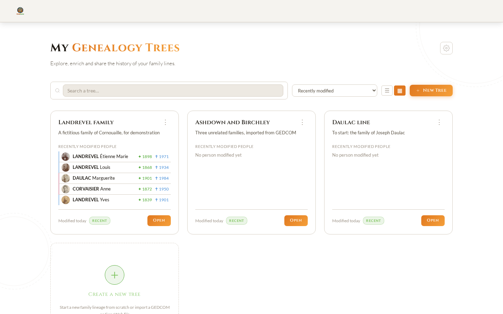
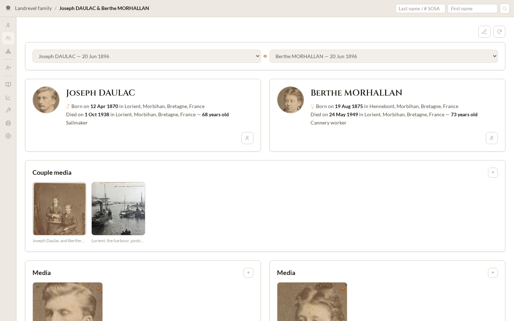
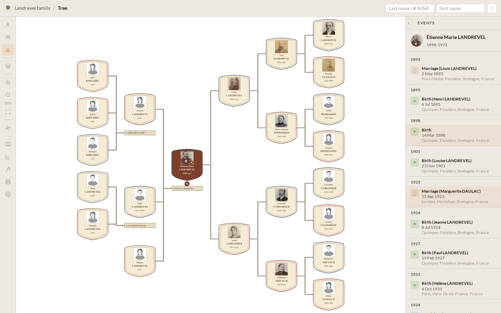
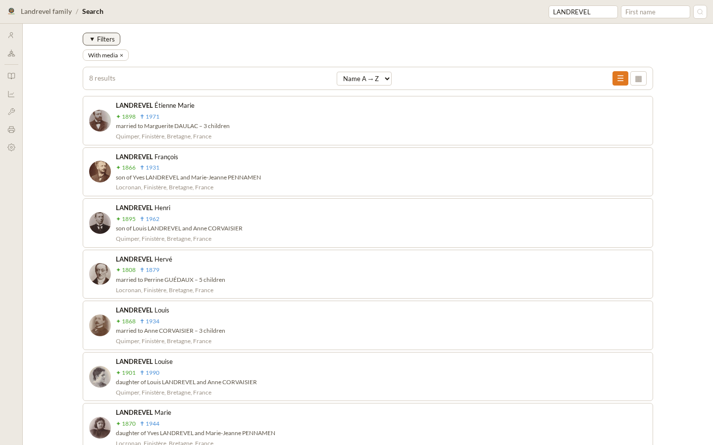
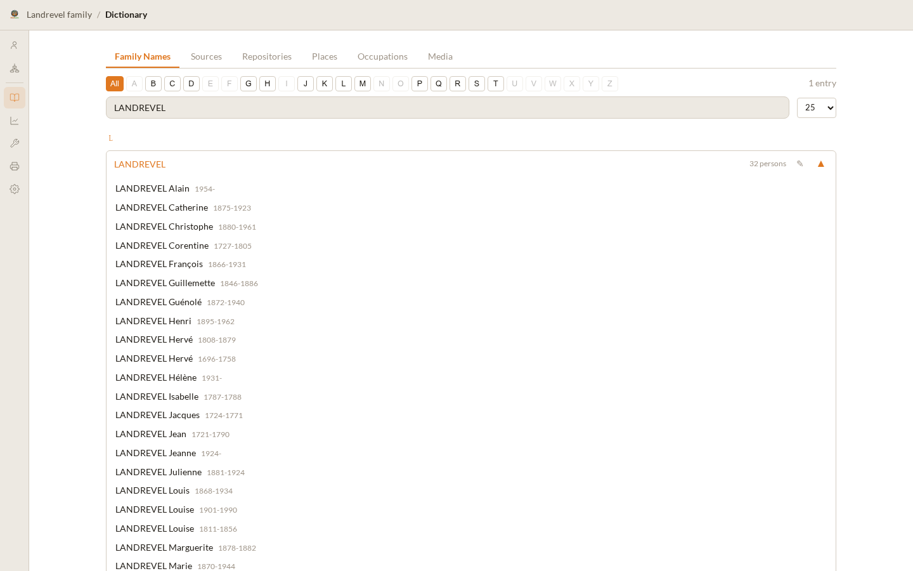
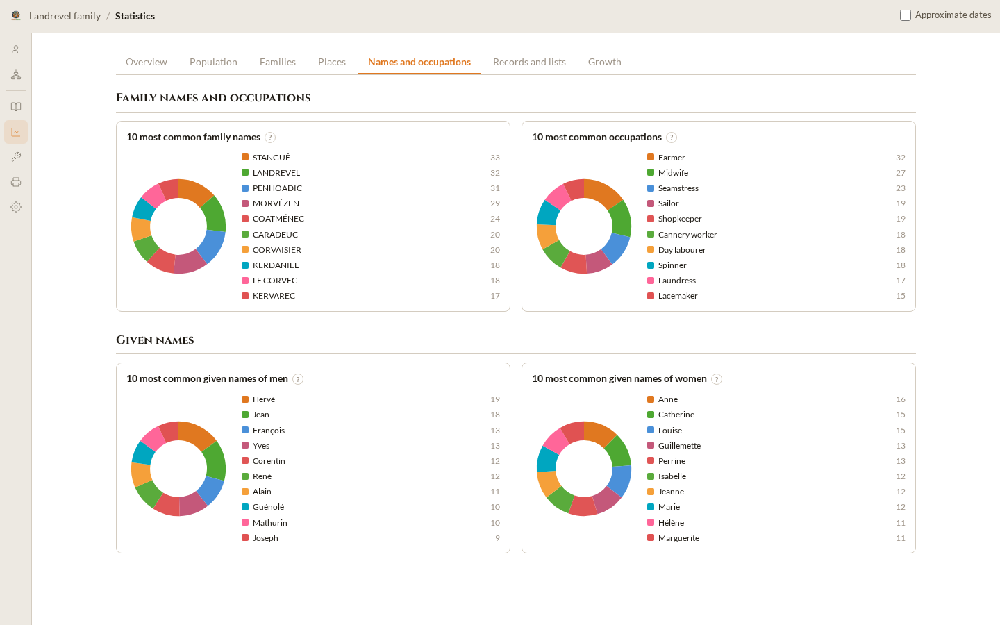
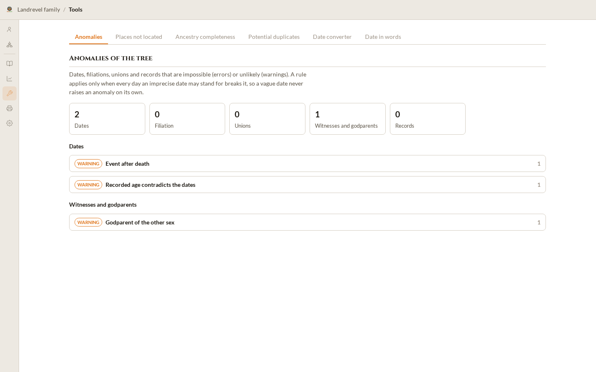
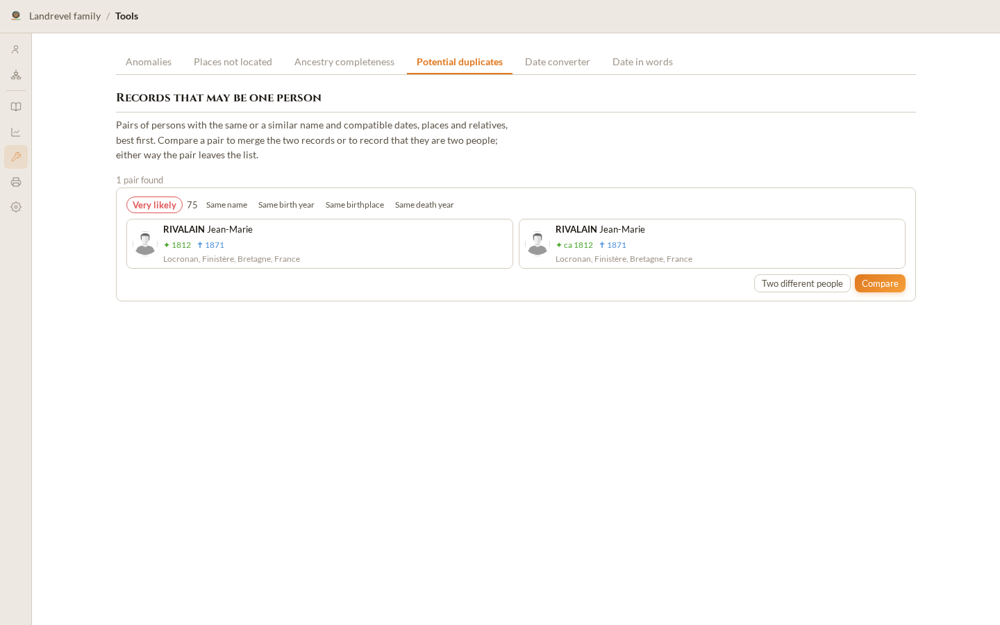
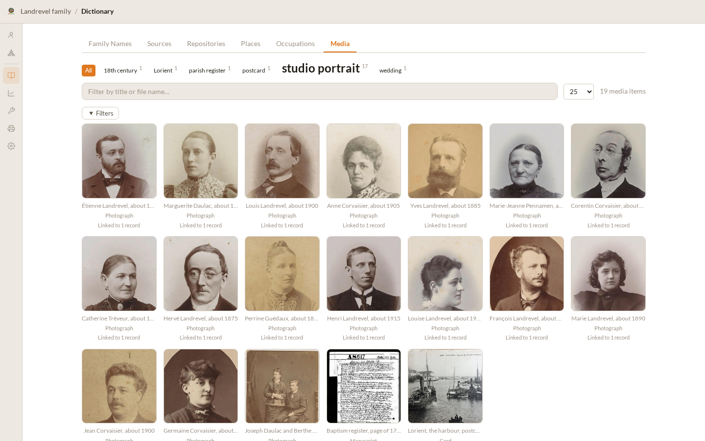
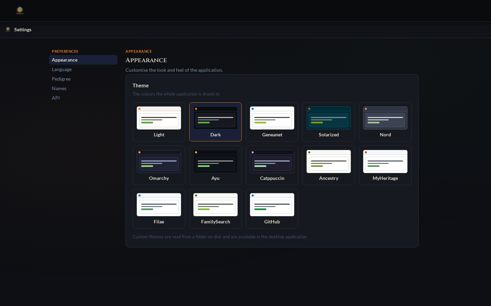

# Features — What OxidGene Does Today

> Part of the [OxidGene Specifications](index.md).
> See also: [General](general.md) · [Roadmap](roadmap.md) · [Quickstart](quickstart.md)

---

## 1. Scope

This is the catalogue of delivered features, one line each. Every line links
to the section of the specification that defines the feature; the
specification is authoritative, this list only points at it. Work not yet
delivered is in the [Roadmap](roadmap.md); the few planned items named here
are marked **planned**.

The screenshots show the fictitious Landrevel family that `just screenshots`
generates ([Development §2.1](development.md#21-build-and-quality)): invented
persons, real place names, and public-domain portraits of anonymous sitters.

## 2. Trees and the home page

- Several trees side by side as cards, each listing its five most recently modified persons with their portraits ([Homepage §6](ui-home.md#6-tree-card)).
- Search, sort and a grid or list layout for the tree cards ([Homepage §5](ui-home.md#5-toolbar)).
- Create, rename, duplicate, import into, configure and delete a tree from its card ([Homepage §7](ui-home.md#7-three-dot-menu-vertical-dots)).
- A card shows an import in progress and stays inert until the import has finished ([Homepage §6](ui-home.md#card-states)).
- A SOSA root (Sosa-Stradonitz numbering) and a "Who am I?" person per tree ([Tree Settings §7](ui-settings.md#7-section-tree--roots)).

## 3. Persons and couples

- A person page: identity with SOSA and "Me" badges, notes, gallery, family narrative, chronological events and a mini pedigree ([Person Profile](ui-person-profile.md)).
- Explanatory sheets beside occupations and given names: more than 3,000 historical occupations and more than 2,000 given names with meaning and feast day, in all eight languages, recognised whatever the record's language ([API Contract](api.md#reference-content)).
- Family connections written as a narrative: parents, each union with its children, siblings and half-siblings ([Person Profile §5](ui-person-profile.md#5-family-connections)).
- A timeline that adds the events of parents, spouses, children and siblings to the person's own ([Person Profile §6](ui-person-profile.md#6-timeline)).
- Sources and citations of each event, with the age the record gives, the agency that kept it, and an optional confidence ([Data Model](data-model.md#citation)).
- A couple page: both spouses side by side, with the union, its events, media and notes drawn once across the two ([Couple Profile](ui-couple-profile.md)).
- Witnesses and godparents linked to events as persons of the tree ([Data Model](data-model.md#eventwitness)).

## 4. Editing

- One form creates or edits a person in every context: a spouse, a child, a sibling, a parent from an empty slot, or a standalone person ([Person Edit Modal §3](ui-person-edit-modal.md#3-create-mode--context-variants)).
- Civil status, birth, death, privacy and every other event type, with places, notes and sources ([Person Edit Modal §4](ui-person-edit-modal.md#4-section-civil-status)).
- Dates in the Gregorian, Julian, Hebrew and French Republican calendars, with qualifiers and ranges ([Common UI §4.3](ui-common.md#43-dateinput)).
- Adding a parent, partner, child or sibling first offers the tree's matching persons ([Person Edit Modal §12](ui-person-edit-modal.md#12-suggest-existing-persons-adding-a-parent)).
- A homonym check after every save offers to merge with, or set apart from, a same-named person ([Person Edit Modal §13](ui-person-edit-modal.md#homonym-check)).
- A couple form for the union, its events and its children ([Person Edit Modal §16](ui-person-edit-modal.md#16-couple-edit-modal)).
- A merge wizard: find the other record, compare field by field, choose what to keep, confirm ([Person Merge](ui-merge.md)).
- A bulk family-name editor: rename a surname across the tree and fix where it splits between particle and root ([Dictionary §7.1](ui-dictionary.md#71-family-name-editor)).

## 5. Pedigree views and printing

- An interactive pedigree: up to ten ancestor and ten descendant generations, Reingold-Tilford layout, pan, zoom and fit ([Genealogy Tree §1](ui-genealogy-tree.md#1-general-structure)).
- An events panel listing the selected person's events and those of their family, year by year ([Genealogy Tree §6](ui-genealogy-tree.md#6-events-sidebar-right)).
- An action picker and context menu on every card: edit, add a relative, merge, trace a relationship ([Genealogy Tree §3](ui-genealogy-tree.md#pencil-icon--action-picker)).
- Eight other charts of the same pedigree: ancestor wheel, fan chart, descendant wheel, descendant fan, lineage, descendant lineage, hourglass and bowtie ([Genealogy Tree §10](ui-genealogy-tree.md#10-views)).
- Two pedigree themes: the classic card and a heraldic medieval escutcheon ([Genealogy Tree §9](ui-genealogy-tree.md#9-themes)).
- Every content page prints, the pedigree whole over several sheets when it is larger than one ([Common UI §7](ui-common.md#7-printing)).

## 6. Search

- Quick search from the topbar by surname, given name or SOSA number ([Common UI §2.3](ui-common.md#23-person-search)).
- A results page filtered by sex, occupation, birth, death and event years, place, event type, spouse, father, mother and media ([Search Results §5](ui-search-results.md#5-filters)).
- Results sorted by name or birth, as a list or as a grid of mini pedigrees ([Search Results §7](ui-search-results.md#7-view-modes)).
- Matching that ignores case, accents and punctuation, in every language ([Cross-cutting Rules §3.6](cross-cutting.md#36-comparing-words)).

## 7. Dictionary

- Family names, sources, repositories, places and occupations, each with its usage count and the persons using it ([Dictionary](ui-dictionary.md)).
- An alphabet index, a quick filter, and a drill-down through large source lists ([Dictionary §8](ui-dictionary.md#8-sources-tab--intelligent-navigation-drill-down)).
- A source editor and a repository editor: archives, libraries and offices, with the sources they hold ([Dictionary §19](ui-dictionary.md#19-repositories-tab)).
- A media library: a tag cloud and filters on name, file type, category, linked person, event years and date added ([Dictionary §18](ui-dictionary.md#18-media-tab)).

## 8. Statistics

- Key figures, completeness and averages of the tree ([Statistics §3](ui-statistics.md#3-key-figures)).
- An offline heat map of the places, with the ten most used and the births by country, region and subdivision ([Statistics §4](ui-statistics.md#4-places)).
- Names and occupations ([Statistics §5](ui-statistics.md#5-names-and-occupations)).
- Demographic charts per period under a year ruler: births and deaths, length of life, unions and children ([Statistics §6](ui-statistics.md#6-charts)).
- Records and notable lists: the extremes of the tree, the latest events, the longest lives, the largest families ([Statistics §8](ui-statistics.md#8-records)).
- The growth of the tree over the days it was worked on ([Statistics §10](ui-statistics.md#10-growth)).

## 9. Tools

- Anomalies of dates, filiations, unions, witnesses and records, by rule, with their catalogue ([Tools §3](ui-tools.md#3-anomalies)).
- Places the statistics cannot locate, with their uses and a way to correct them ([Tools §4](ui-tools.md#4-places-not-located)).
- Ancestry completeness, generation by generation from the SOSA root ([Tools §5](ui-tools.md#5-ancestry-completeness)).
- Potential duplicates to merge or keep apart ([Tools §6](ui-tools.md#6-potential-duplicates)).
- A date converter between the Gregorian, Julian, Hebrew and French Republican calendars ([Tools §7](ui-tools.md#7-date-converter)).
- Dates written out in every interface language and in Latin, and read back ([Tools §8](ui-tools.md#8-date-in-words)).
- Kinship: every way two persons are related, each path drawn generation by generation, or through unions when they share no ancestor ([Kinship](ui-kinship.md)).

## 10. Media and documents

- Photos, scans, PDFs and videos attached to persons, couples, events and sources, uploaded or given by address ([Common UI §4.5](ui-common.md#45-mediainput-mediagallery-and-documentform)).
- Multi-page documents with page order, a document viewer and a ZIP of every page ([API Contract](api.md#media)).
- Identifying someone on part of an image, and using that crop as their portrait ([Data Model](data-model.md#vignette)).
- Dates, places, tags and categories on media ([API Contract](api.md#media)).
- Filesystem storage, or S3-compatible object storage for stateless web deployments ([Architecture §8.1](architecture.md#81-web-deployment)).

## 11. History

- An audit log of every write to a tree — data, settings, media, imports, exports, restores — with filters ([Tree Settings §11](ui-settings.md#11-section-history)).
- Every version of a person compared field by field, and restored, even after a deletion ([Person History](ui-person-history.md)).
- Versions of places, sources, repositories and settings too ([Data Model §5.2](data-model.md#52-versions-record_version)).

## 12. Import and export

- GEDCOM 5.5.1 and 7.0 import with version detection, and GEDCOM 5.5.1 export ([API Contract §4](api.md#4-gedcom-compatibility-reference)).
- GEDZIP archives in and out, with their media ([Import](ui-import.md)).
- GeneWeb `.gw` import ([API Contract](api.md#geneweb-gw)).
- A guided desktop import of a Geneanet tree that recovers its photos and documents and their links to persons ([Geneanet Media Import](geneanet-media-import.md), [Import §9](ui-import.md#9-from-geneanet-tab)).
- An import receipt counting persons, families, events, sources, places, notes, images, documents and pages, with its warnings ([Import](ui-import.md#result)).
- Export options: notes and sources, media, merged occupations and merged names; a submitter; and a kept archive downloadable again for an hour ([Tree Settings §12](ui-settings.md#12-section-export)).
- Imports and exports run as durable background jobs ([Architecture §6](architecture.md#6-asynchronous-processing)).

## 13. Places and entry help

- A built-in place dictionary of twelve countries, with merged municipalities, former names and historical subdivisions, needing no network ([Place Dictionary](place-dictionary.md)).
- Every free-text field suggests the tree's values and the reference dictionaries, while accepting any text ([Common UI §4.4](ui-common.md#44-fields-with-suggestions)).
- Per-tree date display: format, event symbols, « circa », and a second calendar ([Tree Settings §9](ui-settings.md#9-section-date-display)).
- Per-tree entry options: suggestions, surnames in capitals, suggested persons, date input format and default calendar ([Tree Settings §10](ui-settings.md#10-section-entry-options)).

## 14. Appearance and languages

- Built-in colour themes, light and dark among them, and the user's own as JSON files on the desktop ([Common UI §3.1](ui-common.md#31-themes)).
- English, French, German, Spanish, Italian, Dutch, Polish and Portuguese, switched without a restart ([Cross-cutting Rules §3](cross-cutting.md#3-internationalization)).
- Pedigree chart, theme and depth preferences, and name display ([App Settings](ui-app-settings.md)).
- A responsive layout from phones to wide screens ([Common UI §6](ui-common.md#6-responsive-behavior)).

## 15. Privacy

- A tree-wide default privacy and per-person, per-couple and per-media privacy, recorded ([Tree Settings §8](ui-settings.md#8-section-privacy)).
- **Planned:** enforcing privacy, hiding contemporary persons and authentication; today privacy is recorded and hides nothing ([General §4](general.md#4-security--privacy)).

## 16. Desktop and web

- A desktop application for Linux, Windows and macOS: one binary embedding the server, SQLite and the interface, working offline ([Architecture §8.2](architecture.md#82-desktop-distribution)).
- A web deployment: WebAssembly frontend, Axum server, worker and PostgreSQL ([Architecture §8.1](architecture.md#81-web-deployment)).
- Files kept in the XDG data, config, state and cache directories ([Architecture §8.3](architecture.md#83-local-files)).

## 17. APIs and assistants

- A REST API with its generated OpenAPI 3.1 document, on the desktop and the web ([API Contract §2](api.md#2-rest-api)).
- A GraphQL API, with GraphiQL, strictly symmetric with REST, in the web deployment only ([API Contract §3](api.md#3-graphql-api)).
- A read-only Model Context Protocol server in the desktop binary, for Claude and other assistants ([Assistant Access](mcp.md)).
- **Planned:** AI features on media with the user's own LLM provider ([AI Features](ai.md)) and DNA kits ([DNA Kits](dna.md)), specified only.

## 18. Operations

- Structured logs, and OpenTelemetry logs, traces and metrics on every process and in the browser ([Cross-cutting Rules §5](cross-cutting.md#5-logging-and-observability)).
- Docker images and a Compose stack; a Helm chart for Kubernetes with PostgreSQL and S3 options ([Quickstart §3](quickstart.md#3-run-the-web-stack-with-docker-compose), [Quickstart §4](quickstart.md#4-deploy-to-kubernetes-with-helm)).
- Guards that keep the code to its rules — layering, REST/GraphQL parity, specification format, privacy of logs, request and memory budgets — in three CI tiers ([Development §2.8](development.md#28-guards)).
