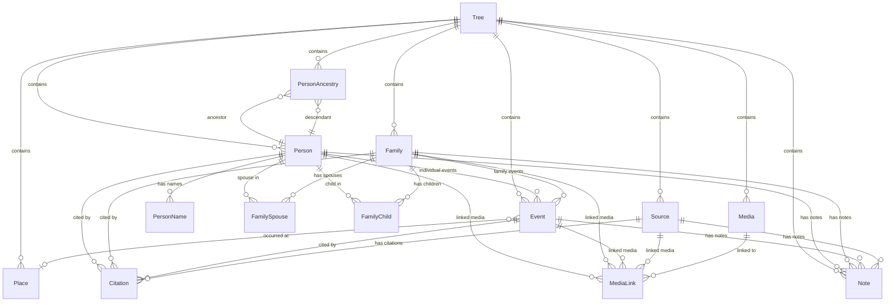

![[OxidGene.png]](OxidGene.png)

---

## 1. Context and Project Objectives

### 1.1 General Context

The project aims to develop a multiplatform genealogy application, built entirely in Rust, based on:

- a **Dioxus** frontend compiled to WebAssembly (WASM) for web and desktop, and
- a backend powered by **Axum** exposing an API simultaneously in REST (JSON) and GraphQL, with all features available through both protocols.

The application is designed to be:

- compiled as a **desktop client** running on Windows, Linux and macOS (single binary embedding an Axum server + SQLite + Dioxus WebView via Wry), and
- deployable as a **web application** through Docker containers:
    - frontend container (static WASM assets served by a lightweight HTTP server),
    - backend container (Axum server),
    - database container (PostgreSQL),
    - queuing application container (for EPIC F — Asynchronous Pipeline, post-MVP).

### 1.2 Nature of the Application

OxidGene is a genealogy platform enabling users to create, view, edit, and share family trees and associated genealogical data (individuals, relationships, events, sources, media).

### 1.3 Main Objectives

- Deliver a modern, high-performance, portable genealogy application.
- Provide an open API (REST + GraphQL) aligned with the design principles of the FamilySearch API.
- Ensure a user experience comparable to leading genealogy platforms.
- Allow progressive evolution toward advanced and paid features.

### 1.4 Differentiation

- Made in Rust — performance, safety, and a single language across the entire stack.
- A theme-based UX system reproducing the experience of Geneanet, Filae, Ancestry, and MyHeritage.
- A unified Rust + WASM architecture with a single Dioxus codebase for web and desktop.
- A dual REST/GraphQL API.
- A fully offline-capable desktop client.
- Advanced collaboration and tree-matching features (post-MVP).

---

## 2. Target Users and Roles

### 2.1 Target Users

- Individuals practicing genealogy.
- Genealogy associations.
- Professional or advanced users.
- Paid subscribers (future phases).

### 2.2 User Roles (per tree)

- **Guest**: limited access, contemporary individuals hidden.
- **Full Read-only**: full tree access.
- **Editor**: read + create/modify/delete.

### 2.3 Access Control

- Trees can be private, shared, or public.
- Access rights defined per tree.
- Authentication deferred to EPIC E (not in MVP).

---

## 3. Core Features

### 3.1 Tree Management

- Create trees from scratch or via GEDCOM import.
- Manage multiple trees (web version).

### 3.2 GEDCOM Import/Export

- Full import/export using Rust crate `ged_io` (v0.12+).
- Support for GEDCOM 5.5.1 and 7.0 (auto-detected).
- Streaming parser for large files.
- Error logging and normalization.

### 3.3 Collaborative Editing (Web) — Post-MVP

- Simultaneous editing (deferred to post-MVP).
- Conflict detection and resolution.

### 3.4 Tree Matching — Post-MVP

- Suggest merges between user trees.

### 3.5 Themes / UX

- Switch between multiple UX themes inspired by major genealogy platforms.

### 3.6 Interface Language

- Configurable UI language.
- User-level (web) or app-level (desktop).
- Runtime switching.

### 3.7 REST & GraphQL APIs

- Full feature parity between both protocols.
- FamilySearch-inspired structure.
- Available from EPIC A onward.

### 3.8 Media Management

- Upload images/PDF/videos.
- Metadata and viewer integration.
- Async upload pipeline (post-MVP).

### 3.9 Statistics & Reports

- Frequent surnames, birth stats, geographic distribution, etc.
- Graphs, tables, PDF export.

### 3.10 Visualization & Printing

- Multiple tree layouts (ancestor chart, descendant chart, fan chart).
- Export high-resolution PDFs.

---

## 4. Technical Architecture

### 4.1 Technology Stack

| Layer | Technology | Version | Notes |
|---|---|---|---|
| Language | Rust | stable | Single language across the entire stack |
| Frontend | Dioxus | 0.7+ | Web (WASM) + Desktop from single codebase |
| Desktop shell | Wry (WebView) | via Dioxus | System WebView, small binary size |
| Backend framework | Axum | 0.8+ | Tokio-based, tower middleware |
| GraphQL | async-graphql | 7.2+ | With async-graphql-axum integration |
| ORM | SeaORM | 1.1+ | Async, supports PostgreSQL + SQLite |
| Web database | PostgreSQL | 16+ | Production web deployment |
| Desktop database | SQLite | 3.35+ | Embedded in desktop binary |
| GEDCOM | ged_io | 0.12+ | Read/write, GEDCOM 5.5.1 + 7.0, streaming |
| Build orchestration | just | latest | Unified justfile for all tasks |

### 4.2 Data Model Approach

- **Family-centric** model (classic GEDCOM style): Persons exist independently; Families link spouses and children.
- Not person-centric (GEDCOM-X style) — deferred to post-MVP consideration.
- Closure table (`PersonAncestry`) for optimized ancestor/descendant traversal.

### 4.3 Key Design Decisions

| Decision | Choice | Rationale |
|---|---|---|
| Primary keys | UUID v7 | Time-ordered, no collision across web/desktop, no sequential ID leakage |
| Pagination | Cursor-based (Relay-style) | Handles concurrent modifications, natural fit for GraphQL connections |
| Deletion | Soft delete (`deleted_at`) | Undo capability, audit trail, filtered out by default |
| Desktop architecture | Single binary | Embeds Axum on localhost + SQLite + Dioxus WebView |
| Authentication | Deferred to EPIC E | No auth in MVP; single-user desktop, open web for now |

### 4.4 Backend Architecture

- Rust core crate (`oxidgene-core`) with domain types, shared across all binaries.
- SeaORM entities crate (`oxidgene-db`) with migrations.
- API crate (`oxidgene-api`) with Axum handlers (REST) and async-graphql resolvers.
- GEDCOM crate (`oxidgene-gedcom`) wrapping `ged_io` with domain conversion logic.
- Separate binary crates for web server, desktop app, and CLI tool.

### 4.5 Frontend Architecture

- Dioxus components crate (`oxidgene-ui`).
- Shared between web and desktop targets.
- Communicates with the backend via REST/GraphQL.
- On desktop: points to `http://127.0.0.1:<port>` served by the embedded Axum server.

### 4.6 Asynchronous Processing — Post-MVP (EPIC F)

- Message queue container (Redis/RabbitMQ/NATS).
- `document-queue` orchestration service.
- Rust workers (scalable).
- Temporary + persistent object storage.

---

## 5. Security & Privacy

- Mask contemporary individuals (< 100 years old) for guest users.
- Optional surname masking.
- Full audit logging.
- Authentication and authorization in EPIC E.

---

## 6. Performance

- Lazy loading of tree branches.
- Server-side caching.
- PersonAncestry closure table for O(1) ancestor/descendant queries.
- Streaming GEDCOM parser for large files.
- Cursor-based pagination to avoid expensive offset scans.

---

## 7. Build & Testing

- Unified `justfile` for build, test, lint, format, migration, and deployment tasks.
- Full test suite: unit tests, integration tests, and end-to-end tests.
- CI/CD pipelines (GitHub Actions).
- Code coverage reporting.

---

## 8. Deployment

### 8.1 Web Deployment

- Docker Compose for local development.
- Kubernetes deployment for production (dev & prod).
- GitOps with FluxCD.
- Liveness/readiness probes on the Axum server.

### 8.2 Desktop Distribution

- Single binary per platform (Windows, Linux, macOS).
- Built via `cargo build --release` with appropriate target.
- No external runtime dependencies (SQLite embedded, WebView from system).

---

## 9. Premium Features — Post-MVP

- Assisted tree matching.
- OCR on scanned documents.
- Image enhancement.
- External data source plugins.

---

## 10. MVP Scope

The MVP covers EPICs A through D:

- Interactive tree visualization.
- Person selection and detail view.
- Full CRUD editing (persons, families, events, sources, media, places, notes).
- GEDCOM import/export.
- Language switching.
- Theme support.
- REST + GraphQL API.
- Desktop and web deployment.

**Not in MVP**: authentication, access control, collaborative editing, tree matching, async pipeline.

---

## 11. Data Model

### 11.1 Entities

#### Tree

| Column | Type | Notes |
|---|---|---|
| `id` | UUID v7 | PK |
| `name` | String | Required |
| `description` | String? | Optional |
| `created_at` | DateTime | Auto |
| `updated_at` | DateTime | Auto |
| `deleted_at` | DateTime? | Soft delete |

#### Person

| Column | Type | Notes |
|---|---|---|
| `id` | UUID v7 | PK |
| `tree_id` | UUID v7 | FK → Tree |
| `sex` | Sex | Enum |
| `created_at` | DateTime | Auto |
| `updated_at` | DateTime | Auto |
| `deleted_at` | DateTime? | Soft delete |

#### PersonName

| Column | Type | Notes |
|---|---|---|
| `id` | UUID v7 | PK |
| `person_id` | UUID v7 | FK → Person |
| `name_type` | NameType | Enum |
| `given_names` | String? | |
| `surname` | String? | |
| `prefix` | String? | |
| `suffix` | String? | |
| `nickname` | String? | |
| `is_primary` | bool | Default true |
| `created_at` | DateTime | Auto |
| `updated_at` | DateTime | Auto |

#### Family

| Column | Type | Notes |
|---|---|---|
| `id` | UUID v7 | PK |
| `tree_id` | UUID v7 | FK → Tree |
| `created_at` | DateTime | Auto |
| `updated_at` | DateTime | Auto |
| `deleted_at` | DateTime? | Soft delete |

#### FamilySpouse

| Column | Type | Notes |
|---|---|---|
| `id` | UUID v7 | PK |
| `family_id` | UUID v7 | FK → Family |
| `person_id` | UUID v7 | FK → Person |
| `role` | SpouseRole | Enum |
| `sort_order` | i32 | For ordering |

#### FamilyChild

| Column | Type | Notes |
|---|---|---|
| `id` | UUID v7 | PK |
| `family_id` | UUID v7 | FK → Family |
| `person_id` | UUID v7 | FK → Person |
| `child_type` | ChildType | Enum |
| `sort_order` | i32 | For ordering |

#### Event

| Column | Type | Notes |
|---|---|---|
| `id` | UUID v7 | PK |
| `tree_id` | UUID v7 | FK → Tree |
| `event_type` | EventType | Enum |
| `date_value` | String? | GEDCOM date phrase (free text) |
| `date_sort` | Date? | Normalized date for sorting |
| `place_id` | UUID v7? | FK → Place |
| `person_id` | UUID v7? | FK → Person (individual event) |
| `family_id` | UUID v7? | FK → Family (family event) |
| `description` | String? | |
| `created_at` | DateTime | Auto |
| `updated_at` | DateTime | Auto |
| `deleted_at` | DateTime? | Soft delete |

#### Place

| Column | Type | Notes |
|---|---|---|
| `id` | UUID v7 | PK |
| `tree_id` | UUID v7 | FK → Tree |
| `name` | String | Required |
| `latitude` | f64? | |
| `longitude` | f64? | |
| `created_at` | DateTime | Auto |
| `updated_at` | DateTime | Auto |

#### Source

| Column | Type | Notes |
|---|---|---|
| `id` | UUID v7 | PK |
| `tree_id` | UUID v7 | FK → Tree |
| `title` | String | Required |
| `author` | String? | |
| `publisher` | String? | |
| `abbreviation` | String? | |
| `repository_name` | String? | |
| `created_at` | DateTime | Auto |
| `updated_at` | DateTime | Auto |
| `deleted_at` | DateTime? | Soft delete |

#### Citation

| Column | Type | Notes |
|---|---|---|
| `id` | UUID v7 | PK |
| `source_id` | UUID v7 | FK → Source |
| `person_id` | UUID v7? | FK → Person |
| `event_id` | UUID v7? | FK → Event |
| `family_id` | UUID v7? | FK → Family |
| `page` | String? | Where in the source |
| `confidence` | Confidence | Enum |
| `text` | String? | Extracted text |
| `created_at` | DateTime | Auto |
| `updated_at` | DateTime | Auto |

#### Media

| Column | Type | Notes |
|---|---|---|
| `id` | UUID v7 | PK |
| `tree_id` | UUID v7 | FK → Tree |
| `file_name` | String | Original filename |
| `mime_type` | String | MIME type |
| `file_path` | String | Storage path |
| `file_size` | i64 | Bytes |
| `title` | String? | |
| `description` | String? | |
| `created_at` | DateTime | Auto |
| `updated_at` | DateTime | Auto |
| `deleted_at` | DateTime? | Soft delete |

#### MediaLink

| Column | Type | Notes |
|---|---|---|
| `id` | UUID v7 | PK |
| `media_id` | UUID v7 | FK → Media |
| `person_id` | UUID v7? | FK → Person |
| `event_id` | UUID v7? | FK → Event |
| `source_id` | UUID v7? | FK → Source |
| `family_id` | UUID v7? | FK → Family |
| `sort_order` | i32 | For ordering |

#### Note

| Column | Type | Notes |
|---|---|---|
| `id` | UUID v7 | PK |
| `tree_id` | UUID v7 | FK → Tree |
| `text` | String | Required |
| `person_id` | UUID v7? | FK → Person |
| `event_id` | UUID v7? | FK → Event |
| `family_id` | UUID v7? | FK → Family |
| `source_id` | UUID v7? | FK → Source |
| `created_at` | DateTime | Auto |
| `updated_at` | DateTime | Auto |
| `deleted_at` | DateTime? | Soft delete |

#### PersonAncestry (Closure Table)

| Column | Type | Notes |
|---|---|---|
| `id` | UUID v7 | PK |
| `tree_id` | UUID v7 | FK → Tree |
| `ancestor_id` | UUID v7 | FK → Person |
| `descendant_id` | UUID v7 | FK → Person |
| `depth` | i32 | Generation distance (0 = self) |

### 11.2 Enums

```rust
enum Sex {
    Male,
    Female,
    Unknown,
}

enum NameType {
    Birth,
    Married,
    AlsoKnownAs,
    Maiden,
    Religious,
    Other,
}

enum SpouseRole {
    Husband,
    Wife,
    Partner,
}

enum ChildType {
    Biological,
    Adopted,
    Foster,
    Step,
    Unknown,
}

enum EventType {
    // Individual events
    Birth,
    Death,
    Baptism,
    Burial,
    Cremation,
    Graduation,
    Immigration,
    Emigration,
    Naturalization,
    Census,
    Occupation,
    Residence,
    Retirement,
    Will,
    Probate,
    // Family events
    Marriage,
    Divorce,
    Annulment,
    Engagement,
    MarriageBann,
    MarriageContract,
    MarriageLicense,
    MarriageSettlement,
    // Generic
    Other,
}

enum Confidence {
    VeryLow,
    Low,
    Medium,
    High,
    VeryHigh,
}
```

### 11.3 Entity Relationship Diagram (Mermaid)



---

## 12. API Contract

### 12.1 REST API

Base path: `/api/v1`

#### Trees

| Method | Path | Description |
|---|---|---|
| `GET` | `/trees` | List trees (cursor-paginated) |
| `POST` | `/trees` | Create a tree |
| `GET` | `/trees/{tree_id}` | Get a tree |
| `PUT` | `/trees/{tree_id}` | Update a tree |
| `DELETE` | `/trees/{tree_id}` | Soft-delete a tree |

#### Persons

| Method | Path | Description |
|---|---|---|
| `GET` | `/trees/{tree_id}/persons` | List persons (cursor-paginated, filterable) |
| `POST` | `/trees/{tree_id}/persons` | Create a person |
| `GET` | `/trees/{tree_id}/persons/{person_id}` | Get a person (with names, events, families) |
| `PUT` | `/trees/{tree_id}/persons/{person_id}` | Update a person |
| `DELETE` | `/trees/{tree_id}/persons/{person_id}` | Soft-delete a person |
| `GET` | `/trees/{tree_id}/persons/{person_id}/ancestors` | Get ancestors (depth param) |
| `GET` | `/trees/{tree_id}/persons/{person_id}/descendants` | Get descendants (depth param) |

#### Person Names

| Method | Path | Description |
|---|---|---|
| `GET` | `/trees/{tree_id}/persons/{person_id}/names` | List names |
| `POST` | `/trees/{tree_id}/persons/{person_id}/names` | Add a name |
| `PUT` | `/trees/{tree_id}/persons/{person_id}/names/{name_id}` | Update a name |
| `DELETE` | `/trees/{tree_id}/persons/{person_id}/names/{name_id}` | Delete a name |

#### Families

| Method | Path | Description |
|---|---|---|
| `GET` | `/trees/{tree_id}/families` | List families (cursor-paginated) |
| `POST` | `/trees/{tree_id}/families` | Create a family |
| `GET` | `/trees/{tree_id}/families/{family_id}` | Get a family (with spouses, children, events) |
| `PUT` | `/trees/{tree_id}/families/{family_id}` | Update a family |
| `DELETE` | `/trees/{tree_id}/families/{family_id}` | Soft-delete a family |

#### Family Members

| Method | Path | Description |
|---|---|---|
| `POST` | `/trees/{tree_id}/families/{family_id}/spouses` | Add a spouse |
| `DELETE` | `/trees/{tree_id}/families/{family_id}/spouses/{spouse_id}` | Remove a spouse |
| `POST` | `/trees/{tree_id}/families/{family_id}/children` | Add a child |
| `DELETE` | `/trees/{tree_id}/families/{family_id}/children/{child_id}` | Remove a child |

#### Events

| Method | Path | Description |
|---|---|---|
| `GET` | `/trees/{tree_id}/events` | List events (cursor-paginated, filterable by type/person/family) |
| `POST` | `/trees/{tree_id}/events` | Create an event |
| `GET` | `/trees/{tree_id}/events/{event_id}` | Get an event |
| `PUT` | `/trees/{tree_id}/events/{event_id}` | Update an event |
| `DELETE` | `/trees/{tree_id}/events/{event_id}` | Soft-delete an event |

#### Places

| Method | Path | Description |
|---|---|---|
| `GET` | `/trees/{tree_id}/places` | List places (cursor-paginated, searchable) |
| `POST` | `/trees/{tree_id}/places` | Create a place |
| `GET` | `/trees/{tree_id}/places/{place_id}` | Get a place |
| `PUT` | `/trees/{tree_id}/places/{place_id}` | Update a place |
| `DELETE` | `/trees/{tree_id}/places/{place_id}` | Delete a place |

#### Sources

| Method | Path | Description |
|---|---|---|
| `GET` | `/trees/{tree_id}/sources` | List sources (cursor-paginated) |
| `POST` | `/trees/{tree_id}/sources` | Create a source |
| `GET` | `/trees/{tree_id}/sources/{source_id}` | Get a source |
| `PUT` | `/trees/{tree_id}/sources/{source_id}` | Update a source |
| `DELETE` | `/trees/{tree_id}/sources/{source_id}` | Soft-delete a source |

#### Citations

| Method | Path | Description |
|---|---|---|
| `POST` | `/trees/{tree_id}/citations` | Create a citation |
| `PUT` | `/trees/{tree_id}/citations/{citation_id}` | Update a citation |
| `DELETE` | `/trees/{tree_id}/citations/{citation_id}` | Delete a citation |

#### Media

| Method | Path | Description |
|---|---|---|
| `GET` | `/trees/{tree_id}/media` | List media (cursor-paginated) |
| `POST` | `/trees/{tree_id}/media` | Upload media (multipart) |
| `GET` | `/trees/{tree_id}/media/{media_id}` | Get media metadata |
| `GET` | `/trees/{tree_id}/media/{media_id}/file` | Download media file |
| `PUT` | `/trees/{tree_id}/media/{media_id}` | Update media metadata |
| `DELETE` | `/trees/{tree_id}/media/{media_id}` | Soft-delete media |

#### Media Links

| Method | Path | Description |
|---|---|---|
| `POST` | `/trees/{tree_id}/media-links` | Create a media link |
| `DELETE` | `/trees/{tree_id}/media-links/{link_id}` | Delete a media link |

#### Notes

| Method | Path | Description |
|---|---|---|
| `POST` | `/trees/{tree_id}/notes` | Create a note |
| `GET` | `/trees/{tree_id}/notes/{note_id}` | Get a note |
| `PUT` | `/trees/{tree_id}/notes/{note_id}` | Update a note |
| `DELETE` | `/trees/{tree_id}/notes/{note_id}` | Soft-delete a note |

#### GEDCOM

| Method | Path | Description |
|---|---|---|
| `POST` | `/trees/{tree_id}/gedcom/import` | Import GEDCOM file (multipart) |
| `GET` | `/trees/{tree_id}/gedcom/export` | Export tree as GEDCOM file |

#### Pagination

All list endpoints accept:
- `first` (i32): number of items to return (default 25, max 100).
- `after` (String): cursor for forward pagination.

Responses use a connection envelope:

```json
{
  "edges": [
    { "cursor": "...", "node": { ... } }
  ],
  "page_info": {
    "has_next_page": true,
    "end_cursor": "..."
  },
  "total_count": 142
}
```

### 12.2 GraphQL API

Endpoint: `/graphql` (POST for queries/mutations, WebSocket for subscriptions).

#### Queries

```graphql
type Query {
  # Trees
  trees(first: Int, after: String): TreeConnection!
  tree(id: ID!): Tree

  # Persons
  persons(treeId: ID!, first: Int, after: String, search: String): PersonConnection!
  person(treeId: ID!, id: ID!): Person
  ancestors(treeId: ID!, personId: ID!, maxDepth: Int): [PersonWithDepth!]!
  descendants(treeId: ID!, personId: ID!, maxDepth: Int): [PersonWithDepth!]!

  # Families
  families(treeId: ID!, first: Int, after: String): FamilyConnection!
  family(treeId: ID!, id: ID!): Family

  # Events
  events(treeId: ID!, first: Int, after: String, eventType: EventType, personId: ID, familyId: ID): EventConnection!
  event(treeId: ID!, id: ID!): Event

  # Places
  places(treeId: ID!, first: Int, after: String, search: String): PlaceConnection!
  place(treeId: ID!, id: ID!): Place

  # Sources
  sources(treeId: ID!, first: Int, after: String): SourceConnection!
  source(treeId: ID!, id: ID!): Source

  # Media
  mediaList(treeId: ID!, first: Int, after: String): MediaConnection!
  media(treeId: ID!, id: ID!): Media
}
```

#### Mutations

```graphql
type Mutation {
  # Trees
  createTree(input: CreateTreeInput!): Tree!
  updateTree(id: ID!, input: UpdateTreeInput!): Tree!
  deleteTree(id: ID!): Boolean!

  # Persons
  createPerson(treeId: ID!, input: CreatePersonInput!): Person!
  updatePerson(treeId: ID!, id: ID!, input: UpdatePersonInput!): Person!
  deletePerson(treeId: ID!, id: ID!): Boolean!

  # Person Names
  addPersonName(treeId: ID!, personId: ID!, input: PersonNameInput!): PersonName!
  updatePersonName(treeId: ID!, personId: ID!, nameId: ID!, input: PersonNameInput!): PersonName!
  deletePersonName(treeId: ID!, personId: ID!, nameId: ID!): Boolean!

  # Families
  createFamily(treeId: ID!, input: CreateFamilyInput!): Family!
  updateFamily(treeId: ID!, id: ID!, input: UpdateFamilyInput!): Family!
  deleteFamily(treeId: ID!, id: ID!): Boolean!
  addSpouse(treeId: ID!, familyId: ID!, input: AddSpouseInput!): FamilySpouse!
  removeSpouse(treeId: ID!, familyId: ID!, spouseId: ID!): Boolean!
  addChild(treeId: ID!, familyId: ID!, input: AddChildInput!): FamilyChild!
  removeChild(treeId: ID!, familyId: ID!, childId: ID!): Boolean!

  # Events
  createEvent(treeId: ID!, input: CreateEventInput!): Event!
  updateEvent(treeId: ID!, id: ID!, input: UpdateEventInput!): Event!
  deleteEvent(treeId: ID!, id: ID!): Boolean!

  # Places
  createPlace(treeId: ID!, input: CreatePlaceInput!): Place!
  updatePlace(treeId: ID!, id: ID!, input: UpdatePlaceInput!): Place!
  deletePlace(treeId: ID!, id: ID!): Boolean!

  # Sources
  createSource(treeId: ID!, input: CreateSourceInput!): Source!
  updateSource(treeId: ID!, id: ID!, input: UpdateSourceInput!): Source!
  deleteSource(treeId: ID!, id: ID!): Boolean!

  # Citations
  createCitation(treeId: ID!, input: CreateCitationInput!): Citation!
  updateCitation(treeId: ID!, id: ID!, input: UpdateCitationInput!): Citation!
  deleteCitation(treeId: ID!, id: ID!): Boolean!

  # Media
  uploadMedia(treeId: ID!, input: UploadMediaInput!): Media!
  updateMedia(treeId: ID!, id: ID!, input: UpdateMediaInput!): Media!
  deleteMedia(treeId: ID!, id: ID!): Boolean!
  createMediaLink(treeId: ID!, input: CreateMediaLinkInput!): MediaLink!
  deleteMediaLink(treeId: ID!, id: ID!): Boolean!

  # Notes
  createNote(treeId: ID!, input: CreateNoteInput!): Note!
  updateNote(treeId: ID!, id: ID!, input: UpdateNoteInput!): Note!
  deleteNote(treeId: ID!, id: ID!): Boolean!

  # GEDCOM
  importGedcom(treeId: ID!, file: Upload!): GedcomImportResult!
  exportGedcom(treeId: ID!): String!
}
```

#### Key Types

```graphql
type Tree {
  id: ID!
  name: String!
  description: String
  personCount: Int!
  familyCount: Int!
  createdAt: DateTime!
  updatedAt: DateTime!
}

type Person {
  id: ID!
  sex: Sex!
  names: [PersonName!]!
  primaryName: PersonName
  families: [Family!]!
  events: [Event!]!
  citations: [Citation!]!
  media: [Media!]!
  notes: [Note!]!
  createdAt: DateTime!
  updatedAt: DateTime!
}

type PersonWithDepth {
  person: Person!
  depth: Int!
}

type Family {
  id: ID!
  spouses: [FamilySpouseDetail!]!
  children: [FamilyChildDetail!]!
  events: [Event!]!
  createdAt: DateTime!
  updatedAt: DateTime!
}

type FamilySpouseDetail {
  id: ID!
  person: Person!
  role: SpouseRole!
  sortOrder: Int!
}

type FamilyChildDetail {
  id: ID!
  person: Person!
  childType: ChildType!
  sortOrder: Int!
}

type Event {
  id: ID!
  eventType: EventType!
  dateValue: String
  dateSort: Date
  place: Place
  person: Person
  family: Family
  description: String
  citations: [Citation!]!
  media: [Media!]!
  notes: [Note!]!
  createdAt: DateTime!
  updatedAt: DateTime!
}

type GedcomImportResult {
  personsImported: Int!
  familiesImported: Int!
  eventsImported: Int!
  sourcesImported: Int!
  mediaImported: Int!
  warnings: [String!]!
  errors: [String!]!
}

# Connection types (Relay-style pagination)
type TreeConnection {
  edges: [TreeEdge!]!
  pageInfo: PageInfo!
  totalCount: Int!
}

type TreeEdge {
  cursor: String!
  node: Tree!
}

type PageInfo {
  hasNextPage: Boolean!
  endCursor: String
}

# Similar connection types for Person, Family, Event, Place, Source, Media
```

---

## 13. Project Structure

### 13.1 Cargo Workspace Layout

```
oxidgene/
├── Cargo.toml              # Workspace root
├── justfile                 # Build orchestration
├── .gitignore
├── README.md
├── LICENSE
├── docs/
│   ├── specifications.md
│   ├── OxidGene.png
│   └── OxidGene.svg
├── crates/
│   ├── oxidgene-core/      # Domain types, enums, error types
│   │   ├── Cargo.toml
│   │   └── src/
│   │       ├── lib.rs
│   │       ├── types/      # Person, Family, Event, etc.
│   │       ├── enums.rs    # Sex, EventType, NameType, etc.
│   │       └── error.rs    # Shared error types
│   ├── oxidgene-db/        # SeaORM entities + migrations
│   │   ├── Cargo.toml
│   │   └── src/
│   │       ├── lib.rs
│   │       ├── entities/   # SeaORM entity definitions
│   │       ├── migration/  # Database migrations
│   │       └── repo/       # Repository trait implementations
│   ├── oxidgene-api/       # Axum handlers + GraphQL resolvers
│   │   ├── Cargo.toml
│   │   └── src/
│   │       ├── lib.rs
│   │       ├── rest/       # REST handlers per resource
│   │       ├── graphql/    # GraphQL schema, queries, mutations
│   │       └── router.rs   # Route definitions
│   ├── oxidgene-gedcom/    # GEDCOM import/export (wraps ged_io)
│   │   ├── Cargo.toml
│   │   └── src/
│   │       ├── lib.rs
│   │       ├── import.rs   # GEDCOM → domain conversion
│   │       └── export.rs   # Domain → GEDCOM conversion
│   └── oxidgene-ui/        # Dioxus components (shared web/desktop)
│       ├── Cargo.toml
│       └── src/
│           ├── lib.rs
│           ├── components/ # Reusable UI components
│           ├── pages/      # Page-level components
│           ├── router.rs   # Frontend routes
│           └── api.rs      # HTTP client for backend calls
├── apps/
│   ├── oxidgene-server/    # Web backend binary
│   │   ├── Cargo.toml
│   │   └── src/
│   │       └── main.rs
│   ├── oxidgene-desktop/   # Desktop binary (Axum + SQLite + Dioxus WebView)
│   │   ├── Cargo.toml
│   │   └── src/
│   │       └── main.rs
│   └── oxidgene-cli/       # CLI tool (import/export, migrations)
│       ├── Cargo.toml
│       └── src/
│           └── main.rs
└── docker/
    ├── Dockerfile.server   # Backend container
    ├── Dockerfile.frontend # Frontend WASM container
    └── docker-compose.yml  # Local dev stack
```

### 13.2 Crate Dependency Graph

```
oxidgene-core (no internal deps)
    ↑
oxidgene-db (depends on: oxidgene-core)
    ↑
oxidgene-gedcom (depends on: oxidgene-core)
    ↑
oxidgene-api (depends on: oxidgene-core, oxidgene-db, oxidgene-gedcom)
    ↑
oxidgene-server (depends on: oxidgene-api, oxidgene-db)
oxidgene-desktop (depends on: oxidgene-api, oxidgene-db, oxidgene-ui)
oxidgene-cli (depends on: oxidgene-db, oxidgene-gedcom)

oxidgene-ui (depends on: oxidgene-core)
```

---

## 14. EPICs, Sprints & Milestones

### EPIC A — Technical Foundation

#### Sprint A.1 — Project Scaffolding

- Initialize Cargo workspace with all crate stubs.
- Configure workspace-level dependencies in root `Cargo.toml`.
- Create `oxidgene-core` crate with all domain types and enums.
- Set up `justfile` with basic commands (build, test, fmt, clippy).
- Create `.gitignore`, `README.md`.
- Set up GitHub Actions CI pipeline (build + test + clippy + fmt).

#### Sprint A.2 — Database Schema & Migrations

- Define SeaORM entities for all 13 tables in `oxidgene-db`.
- Write database migrations (create tables, indexes, foreign keys).
- Implement migration runner (up/down).
- Test migrations against both PostgreSQL and SQLite.

#### Sprint A.3 — Repository Layer

- Implement repository traits in `oxidgene-db` for CRUD operations.
- Implement soft-delete filtering.
- Implement cursor-based pagination helpers.
- Unit tests for all repositories.

#### Sprint A.4 — REST API Skeleton

- Set up Axum router in `oxidgene-api`.
- Implement REST handlers for Trees (full CRUD).
- Implement REST handlers for Persons (full CRUD + names).
- Implement REST handlers for Families (full CRUD + spouses + children).
- JSON serialization, error handling, validation.
- Integration tests against a test database.

#### Sprint A.5 — REST API (continued)

- Implement REST handlers for Events, Places, Sources, Citations.
- Implement REST handlers for Media (upload/download), MediaLinks, Notes.
- Implement ancestor/descendant endpoints using closure table.
- Complete integration test coverage.

#### Sprint A.6 — GraphQL API

- Set up async-graphql schema in `oxidgene-api`.
- Implement all queries with connection types (cursor pagination).
- Implement all mutations.
- GraphQL playground / introspection endpoint.
- Integration tests for GraphQL.

#### Sprint A.7 — Web Server Binary

- Create `oxidgene-server` binary.
- Configuration loading (environment variables, config file).
- Database connection pool setup (PostgreSQL).
- Health check endpoint (`/healthz`).
- Graceful shutdown.
- Docker build for server + Docker Compose for local dev (server + PostgreSQL).

#### Sprint A.8 — Desktop Binary Skeleton

- Create `oxidgene-desktop` binary.
- Embed Axum server on localhost with SQLite.
- Open Dioxus WebView pointing to the local server.
- Verify all API endpoints work with SQLite backend.
- Platform-specific build and smoke test (Linux, macOS, Windows).

### EPIC B — GEDCOM Engine

- Implement `oxidgene-gedcom` crate wrapping `ged_io`.
- GEDCOM → domain model import (persons, families, events, sources, media, places, notes).
- Domain model → GEDCOM export.
- Round-trip tests (import → export → import, verify equivalence).
- Error and warning collection during import.
- Streaming import for large files.
- Wire up import/export REST and GraphQL endpoints.
- Performance benchmarks on large GEDCOM files.

### EPIC C — Tree Editing (Frontend)

- Set up `oxidgene-ui` crate with Dioxus.
- Implement frontend routing (tree list, tree detail, person detail).
- Visual tree component (ancestor/descendant chart).
- Person detail sheet (names, events, sources, media, notes).
- Inline editing of persons, families, events.
- Family creation and member linking UI.
- GEDCOM import/export UI (file upload, download).
- Frontend integration with REST/GraphQL API.

### EPIC D — UX, Languages, Performance

- Theme system (CSS-based, switchable at runtime).
- Implement at least 2 themes (default + one genealogy-platform-inspired theme).
- Internationalization (i18n) with runtime language switching.
- At least 2 languages (English + French).
- Client-side caching of API responses.
- Lazy loading of tree branches in the visualization.
- Performance optimization pass (bundle size, render performance).

### EPIC E — Security & Deployment

- Authentication system (JWT or session-based).
- User registration and login.
- Per-tree access control (guest, read-only, editor).
- Contemporary individual masking for guests.
- Audit logging.
- Kubernetes manifests (deployment, service, ingress).
- FluxCD GitOps configuration.
- Liveness/readiness probes.
- Production PostgreSQL configuration (connection pooling, backups).

### EPIC F — Asynchronous Pipeline (Post-MVP)

- Message queue integration (Redis/RabbitMQ/NATS).
- `document-queue` orchestration service.
- Chunked media uploads.
- Async GEDCOM processing for large files.
- Rust worker pool for background tasks.
- Notification system (processing status).
- Temporary and persistent object storage.
