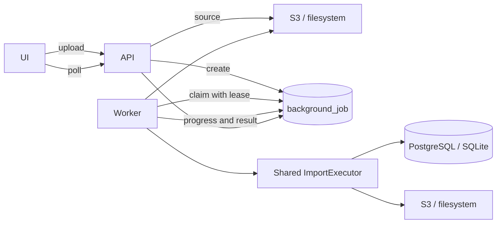
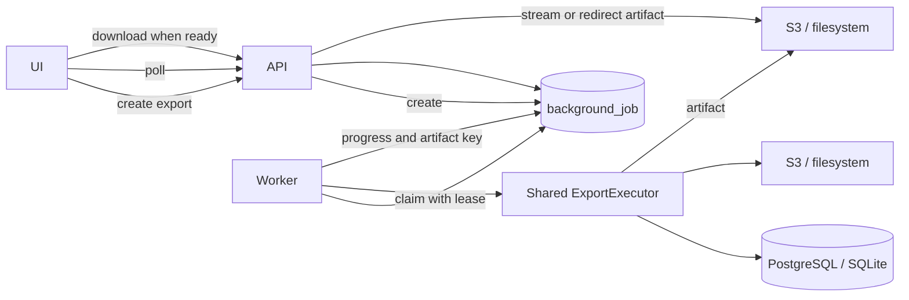

# Technical Architecture

> Part of the [OxidGene Specifications](index.md).
> See also: [Data Model](data-model.md) · [API Contract](api.md) · [Roadmap](roadmap.md)

---

## 1. Technology Stack

| Layer | Technology | Version | Notes |
|---|---|---|---|
| Language | Rust | stable | Single language across the entire stack |
| Frontend | Dioxus | 0.7+ | Web (WASM) + Desktop from single codebase |
| Desktop shell | Wry (WebView) | via Dioxus | System WebView, small binary size |
| Backend framework | Axum | 0.8+ | Tokio-based, tower middleware |
| GraphQL | async-graphql | 7.2+ | With async-graphql-axum integration |
| ORM | SeaORM | 2.0+ | Async, supports PostgreSQL + SQLite |
| Web database | PostgreSQL | 16+ | Production web deployment |
| Desktop database | SQLite | 3.35+ | Embedded in desktop binary |
| GEDCOM | ged_io | 0.16+ | Read/write, GEDCOM 5.5.1 + 7.0, streaming |
| GeneWeb `.gw` | [geneweb](https://github.com/trois-six/rust-geneweb) | 0.1+ | Read only, incl. `gwplus`; converts to the same `ged_io` model, so one domain mapping serves both formats |
| Read projections | Same database | — | `person_denorm` and `person_search_fts`; no cache tier. See [Data Model §4](data-model.md) |
| Web object storage | S3-compatible | — | Durable media bytes; RustFS in development Compose |
| Session storage | Redis | 8+ | Infrastructure provisioned for EPIC G; not used before authentication exists |
| Build orchestration | just | latest | Unified justfile for all tasks |

---

## 2. Data Model Approach

- **Family-centric** model (classic GEDCOM style): Persons exist independently; Families link spouses and children.
- Not person-centric (GEDCOM-X style) — deferred to post-MVP consideration.
- Recursive CTE over the family links (`AncestryRepo`) for ancestor/descendant traversal — no closure table.

For full entity definitions, see [Data Model](data-model.md).

---

## 3. Key Design Decisions

| Decision | Choice | Rationale |
|---|---|---|
| Primary keys | UUID v7 | Time-ordered, no collision across web/desktop, no sequential ID leakage |
| Pagination | Cursor-based (Relay-style) | Handles concurrent modifications, natural fit for GraphQL connections |
| Deletion | Soft delete (`deleted_at`) | Undo capability, audit trail, filtered out by default |
| Desktop architecture | Single binary | Embeds Axum on localhost + SQLite + Dioxus WebView |
| Authentication | Deferred to EPIC G | No auth in MVP; backend access remains local/private and is never directly public |

---

## 4. Backend Architecture

- Rust core crate (`oxidgene-core`) with domain types, shared across all binaries.
- SeaORM entities crate (`oxidgene-db`) with migrations.
- API crate (`oxidgene-api`) with Axum handlers (REST) and async-graphql resolvers.
- GEDCOM crate (`oxidgene-gedcom`) wrapping `ged_io` with domain conversion logic, and `geneweb` for reading GeneWeb `.gw` files — the `.gw` reader emits an `ged_io` model, so both formats share one conversion into the domain.
- Denormalized read projections materialized in the database and maintained by
    `oxidgene-api::profile`. See [Data Model §4](data-model.md).
- Application crates provide the web server, browser frontend, and desktop
    application. There is no CLI.

API endpoints are documented in [API Contract](api.md).

---

## 5. Frontend Architecture

- Dioxus components crate (`oxidgene-ui`).
- Shared between web and desktop targets.
- Communicates with the backend via REST/GraphQL.
- In the browser, `oxidgene-web` compiles the shared UI to WebAssembly and
    injects the separately deployed Axum API URL.
- On desktop: points to `http://127.0.0.1:<port>` served by the embedded Axum server.
- The embedded and standalone servers bind to loopback by default. Before
    authentication and authorization ship, no deployment exposes Axum directly
    to an untrusted network; a container that listens on its private network is
    reachable only through a trusted same-origin gateway.
- The UI fetches backend media through `ApiClient` and gives the rendering
    engine only local `data:`/`blob:` resources. API URLs never become links,
    image sources, redirects, or new-window destinations.
- Geneanet import separates control and data planes: REST/GraphQL carry import
    metadata and local paths, while the login WebView and embedded backend
    exchange media bytes through their shared filesystem. Before returning a
    job id, the backend copies those local inputs into durable `MediaStore`
    objects; no Geneanet media byte payload is uploaded through either API
    surface and no worker depends on WebView-owned temporary files. A runtime
    local-file capability guards both API surfaces, defaults to disabled, and
    is enabled only by the embedded desktop backend; the standalone server
    cannot consume or materialize client-supplied filesystem paths.

UI specifications:
- [Common UI](ui-common.md) — shared layout, tokens, and components
- [Homepage](ui-home.md) — tree dashboard
- [Genealogy Tree](ui-genealogy-tree.md) — pedigree canvas
- [Person Edit Modal](ui-person-edit-modal.md) — edit forms
- [Settings](ui-settings.md) — tree configuration

---

## 6. Asynchronous Processing

- Imports and exports are durable background jobs. The database is the source
    of truth for job state, progress, results, cancellation and worker leases;
    Redis remains reserved for authenticated sessions and is not a job queue.
- The Axum API receives import files into durable staging storage, creates jobs,
    reports their status, and serves or redirects completed export artifacts. It
    never performs parsing, media ingestion, projection rebuilding or archive
    creation on an HTTP request task.
- A long-lived Rust worker claims jobs with expiring leases. PostgreSQL and S3
    permit independent scalable worker pods; SQLite and filesystem storage use
    the same worker code embedded in the single desktop or local backend.
- Import sources and export artifacts use job-scoped object keys. Worker-local
    `emptyDir` files are scratch space only and may be discarded at any time.
- ZIP creation and parsing run as bounded blocking work. Media are copied one at
    a time so memory usage is bounded by an individual file rather than the
    complete archive.
- At most one import or export job is active for a tree. An expired lease makes
    interrupted work claimable again; terminal jobs release the tree and retain
    their result for a bounded period.
- Import database writes and their durable phase transition commit together.
    Once data have committed, recovery resumes projection rebuilding rather than
    inserting the imported records again.
- The UI hides transport orchestration: one action starts a job, progress is
    polled, and a completed export starts a normal browser download with
    `Content-Disposition: attachment`.

### 6.1 Import Job Flow



The API streams an uploaded source to durable storage before creating the job.
For Geneanet, it similarly copies the `.gw`, every selected data archive, and
every gathered medium from the desktop filesystem into job-owned objects before
returning `202` or a GraphQL job id. The worker copies inputs to disposable
scratch space, selects the GEDCOM, GEDZIP, GeneWeb, or Geneanet importer,
persists the result, rebuilds projections, and records a serializable summary
in the job. After the import checkpoint reaches `projections`, recovery rebuilds
projections from the stored result instead of replaying the import. Terminal
Geneanet jobs remove all of their staged input objects.

### 6.2 Export Job Flow



The export executor reads the tree and its media, writes the GEDZIP archive to
disposable scratch space, and uploads the completed artifact. The status
response exposes a same-origin download URL only after the job completes; the
UI then starts the browser download automatically.

GEDZIP compresses the textual `gedcom.ged` entry with Deflate. Media formats
that already carry compression (JPEG, PNG, GIF, WebP, and PDF) are stored
without recompression; raw or potentially uncompressed formats such as BMP and
TIFF remain Deflated. This keeps common exports bounded by I/O without inflating
raw scans.

---

## 7. Build & Testing

- Unified `justfile` for build, test, lint, format, migration, and deployment tasks.
- `just dev-web` runs the Axum backend and Dioxus browser frontend together;
    the frontend hot-reloads. All repository Dioxus commands use the credential-
    filtering `scripts/dx.sh` launcher because the CLI persists its rustc
    environment in local replay artifacts. `just dev-web-watch` also restarts
    the backend via `cargo-watch`. PostgreSQL can be started separately with
    `just dev-db-up`.
- Unit and integration tests across the workspace. End-to-end UI coverage is a
    remaining quality goal where the roadmap names it.
- CI/CD pipelines (GitHub Actions).

---

## 8. Deployment

### 8.1 Web Deployment

- The host development workflow runs the backend on port 8080 and the Dioxus
    frontend on port 8081, with PostgreSQL optionally provided by Docker Compose.
- The standalone server selects durable media storage with
    `OXIDGENE_MEDIA_BACKEND`: `filesystem` is the local default and `s3` is used
    by the development Compose stack and stateless web deployments. PostgreSQL
    stores application data and S3 stores media bytes, so the web pod requires no
    persistent volume.
- Large GEDCOM, GEDZIP, and GeneWeb uploads are staged in the selected durable
    object store before their job is queued. Workers copy sources to their
    system temporary directory while processing; those local files are deleted
    after the attempt and swept at startup. Media extracted from GEDZIP and
    completed export artifacts are persisted through the selected `MediaStore`.
- Development Compose provisions the static frontend, Axum, PostgreSQL,
    RustFS, Redis, and an OpenTelemetry Collector and publishes their ports on
    host loopback only. Redis is
    reserved for EPIC G user sessions and is not a read-projection cache.
    Direct public backend deployment is blocked until EPIC G authentication and
    per-tree authorization are enforced across every transport and media read.
- The Helm chart keeps the OxidGene frontend and backend PVC-free. For the
    database, it either consumes an existing PostgreSQL URL, creates a
    CloudNativePG `Cluster`, or uses ephemeral SQLite in the backend pod; the
    official CloudNativePG operator subchart is optional so an administrator can
    retain a separate cluster-wide operator lifecycle. Redis can remain disabled,
    use an external service, or be provisioned as a persistent Redis 8 instance
    through an optional OpsTree Redis Operator subchart; its URL is reserved for
    EPIC G sessions. For media, the chart either uses an ephemeral backend-local
    filesystem, consumes an existing S3-compatible bucket, or creates a RustFS
    `Tenant`, bucket, policy, and application user through RustFS Operator 0.0.6+.
    The local SQLite and filesystem modes force a single backend replica and lose
    their data when its pod is recreated. The RustFS operator is installed
    separately because its CRDs and cluster-wide RBAC have an independent
    lifecycle. Only operator-managed infrastructure owns persistent volumes.
- Native runtimes export OTLP logs, traces, and metrics when
    `OTEL_EXPORTER_OTLP_ENDPOINT` is configured. The Helm chart connects the
    backend and worker to a cluster-managed collector; it does not prescribe or
    operate a telemetry storage backend.
- Browser builds can export client spans over OTLP/HTTP and inject W3C Trace
    Context into REST and GraphQL requests. The API continues the context into
    SeaORM operations and stores it with durable jobs; workers restore it before
    execution. Browser export is a build-time choice because frontend pods serve
    static WASM assets.
- Request tracing is attached to each final Axum router, after REST and GraphQL
    routers are merged. GraphQL execution and non-introspection resolvers add
    nested spans, while service workflows and SeaORM operations provide the
    internal call boundaries. Durable jobs restore the originating context in a
    consumer span before their service and database work begins.

#### Kubernetes architecture

```mermaid
flowchart TB
    user[Browser]

    subgraph app[OxidGene application workloads]
        ingress[Ingress]
        frontendService[Frontend Service]
        frontendPods[Frontend pods<br/>Dioxus static application]
        backendService[Backend Service]
        backendPods[Backend pods<br/>Axum REST and GraphQL<br/>job control plane]
        workerPods[Worker pods<br/>imports and exports]
        scratch[Worker scratch files<br/>emptyDir]
        sqlite[SQLite<br/>emptyDir, disabled mode]
        localMedia[Media filesystem<br/>emptyDir, disabled mode]

        ingress -->|/| frontendService --> frontendPods
        ingress -->|/api, /graphql, /healthz| backendService --> backendPods
        workerPods --> scratch
        backendPods -->|embedded worker<br/>database.mode disabled| sqlite
        backendPods -->|embedded worker<br/>s3.mode disabled| localMedia
    end

    subgraph durable[Durable data services]
        externalPostgres[Existing PostgreSQL]
        cnpgCluster[CloudNativePG Cluster]
        externalS3[Existing S3-compatible bucket]
        rustfsTenant[RustFS Tenant]
        externalRedis[Existing Redis]
        managedRedis[Operator-managed Redis]
        databasePvc[(PostgreSQL PVCs)]
        rustfsPvc[(RustFS PVCs)]
        redisPvc[(Redis PVC)]

        cnpgCluster --> databasePvc
        rustfsTenant --> rustfsPvc
        managedRedis --> redisPvc
    end

    subgraph control[Optional cluster operators]
        cnpgOperator[CloudNativePG Operator<br/>optional chart dependency]
        redisOperator[OpsTree Redis Operator<br/>optional chart dependency]
        rustfsOperator[RustFS Operator<br/>installed separately]
    end

    user --> ingress
    backendPods -->|requests, jobs and status<br/>database.mode existing| externalPostgres
    backendPods -->|requests, jobs and status<br/>database.mode cloudnativepg| cnpgCluster
    workerPods -->|claim, lease and progress| externalPostgres
    workerPods -->|claim, lease and progress| cnpgCluster
    backendPods -->|import sources and export downloads<br/>s3.mode existing| externalS3
    backendPods -->|import sources and export downloads<br/>s3.mode rustfs| rustfsTenant
    workerPods -->|sources, media and artifacts| externalS3
    workerPods -->|sources, media and artifacts| rustfsTenant
    backendPods -.->|redis.mode existing<br/>reserved for future sessions| externalRedis
    backendPods -.->|redis.mode operator<br/>reserved for future sessions| managedRedis
    cnpgOperator -. reconciles .-> cnpgCluster
    redisOperator -. reconciles .-> managedRedis
    rustfsOperator -. reconciles .-> rustfsTenant

    classDef ephemeral fill:#fff4cc,stroke:#9a6700,color:#3d2d00;
    classDef durable fill:#eaf5ed,stroke:#287a3d,color:#173d21;
    classDef operator fill:#eaf1fb,stroke:#3465a4,color:#17365d;
    class sqlite,localMedia,scratch ephemeral;
    class externalPostgres,cnpgCluster,externalS3,rustfsTenant,externalRedis,managedRedis,databasePvc,rustfsPvc,redisPvc durable;
    class cnpgOperator,redisOperator,rustfsOperator operator;
```



The independent worker deployment is enabled only when PostgreSQL and S3 are
both durable and shared. The SQLite and local-media paths are mutually
selectable alternatives, not additional replicas of those services. Selecting
either local path embeds one worker in the backend, forces one backend replica,
disables autoscaling, and loses that path's data whenever the pod is recreated.
Redis links are dashed because the chart can provision their infrastructure,
but authenticated session storage is not implemented yet.

- The release images, development Compose stack, and Kubernetes deliverables
    are tracked in [Roadmap §5](roadmap.md).

### 8.2 Desktop Distribution

- Single binary per platform (Windows, Linux, macOS).
- Built via `cargo build --release` with appropriate target.
- No external runtime dependencies (SQLite embedded, WebView from system).
- Offline place databases, when installed, live in the application data
    directory and are managed from [Settings](ui-settings.md). See
    [Common UI §4.4](ui-common.md).
- Release artifacts and their platform verification are tracked in
    [Roadmap §5](roadmap.md).

---

## 9. Project Structure

### 9.1 Cargo Workspace Layout

```
oxidgene/
├── Cargo.toml              # Workspace root
├── justfile                # Build orchestration
├── README.md               # Global README
├── docs/
│   ├── specifications/     # This directory
│   └── assets/             # Logos in other assets
├── crates/
│   ├── oxidgene-core/      # Domain types, enums, error types
│   ├── oxidgene-db/        # SeaORM entities + migrations
│   ├── oxidgene-api/       # Axum handlers + GraphQL resolvers
│   ├── oxidgene-gedcom/    # GEDCOM import/export + GeneWeb .gw import
│   ├── oxidgene-geneanet/  # Geneanet person↔photo recovery (join, key, archives)
│   └── oxidgene-ui/        # Dioxus components (shared web/desktop)
├── apps/
│   ├── oxidgene-server/    # Web backend binary
│   ├── oxidgene-worker/    # Web background-job worker
│   ├── oxidgene-web/       # Browser frontend (Dioxus/WASM)
│   ├── oxidgene-desktop/   # Desktop binary (Axum + SQLite + Dioxus WebView)
└── docker/                 # Docker files
```

### 9.2 Crate Dependency Graph

```
oxidgene-core (no internal deps)
    ↑
oxidgene-db (depends on: oxidgene-core)
    ↑
oxidgene-gedcom (depends on: oxidgene-core)
oxidgene-geneanet (no internal deps)
    ↑
oxidgene-api (depends on: oxidgene-core, oxidgene-db, oxidgene-gedcom, oxidgene-geneanet)
    ↑
oxidgene-server (depends on: oxidgene-api, oxidgene-db)
oxidgene-worker (depends on: oxidgene-api, oxidgene-db)
oxidgene-web (depends on: oxidgene-ui)
oxidgene-desktop (depends on: oxidgene-api, oxidgene-db, oxidgene-ui, oxidgene-geneanet)

oxidgene-ui (depends on: oxidgene-core)
```

**`oxidgene-ui` stays platform-free.** It is compiled for wasm as well as for
the desktop, so it depends on neither `dioxus-desktop` nor `oxidgene-geneanet`.
Where it needs something only the desktop can do — the
[Geneanet login window](ui-import.md) — it declares a trait
(`oxidgene_ui::geneanet::GeneanetCollector`) that `oxidgene-desktop` implements
and injects as context. The web build simply finds none and renders the
explanation instead of the control.

The workspace keeps libraries under `crates/` and application entry points
under `apps/`. A former CLI was removed after its workflows moved into the
desktop application. The initial migration holds the baseline schema; every
subsequent schema change adds a migration and existing migrations are not
squashed.
