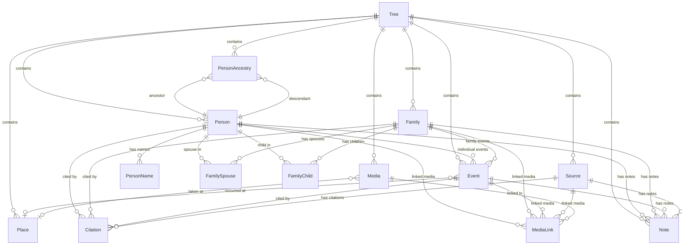

# Data Model

> Part of the [OxidGene Specifications](README.md).
> See also: [Architecture](architecture.md) · [API Contract](api.md)

---

## 1. Entities

### Tree

| Column | Type | Notes |
|---|---|---|
| `id` | UUID v7 | PK |
| `name` | String | Required |
| `description` | String? | Optional |
| `created_at` | DateTime | Auto |
| `updated_at` | DateTime | Auto |
| `deleted_at` | DateTime? | Soft delete |

Displayed in: [Homepage](ui-home.md) (tree cards) · [Settings](ui-settings.md) (tree & roots section)

### Person

| Column | Type | Notes |
|---|---|---|
| `id` | UUID v7 | PK |
| `tree_id` | UUID v7 | FK → Tree |
| `sex` | Sex | Enum |
| `created_at` | DateTime | Auto |
| `updated_at` | DateTime | Auto |
| `deleted_at` | DateTime? | Soft delete |

Displayed in: [Tree View](ui-genealogy-tree.md) (person cards) · [Person Edit Modal](ui-person-edit-modal.md) (edit form)

### PersonName

| Column | Type | Notes |
|---|---|---|
| `id` | UUID v7 | PK |
| `person_id` | UUID v7 | FK → Person |
| `name_type` | NameType | Enum |
| `given_names` | String? | |
| `surname` | String? | |
| `prefix` | String? | |
| `suffix` | String? | |
| `nickname` | String? | |
| `is_primary` | bool | Default true |
| `created_at` | DateTime | Auto |
| `updated_at` | DateTime | Auto |

### Family

| Column | Type | Notes |
|---|---|---|
| `id` | UUID v7 | PK |
| `tree_id` | UUID v7 | FK → Tree |
| `created_at` | DateTime | Auto |
| `updated_at` | DateTime | Auto |
| `deleted_at` | DateTime? | Soft delete |

Displayed in: [Tree View](ui-genealogy-tree.md) (connectors) · [Person Edit Modal](ui-person-edit-modal.md) (couple edit)

### FamilySpouse

| Column | Type | Notes |
|---|---|---|
| `id` | UUID v7 | PK |
| `family_id` | UUID v7 | FK → Family |
| `person_id` | UUID v7 | FK → Person |
| `role` | SpouseRole | Enum |
| `sort_order` | i32 | For ordering |

### FamilyChild

| Column | Type | Notes |
|---|---|---|
| `id` | UUID v7 | PK |
| `family_id` | UUID v7 | FK → Family |
| `person_id` | UUID v7 | FK → Person |
| `child_type` | ChildType | Enum |
| `sort_order` | i32 | For ordering |

### Event

| Column | Type | Notes |
|---|---|---|
| `id` | UUID v7 | PK |
| `tree_id` | UUID v7 | FK → Tree |
| `event_type` | EventType | Enum |
| `date_value` | String? | GEDCOM date phrase (free text) |
| `date_sort` | Date? | Normalized date for sorting |
| `place_id` | UUID v7? | FK → Place |
| `person_id` | UUID v7? | FK → Person (individual event) |
| `family_id` | UUID v7? | FK → Family (family event) |
| `description` | String? | Free text; also holds occupation title for `Occupation` events |
| `cause` | String? | Cause of event (GEDCOM `CAUS`), e.g. cause of death |
| `created_at` | DateTime | Auto |
| `updated_at` | DateTime | Auto |
| `deleted_at` | DateTime? | Soft delete |

Displayed in: [Tree View](ui-genealogy-tree.md) (events sidebar) · [Person Edit Modal](ui-person-edit-modal.md) (event blocks)

### Place

| Column | Type | Notes |
|---|---|---|
| `id` | UUID v7 | PK |
| `tree_id` | UUID v7 | FK → Tree |
| `name` | String | Required — single free-text string (e.g. "Beaune, 21200, Côte-d'Or, Bourgogne-Franche-Comté, France") |
| `latitude` | f64? | Filled when selected from offline database or geocoding |
| `longitude` | f64? | Filled when selected from offline database or geocoding |
| `created_at` | DateTime | Auto |
| `updated_at` | DateTime | Auto |

The `name` is a single string. The recommended format is comma-separated from most specific to least specific (see [PlaceInput](ui-shared-components.md) §5), but any text is valid.

### Source

| Column | Type | Notes |
|---|---|---|
| `id` | UUID v7 | PK |
| `tree_id` | UUID v7 | FK → Tree |
| `title` | String | Required |
| `author` | String? | |
| `publisher` | String? | |
| `abbreviation` | String? | |
| `repository_name` | String? | |
| `created_at` | DateTime | Auto |
| `updated_at` | DateTime | Auto |
| `deleted_at` | DateTime? | Soft delete |

### Citation

| Column | Type | Notes |
|---|---|---|
| `id` | UUID v7 | PK |
| `source_id` | UUID v7 | FK → Source |
| `person_id` | UUID v7? | FK → Person |
| `event_id` | UUID v7? | FK → Event |
| `family_id` | UUID v7? | FK → Family |
| `page` | String? | Where in the source |
| `confidence` | Confidence | Enum |
| `text` | String? | Extracted text |
| `created_at` | DateTime | Auto |
| `updated_at` | DateTime | Auto |

### Media

| Column | Type | Notes |
|---|---|---|
| `id` | UUID v7 | PK |
| `tree_id` | UUID v7 | FK → Tree |
| `file_name` | String | Original filename |
| `mime_type` | String | MIME type |
| `file_path` | String | Storage path |
| `file_size` | i64 | Bytes |
| `title` | String? | |
| `description` | String? | |
| `date_value` | String? | Date of the media (GEDCOM date phrase, same format as Event) |
| `place_id` | UUID v7? | FK → Place — where the media was created/taken |
| `created_at` | DateTime | Auto |
| `updated_at` | DateTime | Auto |
| `deleted_at` | DateTime? | Soft delete |

Displayed in: [Person Edit Modal](ui-person-edit-modal.md) (media section)

### MediaLink

| Column | Type | Notes |
|---|---|---|
| `id` | UUID v7 | PK |
| `media_id` | UUID v7 | FK → Media |
| `person_id` | UUID v7? | FK → Person |
| `event_id` | UUID v7? | FK → Event |
| `source_id` | UUID v7? | FK → Source |
| `family_id` | UUID v7? | FK → Family |
| `sort_order` | i32 | For ordering |

### Note

| Column | Type | Notes |
|---|---|---|
| `id` | UUID v7 | PK |
| `tree_id` | UUID v7 | FK → Tree |
| `text` | String | Required |
| `person_id` | UUID v7? | FK → Person |
| `event_id` | UUID v7? | FK → Event |
| `family_id` | UUID v7? | FK → Family |
| `source_id` | UUID v7? | FK → Source |
| `created_at` | DateTime | Auto |
| `updated_at` | DateTime | Auto |
| `deleted_at` | DateTime? | Soft delete |

### PersonAncestry (Closure Table)

| Column | Type | Notes |
|---|---|---|
| `id` | UUID v7 | PK |
| `tree_id` | UUID v7 | FK → Tree |
| `ancestor_id` | UUID v7 | FK → Person |
| `descendant_id` | UUID v7 | FK → Person |
| `depth` | i32 | Generation distance (0 = self) |

Used by: ancestor/descendant [API endpoints](api.md) · [Settings](ui-settings.md) (missing ancestors tool)

---

## 2. Enums

```rust
enum Sex {
    Male,
    Female,
    Unknown,
}

enum NameType {
    Birth,
    Married,
    Aka,
    Maiden,
    Religious,
    Immigrant,
    Professional,
    Other,
}

enum SpouseRole {
    Husband,
    Wife,
    Partner,
}

enum ChildType {
    Birth,
    Adopted,
    Foster
    Unknown,
}

// GEDCOM tag mapping is shown for types supported by ged_io 0.12.
// Types without a GEDCOM tag export as EVEN with a TYPE subrecord.
enum EventType {
    // Individual events (GEDCOM tag → ged_io variant)
    Birth,          // BIRT → GedEvent::Birth
    Death,          // DEAT → GedEvent::Death
    Baptism,        // BAPM → GedEvent::Baptism
    Burial,         // BURI → GedEvent::Burial
    Cremation,      // CREM → GedEvent::Cremation
    Graduation,     // GRAD → GedEvent::Graduation
    Immigration,    // IMMI → GedEvent::Immigration
    Emigration,     // EMIG → GedEvent::Emigration
    Naturalization, // NATU → GedEvent::Naturalization
    Census,         // CENS → GedEvent::Census
    Occupation,     // OCCU → GedEvent::Occupation (description holds the title)
    Residence,      // RESI → GedEvent::Residence
    Retired,        // RETI → GedEvent::Retired
    Will,           // WILL → GedEvent::Will
    Probate,        // PROB → GedEvent::Probate
    // Family events
    Marriage,           // MARR → GedEvent::Marriage
    Divorce,            // DIV  → GedEvent::Divorce
    Annulment,          // ANUL → GedEvent::Annulment
    Engagement,         // ENGA → GedEvent::Engagement
    MarriageBann,       // MARB → GedEvent::MarriageBann
    MarriageContract,   // MARC → GedEvent::MarriageContract
    MarriageLicense,    // MARL → GedEvent::MarriageLicense
    MarriageSettlement, // MARS → GedEvent::MarriageSettlement
    // Generic (no native GEDCOM tag — exports as EVEN + TYPE)
    Other,
}

// Maps to GEDCOM QUAY (Certainty Assessment) via ged_io
enum Confidence {
    VeryLow,  // ged_io: Unreliable (QUAY 0)
    Low,      // ged_io: Questionable (QUAY 1)
    Medium,   // ged_io: Secondary (QUAY 2)
    High,     // ged_io: Direct (QUAY 3)
}
```

---

## 3. Entity Relationship Diagram (Mermaid)


