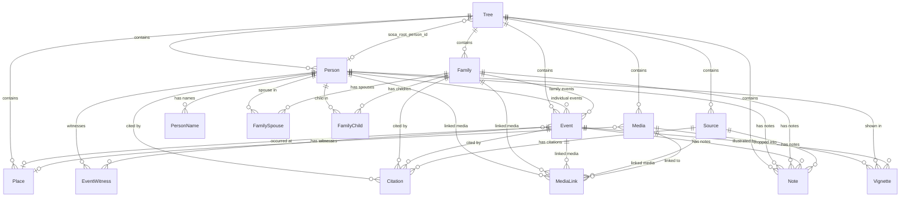

# Data Model

> Part of the [OxidGene Specifications](index.md).
> See also: [Architecture](architecture.md) · [API Contract](api.md)

Source of truth in code: `crates/oxidgene-core/src/types/` (domain structs), `crates/oxidgene-core/src/enums.rs` (enums), `crates/oxidgene-db/src/entities/` (SeaORM entities), `crates/oxidgene-db/src/migration/` (`m20250101_000001_initial.rs` is the consolidated base schema; later `mYYYYMMDD_*` files add to it).

---

## 1. Entities

### Tree

| Column | Type | Notes |
|---|---|---|
| `id` | UUID v7 | PK |
| `name` | String | Required |
| `description` | String? | Optional |
| `default_privacy` | TreeDefaultPrivacy | Stored tree-wide intent (`Private` by default); not enforced in the current MVP |
| `sosa_root_person_id` | UUID v7? | FK → Person — SOSA 1 root for Sosa-Stradonitz numbering, set in [Settings](ui-settings.md) §7 |
| `self_person_id` | UUID v7? | FK → Person — person representing the current user, used only for the blue pedigree badge, set in [Settings](ui-settings.md) §7 |
| `created_at` | DateTime | Creation time. Native OxidGene records use the current time; a Geneanet import preserves the deposit's `date_create` when it is valid |
| `updated_at` | DateTime | Auto |
| `deleted_at` | DateTime? | Soft delete |

Displayed in: [Homepage](ui-home.md) (tree cards) · [Settings](ui-settings.md) (tree & roots section)

### Person

| Column | Type | Notes |
|---|---|---|
| `id` | UUID v7 | PK |
| `tree_id` | UUID v7 | FK → Tree |
| `sex` | Sex | Enum |
| `privacy` | Privacy | Enum — per-person privacy override (default `Default`) |
| `created_at` | DateTime | Auto |
| `updated_at` | DateTime | Auto |
| `deleted_at` | DateTime? | Soft delete |

Displayed in: [Tree View](ui-genealogy-tree.md) (person cards) · [Person Edit Modal](ui-person-edit-modal.md) (edit form)

### PersonName

| Column | Type | Notes |
|---|---|---|
| `id` | UUID v7 | PK |
| `person_id` | UUID v7 | FK → Person |
| `name_type` | NameType | Enum |
| `given_names` | String? | GEDCOM `GIVN`. Multiple given names stay in one string (`<given name 1> <given name 2>`) rather than becoming separate names |
| `surname` | String? | GEDCOM `SURN` — the surname **root**, particle excluded ("Cruz") |
| `surname_prefix` | String? | GEDCOM `SPFX` — the surname particle ("de la", "van der") |
| `prefix` | String? | GEDCOM `NPFX` — title of address ("Dr.", "Rév. Père") |
| `suffix` | String? | GEDCOM `NSFX` — generational ordinal or epithet ("Jr.", "III") |
| `nickname` | String? | GEDCOM `NICK` |
| `is_primary` | bool | Default true |
| `sort_order` | i32 | Display order among a person's secondary names; the primary name always comes first |
| `created_at` | DateTime | Auto |
| `updated_at` | DateTime | Auto |

**One row = one complete name the person bore**, not one name *piece*. The pieces
only mean anything relative to each other, which is why a birth name and a
married name are two rows rather than shared columns: splitting `given_names`
into its own table would lose which given names go with which surname.

**Particles are derived, not typed.** The UI keeps a single "surname" field and
calls `oxidgene_core::types::split_surname_particle` on save, showing the
detected split with a **Modifier** button beside it. Detection is a guess over a
fixed word list, so the override is part of the contract, not a nicety: someone
actually surnamed "Le", or a "Da Silva" that should file under D, clears the
particle to opt out, and an unusual particle can be declared by hand. The
override can only *cut* the single field, never add to it (`split_surname_at_head`):
the field's text is the complete surname, so a particle absent from it is
reported rather than applied — accepting it would inject a word the user never
typed, and clearing the particle afterwards could not remove it. GEDCOM import
uses the looser `split_surname_with`, since a file may legitimately state
`2 SPFX de la` beside a bare `2 SURN Cruz`. A stored particle that
detection disagrees with pins the override on load, so saving an unrelated field
never silently re-splits it. The per-name editor, already a multi-field form,
exposes `surname_prefix` as its own input instead. GEDCOM/GeneWeb import does the
same when the file carries no `SPFX`. Display always rejoins the two parts
(`PersonName::full_surname`), so a name entered as "de la Cruz" still reads
"de la Cruz" — only *filing* changes. Whether the particle counts when sorting is
a per-viewer preference (`/app-settings` → Noms), defaulting to "included".

### Family

| Column | Type | Notes |
|---|---|---|
| `id` | UUID v7 | PK |
| `tree_id` | UUID v7 | FK → Tree |
| `privacy` | Privacy | Per-family privacy intent (default `Default`); not enforced in the current MVP |
| `created_at` | DateTime | Auto |
| `updated_at` | DateTime | Auto |
| `deleted_at` | DateTime? | Soft delete |

Displayed in: [Tree View](ui-genealogy-tree.md) (connectors) · [Person Edit Modal](ui-person-edit-modal.md) (couple edit)

### FamilySpouse

| Column | Type | Notes |
|---|---|---|
| `id` | UUID v7 | PK |
| `family_id` | UUID v7 | FK → Family |
| `person_id` | UUID v7 | FK → Person |
| `role` | SpouseRole | Enum |
| `sort_order` | i32 | For ordering |

### FamilyChild

| Column | Type | Notes |
|---|---|---|
| `id` | UUID v7 | PK |
| `family_id` | UUID v7 | FK → Family |
| `person_id` | UUID v7 | FK → Person |
| `child_type` | ChildType | Enum |
| `sort_order` | i32 | For ordering |

### Event

| Column | Type | Notes |
|---|---|---|
| `id` | UUID v7 | PK |
| `tree_id` | UUID v7 | FK → Tree |
| `event_type` | EventType | Enum |
| `date_value` | String? | GEDCOM date phrase (free text, e.g. "ABT 1842") |
| `date_sort` | Date? | Normalized date for sorting |
| `date_qualifier` | DateQualifier | Enum — precision/shape of the date (default `Exact`) |
| `date_value2` | String? | Second date, used by the `Or` and `Between` qualifiers |
| `calendar` | Calendar | Enum — calendar system the date was recorded in (default `Gregorian`) |
| `cause` | String? | Cause of event (GEDCOM `CAUS`), e.g. cause of death |
| `place_id` | UUID v7? | FK → Place |
| `person_id` | UUID v7? | FK → Person (individual event) — never set together with `family_id` |
| `family_id` | UUID v7? | FK → Family (family event) — never set together with `person_id` |
| `description` | String? | Free text; also holds occupation title for `Occupation` events |
| `created_at` | DateTime | Auto |
| `updated_at` | DateTime | Auto |
| `deleted_at` | DateTime? | Soft delete |

`Event::year()` / `oxidgene_core::types::year_from_date` provide the shared display-year logic (prefer `date_sort`, fall back to the first 4-digit token of `date_value`) used by pedigree cards, the person narrative, dictionary usage lists, and search results.

Displayed in: [Tree View](ui-genealogy-tree.md) (events sidebar) · [Person Edit Modal](ui-person-edit-modal.md) (event blocks)

### EventWitness

Join table mirroring GEDCOM's `ASSO`/`RELA` associations — a witness, godparent, or other role-holder linked to an event as a real `Person` in the tree.

| Column | Type | Notes |
|---|---|---|
| `id` | UUID v7 | PK |
| `event_id` | UUID v7 | FK → Event |
| `person_id` | UUID v7 | FK → Person |
| `relation` | String? | Free text (e.g. "Godmother", "Witness") |
| `sort_order` | i32 | For ordering |

Exposed via `GET/POST /events/{id}/witnesses` (REST) and `addEventWitness`/`removeEventWitness` (GraphQL). Round-trips through GEDCOM import/export as a top-level `ASSO` on the INDI record (see [API Contract](api.md) §3).

### Place

| Column | Type | Notes |
|---|---|---|
| `id` | UUID v7 | PK |
| `tree_id` | UUID v7 | FK → Tree |
| `name` | String | Required single free-text hierarchy, for example `<locality>, <postal code>, <region>, <country>` |
| `latitude` | f64? | Filled when selected from offline database or geocoding |
| `longitude` | f64? | Filled when selected from offline database or geocoding |
| `created_at` | DateTime | Auto |
| `updated_at` | DateTime | Auto |

The `name` is a single string. The recommended format is comma-separated from
most specific to least specific (see [Common UI §4.4](ui-common.md)), but any
text is valid.

### Source

| Column | Type | Notes |
|---|---|---|
| `id` | UUID v7 | PK |
| `tree_id` | UUID v7 | FK → Tree |
| `title` | String | Required |
| `author` | String? | |
| `publisher` | String? | |
| `abbreviation` | String? | |
| `repository_name` | String? | |
| `created_at` | DateTime | Auto |
| `updated_at` | DateTime | Auto |
| `deleted_at` | DateTime? | Soft delete |

### Citation

| Column | Type | Notes |
|---|---|---|
| `id` | UUID v7 | PK |
| `source_id` | UUID v7 | FK → Source |
| `person_id` | UUID v7? | FK → Person |
| `event_id` | UUID v7? | FK → Event |
| `family_id` | UUID v7? | FK → Family |
| `page` | String? | Where in the source |
| `confidence` | Confidence | Enum |
| `text` | String? | Extracted text |
| `created_at` | DateTime | Auto |
| `updated_at` | DateTime | Auto |

### Media

| Column | Type | Notes |
|---|---|---|
| `id` | UUID v7 | PK |
| `tree_id` | UUID v7 | FK → Tree |
| `file_name` | String | Original filename |
| `mime_type` | String | MIME type, decided from the file's magic bytes at upload |
| `file_path` | String | GEDCOM `OBJE.FILE` value — the producer's own path, kept verbatim so an export round-trips. Not where our copy lives |
| `storage_key` | String? | Key of the stored bytes in the media store. Null for a record that names a file we have never received — every GEDCOM import starts that way |
| `sha256` | String? | Hex SHA-256 of the stored bytes. Doubles as the HTTP `ETag` and as the deduplication key |
| `thumbnail_key` | String? | Key of the generated thumbnail. Null for PDFs and for byte-less records |
| `width` | i32? | Intrinsic pixel width, after applying any EXIF orientation |
| `height` | i32? | Intrinsic pixel height |
| `page_count` | i32 | Pages in the document; `1` for photos and single-page files |
| `file_size` | i64 | Bytes |
| `title` | String? | |
| `description` | String? | |
| `date_value` | String? | Date of the media (GEDCOM date phrase, same format as Event) |
| `date_sort` | Date? | Normalized date for sorting |
| `source_media_type` | Enum | What the medium physically is — GEDCOM's `SOURCE_MEDIA_TYPE`. Default `other` |
| `document_category` | Enum? | What kind of *record* it is. Null when unclassified |
| `tags` | String[] | Free-form labels. On a multi-page document, they belong to the document, not its pages |
| `place_id` | UUID v7? | FK → Place — where the media was created/taken |
| `created_at` | DateTime | Auto |
| `updated_at` | DateTime | Auto |
| `deleted_at` | DateTime? | Soft delete |

Displayed in: [Person Edit Modal](ui-person-edit-modal.md) (media section)

**Why two type columns.** GEDCOM has a field for this and its vocabulary is
fixed: `OBJE.FILE.FORM.TYPE` in 5.5.1, `FORM.MEDI` in 7.0, enumerating `PHOTO`,
`MANUSCRIPT`, `TOMBSTONE`, `FICHE`, `FILM`, `MAP`, `NEWSPAPER`, `BOOK`, `CARD`,
`MAGAZINE`, `AUDIO`, `VIDEO`, `ELECTRONIC`, `OTHER`. Supporting it exactly is
what makes an export readable by other genealogy software, so `SourceMediaType`
is GEDCOM's list and nothing else is ever written there.

But that vocabulary describes the *carrier*, not the record. A census return, a
marriage contract and a conscription register are all `MANUSCRIPT` to GEDCOM,
and to a genealogist they are three different things — the distinction
Geneanet's own media types draw. `DocumentCategory` holds it: `portrait`,
`group_photo`, `family_document`, `civil_record`, `parish_record`,
`notarial_archive`, `military_archive`, `census`, `coat_of_arms`, `grave`,
`other`. It is nullable because a photograph somebody uploaded needs no
classification.

Each category knows the medium it implies, so choosing only a category still
produces a correct export — a census return exports as `MANUSCRIPT`, not
`OTHER`. Where both are set explicitly, the stored medium wins: the user
answered GEDCOM's question directly and that answer is not ours to discard.

`source_media_type` defaults to `other` rather than to `photo`: the table holds
scans and PDFs as readily as photographs, and a default that guessed would
mislabel every existing row instead of admitting it does not know.

**Tags.** `tags` is an ordered list of free-form labels for grouping scans and
documents, materialized from `media_tag` rows. Its compound key
`(media_id, normalized_tag)` makes concurrent additions idempotent, while a
single row deletion cannot overwrite another editor's tags. Values are trimmed
and de-duplicated case-insensitively. A multi-page document owns one list; its
page rows do not copy it, so every page always presents the document's same
labels.

**Storage.** Files live on the filesystem, content-addressed under
`{tree_id}/{aa}/{bb}/{sha256}.{ext}` beneath `OXIDGENE_MEDIA_ROOT` (default: the
platform user-data directory). Uploading the same scan twice writes one file and
two rows — what a census page documenting eight siblings needs. Keys are scoped
per tree rather than globally: deduplication stops at the tree boundary, which is
the price of purging a tree by removing one directory, with no reference counting.

**Privacy.** `Person`, `Family` and `Media` each carry a `privacy` enum
(`default` / `public` / `private`), defaulting to `default` — follow the tree's
own setting. A couple needs its own: a living pair's marriage is a fact about
two living people, and withholding both their person records does not withhold
the union that names them. A document needs one for the same reason a photograph
of living children does.

`Default` means "follow the tree", and the tree says which: `tree.default_privacy`
is `public` | `private`, defaulting to **private**. It is deliberately *not* a
`Privacy` — that enum's own `Default` variant would make a tree follow itself —
so it has two variants and the circular state cannot be written down.
`TreeDefaultPrivacy::resolve(privacy)` is the one place the pair is combined: a
record saying `Default` takes the tree's answer, and `Public` / `Private` on the
record override it.

The default default withholds. A genealogy holds living people, and a tree
nobody has classified has not been cleared for publication, so the value that
applies before anyone has thought about it is the one that hides. Publishing is
the deliberate act.

**Nothing enforces it yet.** Privacy is meaningful only against a viewer, and
there are no viewers until authentication lands. What the column buys now is
that the *intent* is recorded: a user classifying their tree today does not have
to do it again later, and enforcement becomes a read-path change rather than a
schema change plus a data-entry campaign. Every picker that sets it says so.

### Vignette

A rectangular region of a media file, kept as coordinates rather than as a second
copy of the pixels. One parish-register page routinely documents several unrelated
families; each entry is a vignette on the single stored scan, so a better scan can
replace it without orphaning anything, and the crop is still served as if it were
its own image.

| Column | Type | Notes |
|---|---|---|
| `id` | UUID v7 | PK |
| `media_id` | UUID v7 | FK → Media (cascade) |
| `page` | i32 | Zero-based page of a multi-page document; `0` for a photo |
| `x` | i32 | Crop origin, in the source image's own pixel coordinates |
| `y` | i32 | |
| `width` | i32 | |
| `height` | i32 | |
| `person_id` | UUID v7? | FK → Person — who the region shows, if attributed |
| `event_id` | UUID v7? | FK → Event — the event this region is evidence for |
| `created_at` | DateTime | Auto |
| `updated_at` | DateTime | Auto |

No soft delete: a vignette is a coordinate annotation, not a record anyone cites,
and a rectangle that does not fit its media is refused at write time — so a stored
vignette always describes a region that exists.

**Which image represents a person.** At most one of `portrait_media_id` /
`portrait_vignette_id` is ever set, and the pair is read and written through a
single `Portrait` value (`Media(id)` / `Vignette(id)` / `None`), so "both set"
is not a state a caller can produce — the API refuses a request carrying both
rather than silently picking one.

It lives here rather than as a flag on `MediaLink` because a person is very
often identified *inside* a larger photograph — a group portrait, a wedding
party — and that region is already a first-class row: a `Vignette`. A second
`is_profile` on `Vignette` would spread the invariant "at most one portrait per
person" across two tables, where it can no longer be established in a single
statement; a pointer on `Person` makes it structural instead of enforced.

Not a foreign key: SQLite cannot add one through `ALTER TABLE`, the same reason
`media.place_id` has none. A dangling pointer resolves to "no portrait" rather
than to an error.

### MediaLink

| Column | Type | Notes |
|---|---|---|
| `id` | UUID v7 | PK |
| `media_id` | UUID v7 | FK → Media |
| `person_id` | UUID v7? | FK → Person |
| `event_id` | UUID v7? | FK → Event |
| `source_id` | UUID v7? | FK → Source |
| `family_id` | UUID v7? | FK → Family |
| `sort_order` | i32 | For ordering |

A link to the parent `Media` row attaches the complete multi-page document. A
link to one of its child `Media` rows attaches that page only. The link needs no
separate page column because a page is already a media in its own right. A
`Vignette` remains page-specific and identifies a rectangular region of its
page media.

### Note

| Column | Type | Notes |
|---|---|---|
| `id` | UUID v7 | PK |
| `tree_id` | UUID v7 | FK → Tree |
| `text` | String | Required |
| `person_id` | UUID v7? | FK → Person |
| `event_id` | UUID v7? | FK → Event |
| `family_id` | UUID v7? | FK → Family |
| `source_id` | UUID v7? | FK → Source |
| `media_id` | UUID v7? | FK → Media — a note about one media record, distinct from `Media.description`, which is the caption under its tile. On a multi-page document, the parent id carries the general document note while a page id carries that page's transcript. |
| `created_at` | DateTime | Auto |
| `updated_at` | DateTime | Auto |
| `deleted_at` | DateTime? | Soft delete |

### Ancestry traversal (no table)

There is no closure table. Ancestor and descendant traversal is a recursive
CTE over `family_child` ⋈ `family_spouse` (`AncestryRepo`): a person's parents
are the spouses of the family in which they are a child. Both back-ends support
`WITH RECURSIVE`. Each reached person is returned once, at their **shortest**
generation distance, as `AncestryLink { person_id, depth }`.

The `person_ancestry` closure table it replaced was dropped in
`m20260803_000001`: on a real 10k-person tree it held 364k rows and, with its
four indexes, 62 % of the whole database, while being ~12x *slower* to read
than the CTE (160 ms against 13 ms for a depth-10 pedigree) and needing a
rebuild on every re-parenting.

Traversal is bounded at 64 generations when no depth is given, because the
schema does not prevent a cycle in the family links.

Used by: ancestor/descendant [API endpoints](api.md) · pedigree assembly (§4) ·
SOSA badge computation ([Person Profile](ui-person-profile.md),
[Dictionary](ui-dictionary.md) §12)

### person_search_fts (Search Table — Sprint E.6)

DB-native person search index; not a domain entity (no UUID PK, maintained by
`PersonSearchRepo`). SQLite uses an FTS5 virtual table and PostgreSQL uses a
plain indexed table. Columns include normalized `surname`, `given_names`,
`maiden_name`, `birth_year`, and `death_year`, plus unindexed display fields.
See §4.3 for maintenance and query behavior.

---

## 2. Enums

Defined in `crates/oxidgene-core/src/enums.rs`; DB string representations in `crates/oxidgene-db/src/entities/sea_enums.rs`.

```rust
enum Sex {
    Male,
    Female,
    Unknown,
}

enum NameType {
    Birth,
    Married,
    AlsoKnownAs,
    Maiden,
    Religious,
    // Refinements of "also known as". GEDCOM's NAME.TYPE enumeration has no
    // equivalent, so all four export as `aka` — the distinction is internal.
    // They exist because the UI lets the user pick between them, and
    // collapsing them onto AlsoKnownAs made the choice unrecoverable.
    GivenName,
    Alias,
    Byname,
    Sobriquet,
    Other,
}

enum SpouseRole {
    Husband,
    Wife,
    Partner,
}

enum ChildType {
    Biological,
    Adopted,
    Foster,
    Step,
    Unknown,
}

/// Per-person privacy override (see ui-person-edit-modal.md §7).
enum Privacy {
    Default,   // Follows the tree-level privacy settings
    Public,    // Always visible regardless of tree settings
    Private,   // Hidden once viewer-aware enforcement is implemented
}

/// Precision/shape of a date entry (see ui-person-edit-modal.md §5).
/// `Or` and `Between` use two date values; the rest use a single one.
enum DateQualifier {
    Exact,     // default
    About,     // GEDCOM ABT
    Perhaps,   // GEDCOM EST
    Before,    // GEDCOM BEF
    After,     // GEDCOM AFT
    Or,        // app-specific (two dates)
    Between,   // GEDCOM BET ... AND ...
    FromAge,   // app-specific
}

/// Calendar system used to record a date.
enum Calendar {
    Gregorian, // default
    Julian,
    Hebrew,
    FrenchRepublican,
}

// GEDCOM tag mapping shown per variant. Variants without a native tag
// export as EVEN + TYPE subrecord.
enum EventType {
    // Individual events
    Birth,               // BIRT
    Death,               // DEAT
    Baptism,             // BAPM
    Confirmation,        // (EVEN + TYPE)
    FirstCommunion,      // (EVEN + TYPE)
    BarBatMitzvah,       // (EVEN + TYPE)
    MilitaryService,     // (EVEN + TYPE)
    Burial,              // BURI
    Cremation,           // CREM
    Graduation,          // GRAD
    Immigration,         // IMMI
    Emigration,          // EMIG
    Naturalization,      // NATU
    Census,              // CENS
    Occupation,          // OCCU (description holds the title)
    Residence,           // RESI
    Retirement,          // RETI
    Will,                // WILL
    Probate,             // PROB
    Adoption,            // ADOP — individual-level, may reference the
                         //        adoptive family via a nested FAMC
    // Individual attributes (GEDCOM 5.5.1 "attribute" tags)
    CasteName,           // CAST
    PhysicalDescription, // DSCR
    Education,           // EDUC
    NationalId,          // IDNO
    NationalOrigin,      // NATI
    ChildrenCount,       // NCHI
    MarriagesCount,      // NMR
    Property,            // PROP
    Religion,            // RELI
    SocialSecurityNumber,// SSN
    NobilityTitle,       // TITL (as an individual attribute)
    Fact,                // FACT
    // Family events
    Marriage,            // MARR
    Divorce,             // DIV
    Annulment,           // ANUL
    Engagement,          // ENGA
    MarriageBann,        // MARB
    MarriageContract,    // MARC
    MarriageLicense,     // MARL
    MarriageSettlement,  // MARS
    CivilUnion,          // (EVEN family tag) — PACS / cohabitation
    Separation,          // SEP (GEDCOM 7.0)
    DivorceFiled,        // DIVF
    // Generic
    Other,               // EVEN + TYPE
}

// Maps to GEDCOM QUAY (Certainty Assessment)
enum Confidence {
    VeryLow,   // QUAY 0 (Unreliable)
    Low,       // QUAY 1 (Questionable)
    Medium,    // QUAY 2 (Secondary)
    High,      // QUAY 3 (Direct)
    VeryHigh,  // app-specific fifth level
}
```

`EventType::is_individual()` / `is_family()` partition the variants; `Adoption` is individual, never family.

---

## 3. Entity Relationship Diagram (Mermaid)


```mermaid
erDiagram
    Tree ||--o{ Person : contains
    Tree ||--o{ Family : contains
    Tree ||--o{ Event : contains
    Tree ||--o{ Place : contains
    Tree ||--o{ Source : contains
    Tree ||--o{ Media : contains
    Tree ||--o{ Note : contains
    Tree }o--o| Person : "sosa_root_person_id"

    Person ||--o{ PersonName : "has names"
    Person ||--o{ FamilySpouse : "spouse in"
    Person ||--o{ FamilyChild : "child in"
    Person ||--o{ Event : "individual events"
    Person ||--o{ EventWitness : "witnesses"
    Person ||--o{ Citation : "cited by"
    Person ||--o{ MediaLink : "linked media"
    Person ||--o{ Note : "has notes"

    Family ||--o{ FamilySpouse : "has spouses"
    Family ||--o{ FamilyChild : "has children"
    Family ||--o{ Event : "family events"
    Family ||--o{ Citation : "cited by"
    Family ||--o{ MediaLink : "linked media"
    Family ||--o{ Note : "has notes"

    Event }o--o| Place : "occurred at"
    Media }o--o| Place : "taken at"
    Event ||--o{ EventWitness : "has witnesses"
    Event ||--o{ Citation : "cited by"
    Event ||--o{ MediaLink : "linked media"
    Event ||--o{ Note : "has notes"

    Source ||--o{ Citation : "has citations"
    Source ||--o{ MediaLink : "linked media"
    Source ||--o{ Note : "has notes"

    Media ||--o{ MediaLink : "linked to"
    Media ||--o{ Vignette : "cropped into"
    Person ||--o{ Vignette : "shown in"
    Event ||--o{ Vignette : "illustrated by"

```

---

## 4. Read Models and Projections

### 4.0 Durable background jobs

`background_job` stores import and export work that may execute in another
process after the originating request has completed. Its nullable
`trace_parent` and `trace_state` columns contain W3C Trace Context captured when
the job is created. They contain no user or genealogical data and do not affect
job execution when absent. A worker restores them only as the parent of its
consumer span; retries retain the original context.

Read models are durable database data, not a cache tier. They are derived from
the normalized entities above, refreshed with mutations, and rebuilt when
their schema version changes. The same design is used by SQLite and PostgreSQL.

### 4.1 Person projection: `person_denorm`

`person_denorm` stores one `PersonProfile` JSON payload per active person.

| Column | Purpose |
|---|---|
| `person_id` | Primary key and FK to `person`. |
| `tree_id` | Tree scoping and whole-tree rebuild selection. |
| `payload` | Serialized `oxidgene_core::projection::PersonProfile`. |
| `schema_version` | Version of the payload shape written by the current build. |
| `built_at` | Time the projection was derived. |

The payload contains the person's primary and alternate names, sex, complete
birth/death/baptism/burial events, other events, family links, portrait
reference, and aggregate citation, note, and media counts. Nested event values
retain qualifier, both date bounds, calendar, place ID, and place display name.

`PROJECTION_SCHEMA_VERSION` is incremented whenever `PersonProfile` or any
nested projection type changes. Reads filter by the current version. An older
row is treated as absent and rebuilt lazily, because `#[serde(default)]` alone
would deserialize a missing new field as if it were genuine empty data.
Migration defaults intentionally leave old rows stale rather than fabricating
current payloads.

### 4.2 Pedigree assembly

Pedigrees are computed on request and are never stored as a second projection.
The API:

1. runs the bounded recursive ancestry/descendant traversal;
2. loads reached `person_denorm` rows in a batch;
3. lazily rebuilds missing or stale profiles;
4. assembles nodes and family edges for the requested depth window.

Nodes carry whole projected birth and death events rather than extracted year
and place strings. A missing birth date may fall back to baptism; a missing
death date may fall back to burial. Each event retains its own precision.

Expansion returns only nodes and edges beyond the depth already held by the
client. The opposite loaded depth is part of the request so crossing edges are
complete.

### 4.3 Search projection: `person_search_fts`

Search is rebuilt or upserted by `PersonSearchRepo` whenever names, identity
events, or related display fields change. It stores normalized tokens for
matching and original-cased fields for display; the UI never reconstructs a
name by splitting `display_name`.

SQLite uses FTS5 for token matching. PostgreSQL uses the same logical columns
behind ordinary indexes. Empty queries provide browse mode. Search ordering,
filters, and API pagination are documented in [API](api.md).

### 4.4 Refresh and consistency

Every mutation that can affect a profile computes the affected person set and
refreshes those rows in the same database transaction as the normalized write.
The response is returned only after commit, guaranteeing that a subsequent
read cannot observe new domain data with an old projection.

The affected set includes the directly changed person and any relatives whose
display name, family link, portrait, event, aggregate count, or pedigree card
depends on that change. The algorithm lives in
`oxidgene-api/src/profile/invalidation.rs`; repository methods accept a generic
SeaORM `ConnectionTrait` so they work on a transaction as well as a pooled
connection.

Whole-tree imports and explicit maintenance rebuilds perform idempotent bulk
work. On startup or first read, `ensure_materialized` compares the count of
current-version projections with active people and rebuilds when necessary.

### 4.5 Deletion and recovery

- Soft-deleted people are excluded from projections and search.
- Dropping projections does not remove domain data; rows rebuild lazily.
- A failed or rolled-back mutation leaves neither normalized changes nor new
    projection payloads.
- Projection rows survive application restart in the same database.
- There is no Redis, process-memory, or disk-snapshot projection backend.

### 4.6 Code ownership

| Area | Location |
|---|---|
| Projection types | `oxidgene-core/src/projection.rs` |
| `person_denorm` entity and repository | `oxidgene-db` |
| Search entity and repository | `oxidgene-db` |
| Builder, invalidation, and service | `oxidgene-api/src/profile/` |
| REST and GraphQL contract | [API](api.md) |

`oxidgene-ui` depends on projection types through `oxidgene-core`; it does not
depend on the database or API implementation crates.

### 4.7 Performance targets

- A single current profile read should be a primary-key lookup.
- Pedigree assembly should issue bounded traversal and batched profile reads,
    never one profile query per node.
- Search should use backend-native indexes and avoid offset scans for ordinary
    list APIs.
- Refresh latency is part of mutation latency and must remain bounded to the
    affected set; whole-tree rebuilds are reserved for imports, maintenance, or
    schema-version changes.
