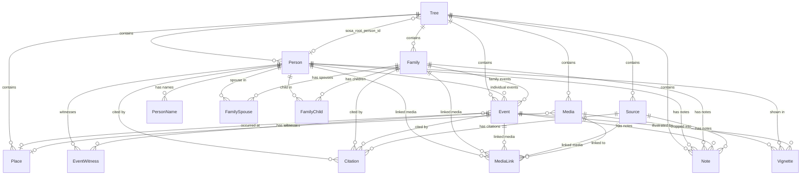

# Data Model

> Part of the [OxidGene Specifications](index.md).
> See also: [Architecture](architecture.md) · [API Contract](api.md)

Source of truth in code: `crates/oxidgene-core/src/types/` (domain structs), `crates/oxidgene-core/src/enums.rs` (enums), `crates/oxidgene-db/src/entities/` (SeaORM entities), `crates/oxidgene-db/src/migration/` (`m20250101_000001_initial.rs` is the consolidated base schema; later `mYYYYMMDD_*` files add to it).

---

## 1. Entities

### Tree

| Column | Type | Notes |
|---|---|---|
| `id` | UUID v7 | PK |
| `name` | String | Required |
| `description` | String? | Optional |
| `sosa_root_person_id` | UUID v7? | FK → Person — SOSA 1 root for Sosa-Stradonitz numbering, set in [Settings](ui-settings.md) §7 |
| `created_at` | DateTime | Auto |
| `updated_at` | DateTime | Auto |
| `deleted_at` | DateTime? | Soft delete |

Displayed in: [Homepage](ui-home.md) (tree cards) · [Settings](ui-settings.md) (tree & roots section)

### Person

| Column | Type | Notes |
|---|---|---|
| `id` | UUID v7 | PK |
| `tree_id` | UUID v7 | FK → Tree |
| `sex` | Sex | Enum |
| `privacy` | Privacy | Enum — per-person privacy override (default `Default`) |
| `created_at` | DateTime | Auto |
| `updated_at` | DateTime | Auto |
| `deleted_at` | DateTime? | Soft delete |

Displayed in: [Tree View](ui-genealogy-tree.md) (person cards) · [Person Edit Modal](ui-person-edit-modal.md) (edit form)

### PersonName

| Column | Type | Notes |
|---|---|---|
| `id` | UUID v7 | PK |
| `person_id` | UUID v7 | FK → Person |
| `name_type` | NameType | Enum |
| `given_names` | String? | GEDCOM `GIVN`. Multiple given names stay in one string ("Jean Baptiste Marie") — they are one name, not three |
| `surname` | String? | GEDCOM `SURN` — the surname **root**, particle excluded ("Cruz") |
| `surname_prefix` | String? | GEDCOM `SPFX` — the surname particle ("de la", "van der") |
| `prefix` | String? | GEDCOM `NPFX` — title of address ("Dr.", "Rév. Père") |
| `suffix` | String? | GEDCOM `NSFX` — generational ordinal or epithet ("Jr.", "III") |
| `nickname` | String? | GEDCOM `NICK` |
| `is_primary` | bool | Default true |
| `sort_order` | i32 | Display order among a person's secondary names; the primary name always comes first |
| `created_at` | DateTime | Auto |
| `updated_at` | DateTime | Auto |

**One row = one complete name the person bore**, not one name *piece*. The pieces
only mean anything relative to each other, which is why a birth name and a
married name are two rows rather than shared columns: splitting `given_names`
into its own table would lose which given names go with which surname.

**Particles are derived, not typed.** The UI keeps a single "surname" field and
calls `oxidgene_core::types::split_surname_particle` on save, showing the
detected split with a **Modifier** button beside it. Detection is a guess over a
fixed word list, so the override is part of the contract, not a nicety: someone
actually surnamed "Le", or a "Da Silva" that should file under D, clears the
particle to opt out, and an unusual particle can be declared by hand. The
override can only *cut* the single field, never add to it (`split_surname_at_head`):
the field's text is the complete surname, so a particle absent from it is
reported rather than applied — accepting it would inject a word the user never
typed, and clearing the particle afterwards could not remove it. GEDCOM import
uses the looser `split_surname_with`, since a file may legitimately state
`2 SPFX de la` beside a bare `2 SURN Cruz`. A stored particle that
detection disagrees with pins the override on load, so saving an unrelated field
never silently re-splits it. The per-name editor, already a multi-field form,
exposes `surname_prefix` as its own input instead. GEDCOM/GeneWeb import does the
same when the file carries no `SPFX`. Display always rejoins the two parts
(`PersonName::full_surname`), so a name entered as "de la Cruz" still reads
"de la Cruz" — only *filing* changes. Whether the particle counts when sorting is
a per-viewer preference (`/app-settings` → Noms), defaulting to "included".

### Family

| Column | Type | Notes |
|---|---|---|
| `id` | UUID v7 | PK |
| `tree_id` | UUID v7 | FK → Tree |
| `created_at` | DateTime | Auto |
| `updated_at` | DateTime | Auto |
| `deleted_at` | DateTime? | Soft delete |

Displayed in: [Tree View](ui-genealogy-tree.md) (connectors) · [Person Edit Modal](ui-person-edit-modal.md) (couple edit)

### FamilySpouse

| Column | Type | Notes |
|---|---|---|
| `id` | UUID v7 | PK |
| `family_id` | UUID v7 | FK → Family |
| `person_id` | UUID v7 | FK → Person |
| `role` | SpouseRole | Enum |
| `sort_order` | i32 | For ordering |

### FamilyChild

| Column | Type | Notes |
|---|---|---|
| `id` | UUID v7 | PK |
| `family_id` | UUID v7 | FK → Family |
| `person_id` | UUID v7 | FK → Person |
| `child_type` | ChildType | Enum |
| `sort_order` | i32 | For ordering |

### Event

| Column | Type | Notes |
|---|---|---|
| `id` | UUID v7 | PK |
| `tree_id` | UUID v7 | FK → Tree |
| `event_type` | EventType | Enum |
| `date_value` | String? | GEDCOM date phrase (free text, e.g. "ABT 1842") |
| `date_sort` | Date? | Normalized date for sorting |
| `date_qualifier` | DateQualifier | Enum — precision/shape of the date (default `Exact`) |
| `date_value2` | String? | Second date, used by the `Or` and `Between` qualifiers |
| `calendar` | Calendar | Enum — calendar system the date was recorded in (default `Gregorian`) |
| `cause` | String? | Cause of event (GEDCOM `CAUS`), e.g. cause of death |
| `place_id` | UUID v7? | FK → Place |
| `person_id` | UUID v7? | FK → Person (individual event) — never set together with `family_id` |
| `family_id` | UUID v7? | FK → Family (family event) — never set together with `person_id` |
| `description` | String? | Free text; also holds occupation title for `Occupation` events |
| `created_at` | DateTime | Auto |
| `updated_at` | DateTime | Auto |
| `deleted_at` | DateTime? | Soft delete |

`Event::year()` / `oxidgene_core::types::year_from_date` provide the shared display-year logic (prefer `date_sort`, fall back to the first 4-digit token of `date_value`) used by pedigree cards, the person narrative, dictionary usage lists, and search results.

Displayed in: [Tree View](ui-genealogy-tree.md) (events sidebar) · [Person Edit Modal](ui-person-edit-modal.md) (event blocks)

### EventWitness

Join table mirroring GEDCOM's `ASSO`/`RELA` associations — a witness, godparent, or other role-holder linked to an event as a real `Person` in the tree.

| Column | Type | Notes |
|---|---|---|
| `id` | UUID v7 | PK |
| `event_id` | UUID v7 | FK → Event |
| `person_id` | UUID v7 | FK → Person |
| `relation` | String? | Free text (e.g. "Godmother", "Witness") |
| `sort_order` | i32 | For ordering |

Exposed via `GET/POST /events/{id}/witnesses` (REST) and `addEventWitness`/`removeEventWitness` (GraphQL). Round-trips through GEDCOM import/export as a top-level `ASSO` on the INDI record (see [API Contract](api.md) §3).

### Place

| Column | Type | Notes |
|---|---|---|
| `id` | UUID v7 | PK |
| `tree_id` | UUID v7 | FK → Tree |
| `name` | String | Required — single free-text string (e.g. "Beaune, 21200, Côte-d'Or, Bourgogne-Franche-Comté, France") |
| `latitude` | f64? | Filled when selected from offline database or geocoding |
| `longitude` | f64? | Filled when selected from offline database or geocoding |
| `created_at` | DateTime | Auto |
| `updated_at` | DateTime | Auto |

The `name` is a single string. The recommended format is comma-separated from most specific to least specific (see [PlaceInput](ui-shared-components.md) §5), but any text is valid.

### Source

| Column | Type | Notes |
|---|---|---|
| `id` | UUID v7 | PK |
| `tree_id` | UUID v7 | FK → Tree |
| `title` | String | Required |
| `author` | String? | |
| `publisher` | String? | |
| `abbreviation` | String? | |
| `repository_name` | String? | |
| `created_at` | DateTime | Auto |
| `updated_at` | DateTime | Auto |
| `deleted_at` | DateTime? | Soft delete |

### Citation

| Column | Type | Notes |
|---|---|---|
| `id` | UUID v7 | PK |
| `source_id` | UUID v7 | FK → Source |
| `person_id` | UUID v7? | FK → Person |
| `event_id` | UUID v7? | FK → Event |
| `family_id` | UUID v7? | FK → Family |
| `page` | String? | Where in the source |
| `confidence` | Confidence | Enum |
| `text` | String? | Extracted text |
| `created_at` | DateTime | Auto |
| `updated_at` | DateTime | Auto |

### Media

| Column | Type | Notes |
|---|---|---|
| `id` | UUID v7 | PK |
| `tree_id` | UUID v7 | FK → Tree |
| `file_name` | String | Original filename |
| `mime_type` | String | MIME type, decided from the file's magic bytes at upload |
| `file_path` | String | GEDCOM `OBJE.FILE` value — the producer's own path, kept verbatim so an export round-trips. Not where our copy lives |
| `storage_key` | String? | Key of the stored bytes in the media store. Null for a record that names a file we have never received — every GEDCOM import starts that way |
| `sha256` | String? | Hex SHA-256 of the stored bytes. Doubles as the HTTP `ETag` and as the deduplication key |
| `thumbnail_key` | String? | Key of the generated thumbnail. Null for PDFs and for byte-less records |
| `width` | i32? | Intrinsic pixel width, after applying any EXIF orientation |
| `height` | i32? | Intrinsic pixel height |
| `page_count` | i32 | Pages in the document; `1` for photos and single-page files |
| `file_size` | i64 | Bytes |
| `title` | String? | |
| `description` | String? | |
| `date_value` | String? | Date of the media (GEDCOM date phrase, same format as Event) |
| `date_sort` | Date? | Normalized date for sorting |
| `place_id` | UUID v7? | FK → Place — where the media was created/taken |
| `created_at` | DateTime | Auto |
| `updated_at` | DateTime | Auto |
| `deleted_at` | DateTime? | Soft delete |

Displayed in: [Person Edit Modal](ui-person-edit-modal.md) (media section)

**Storage.** Files live on the filesystem, content-addressed under
`{tree_id}/{aa}/{bb}/{sha256}.{ext}` beneath `OXIDGENE_MEDIA_ROOT` (default: the
platform user-data directory). Uploading the same scan twice writes one file and
two rows — what a census page documenting eight siblings needs. Keys are scoped
per tree rather than globally: deduplication stops at the tree boundary, which is
the price of purging a tree by removing one directory, with no reference counting.

### Vignette

A rectangular region of a media file, kept as coordinates rather than as a second
copy of the pixels. One parish-register page routinely documents several unrelated
families; each entry is a vignette on the single stored scan, so a better scan can
replace it without orphaning anything, and the crop is still served as if it were
its own image.

| Column | Type | Notes |
|---|---|---|
| `id` | UUID v7 | PK |
| `media_id` | UUID v7 | FK → Media (cascade) |
| `page` | i32 | Zero-based page of a multi-page document; `0` for a photo |
| `x` | i32 | Crop origin, in the source image's own pixel coordinates |
| `y` | i32 | |
| `width` | i32 | |
| `height` | i32 | |
| `title` | String? | |
| `person_id` | UUID v7? | FK → Person — who the region shows, if attributed |
| `event_id` | UUID v7? | FK → Event — the event this region is evidence for |
| `created_at` | DateTime | Auto |
| `updated_at` | DateTime | Auto |

No soft delete: a vignette is a coordinate annotation, not a record anyone cites,
and a rectangle that does not fit its media is refused at write time — so a stored
vignette always describes a region that exists.

### MediaLink

| Column | Type | Notes |
|---|---|---|
| `id` | UUID v7 | PK |
| `media_id` | UUID v7 | FK → Media |
| `person_id` | UUID v7? | FK → Person |
| `event_id` | UUID v7? | FK → Event |
| `source_id` | UUID v7? | FK → Source |
| `family_id` | UUID v7? | FK → Family |
| `sort_order` | i32 | For ordering |

### Note

| Column | Type | Notes |
|---|---|---|
| `id` | UUID v7 | PK |
| `tree_id` | UUID v7 | FK → Tree |
| `text` | String | Required |
| `person_id` | UUID v7? | FK → Person |
| `event_id` | UUID v7? | FK → Event |
| `family_id` | UUID v7? | FK → Family |
| `source_id` | UUID v7? | FK → Source |
| `media_id` | UUID v7? | FK → Media — a note *about a document* ("the left-hand column is water-damaged"), distinct from `Media.description`, which is the caption under its tile |
| `created_at` | DateTime | Auto |
| `updated_at` | DateTime | Auto |
| `deleted_at` | DateTime? | Soft delete |

### Ancestry traversal (no table)

There is no closure table. Ancestor and descendant traversal is a recursive
CTE over `family_child` ⋈ `family_spouse` (`AncestryRepo`): a person's parents
are the spouses of the family in which they are a child. Both back-ends support
`WITH RECURSIVE`. Each reached person is returned once, at their **shortest**
generation distance, as `AncestryLink { person_id, depth }`.

The `person_ancestry` closure table it replaced was dropped in
`m20260803_000001`: on a real 10k-person tree it held 364k rows and, with its
four indexes, 62 % of the whole database, while being ~12x *slower* to read
than the CTE (160 ms against 13 ms for a depth-10 pedigree) and needing a
rebuild on every re-parenting.

Traversal is bounded at 64 generations when no depth is given, because the
schema does not prevent a cycle in the family links.

Used by: ancestor/descendant [API endpoints](api.md) · pedigree assembly ([Read Projections](read-projections.md)) · SOSA badge computation ([Person Profile](ui-person-profile.md), [Dictionary](ui-dictionary.md) §12)

### person_search_fts (Search Table — Sprint E.6)

DB-native person search index; not a domain entity (no UUID PK, maintained by `PersonSearchRepo`). SQLite FTS5 virtual table on desktop, plain indexed table on PostgreSQL. Columns: normalized `surname`, `given_names`, `maiden_name`, `birth_year`, `death_year` plus unindexed display fields. See [Read Projections](read-projections.md) §4.

---

## 2. Enums

Defined in `crates/oxidgene-core/src/enums.rs`; DB string representations in `crates/oxidgene-db/src/entities/sea_enums.rs`.

```rust
enum Sex {
    Male,
    Female,
    Unknown,
}

enum NameType {
    Birth,
    Married,
    AlsoKnownAs,
    Maiden,
    Religious,
    // Refinements of "also known as". GEDCOM's NAME.TYPE enumeration has no
    // equivalent, so all four export as `aka` — the distinction is internal.
    // They exist because the UI lets the user pick between them, and
    // collapsing them onto AlsoKnownAs made the choice unrecoverable.
    GivenName,
    Alias,
    Byname,
    Sobriquet,
    Other,
}

enum SpouseRole {
    Husband,
    Wife,
    Partner,
}

enum ChildType {
    Biological,
    Adopted,
    Foster,
    Step,
    Unknown,
}

/// Per-person privacy override (see ui-person-edit-modal.md §7).
enum Privacy {
    Default,   // Follows the tree-level privacy settings
    Public,    // Always visible regardless of tree settings
    Private,   // Always hidden regardless of tree settings
}

/// Precision/shape of a date entry (see ui-person-edit-modal.md §5).
/// `Or` and `Between` use two date values; the rest use a single one.
enum DateQualifier {
    Exact,     // default
    About,     // GEDCOM ABT
    Perhaps,   // GEDCOM EST
    Before,    // GEDCOM BEF
    After,     // GEDCOM AFT
    Or,        // app-specific (two dates)
    Between,   // GEDCOM BET ... AND ...
    FromAge,   // app-specific
}

/// Calendar system used to record a date.
enum Calendar {
    Gregorian, // default
    Julian,
    Hebrew,
    FrenchRepublican,
}

// GEDCOM tag mapping shown per variant. Variants without a native tag
// export as EVEN + TYPE subrecord.
enum EventType {
    // Individual events
    Birth,               // BIRT
    Death,               // DEAT
    Baptism,             // BAPM
    Confirmation,        // (EVEN + TYPE)
    FirstCommunion,      // (EVEN + TYPE)
    BarBatMitzvah,       // (EVEN + TYPE)
    MilitaryService,     // (EVEN + TYPE)
    Burial,              // BURI
    Cremation,           // CREM
    Graduation,          // GRAD
    Immigration,         // IMMI
    Emigration,          // EMIG
    Naturalization,      // NATU
    Census,              // CENS
    Occupation,          // OCCU (description holds the title)
    Residence,           // RESI
    Retirement,          // RETI
    Will,                // WILL
    Probate,             // PROB
    Adoption,            // ADOP — individual-level, may reference the
                         //        adoptive family via a nested FAMC
    // Individual attributes (GEDCOM 5.5.1 "attribute" tags)
    CasteName,           // CAST
    PhysicalDescription, // DSCR
    Education,           // EDUC
    NationalId,          // IDNO
    NationalOrigin,      // NATI
    ChildrenCount,       // NCHI
    MarriagesCount,      // NMR
    Property,            // PROP
    Religion,            // RELI
    SocialSecurityNumber,// SSN
    NobilityTitle,       // TITL (as an individual attribute)
    Fact,                // FACT
    // Family events
    Marriage,            // MARR
    Divorce,             // DIV
    Annulment,           // ANUL
    Engagement,          // ENGA
    MarriageBann,        // MARB
    MarriageContract,    // MARC
    MarriageLicense,     // MARL
    MarriageSettlement,  // MARS
    CivilUnion,          // (EVEN family tag) — PACS / cohabitation
    Separation,          // SEP (GEDCOM 7.0)
    DivorceFiled,        // DIVF
    // Generic
    Other,               // EVEN + TYPE
}

// Maps to GEDCOM QUAY (Certainty Assessment)
enum Confidence {
    VeryLow,   // QUAY 0 (Unreliable)
    Low,       // QUAY 1 (Questionable)
    Medium,    // QUAY 2 (Secondary)
    High,      // QUAY 3 (Direct)
    VeryHigh,  // app-specific fifth level
}
```

`EventType::is_individual()` / `is_family()` partition the variants; `Adoption` is individual, never family.

---

## 3. Entity Relationship Diagram (Mermaid)


```mermaid
erDiagram
    Tree ||--o{ Person : contains
    Tree ||--o{ Family : contains
    Tree ||--o{ Event : contains
    Tree ||--o{ Place : contains
    Tree ||--o{ Source : contains
    Tree ||--o{ Media : contains
    Tree ||--o{ Note : contains
    Tree }o--o| Person : "sosa_root_person_id"

    Person ||--o{ PersonName : "has names"
    Person ||--o{ FamilySpouse : "spouse in"
    Person ||--o{ FamilyChild : "child in"
    Person ||--o{ Event : "individual events"
    Person ||--o{ EventWitness : "witnesses"
    Person ||--o{ Citation : "cited by"
    Person ||--o{ MediaLink : "linked media"
    Person ||--o{ Note : "has notes"

    Family ||--o{ FamilySpouse : "has spouses"
    Family ||--o{ FamilyChild : "has children"
    Family ||--o{ Event : "family events"
    Family ||--o{ Citation : "cited by"
    Family ||--o{ MediaLink : "linked media"
    Family ||--o{ Note : "has notes"

    Event }o--o| Place : "occurred at"
    Media }o--o| Place : "taken at"
    Event ||--o{ EventWitness : "has witnesses"
    Event ||--o{ Citation : "cited by"
    Event ||--o{ MediaLink : "linked media"
    Event ||--o{ Note : "has notes"

    Source ||--o{ Citation : "has citations"
    Source ||--o{ MediaLink : "linked media"
    Source ||--o{ Note : "has notes"

    Media ||--o{ MediaLink : "linked to"
    Media ||--o{ Vignette : "cropped into"
    Person ||--o{ Vignette : "shown in"
    Event ||--o{ Vignette : "illustrated by"

```
