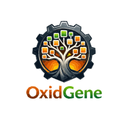

# General — Vision, Users & Features

> Part of the [OxidGene Specifications](README.md).
> See also: [Architecture](architecture.md) · [Data Model](data-model.md) · [API Contract](api.md) · [Roadmap](roadmap.md)

---

## 1. Context and Project Objectives

### 1.1 General Context

The project aims to develop a multiplatform genealogy application, built entirely in Rust, based on:

- a **Dioxus** frontend compiled to WebAssembly (WASM) for web and desktop, and
- a backend powered by **Axum** exposing an API simultaneously in REST (JSON) and GraphQL, with all features available through both protocols.

The application is designed to be:

- compiled as a **desktop client** running on Windows, Linux and macOS (single binary embedding an Axum server + SQLite + Dioxus WebView via Wry), and
- deployable as a **web application** through Docker containers:
    - frontend container (static WASM assets served by a lightweight HTTP server),
    - backend container (Axum server),
    - database container (PostgreSQL),
    - queuing application container (for EPIC F — Asynchronous Pipeline, post-MVP).

For technical details, see [Architecture](architecture.md).

### 1.2 Nature of the Application

OxidGene is a genealogy platform enabling users to create, view, edit, and share family trees and associated genealogical data (individuals, relationships, events, sources, media).

### 1.3 Main Objectives

- Deliver a modern, high-performance, portable genealogy application.
- Provide an open API (REST + GraphQL) aligned with the design principles of the FamilySearch API. → see [API Contract](api.md)
- Ensure a user experience comparable to leading genealogy platforms.
- Allow progressive evolution toward advanced and paid features.

### 1.4 Differentiation

- Made in Rust — performance, safety, and a single language across the entire stack.
- A theme-based UX system reproducing the experience of Geneanet, Filae, Ancestry, or MyHeritage.
- A unified Rust + WASM architecture with a single Dioxus codebase for web and desktop.
- A dual REST/GraphQL API.
- A fully offline-capable desktop client.
- Advanced collaboration and tree-matching features (post-MVP).

---

## 2. Target Users and Roles

### 2.1 Target Users

- Individuals practicing genealogy.
- Genealogy associations.
- Professional or advanced users.
- Paid subscribers (future phases).

### 2.2 User Roles (per tree)

- **Guest**: limited access, contemporary individuals hidden. → see [Settings](ui-settings.md) (privacy section)
- **Full Read-only**: full tree access.
- **Editor**: read + create/modify/delete.

### 2.3 Access Control

- Trees can be private, shared, or public.
- Access rights defined per tree.
- Authentication deferred to EPIC E (not in MVP). → see [Roadmap](roadmap.md)

---

## 3. Core Features

### 3.1 Tree Management

- Create trees from scratch or via GEDCOM import.
- Manage multiple trees.
- → see [Homepage spec](ui-home.md)

### 3.2 GEDCOM Import/Export

- Full import/export using Rust crate `ged_io` (v0.12+). Also Support exporting a subpart of the tree by selecting a root person when exporting.
- Support for GEDCOM 5.5.1 and 7.0 (auto-detected).
- Streaming parser for large files.
- Error logging and normalization.
- → see [API Contract](api.md) (GEDCOM endpoints) · [Settings](ui-settings.md) (export section)

### 3.3 Collaborative Editing (Web) — Post-MVP

- Simultaneous editing (deferred to post-MVP).
- Conflict detection and resolution.

### 3.4 Tree Matching — Post-MVP

- Suggest merges between user trees.

### 3.5 Themes / UX

- Switch between multiple UX themes inspired by major genealogy platforms from the settings.
- → see [Settings](ui-settings.md)

### 3.6 Interface Language

- Configurable UI language, without restart.
- User-level (web) or app-level (desktop).

### 3.7 REST & GraphQL APIs

- Full feature parity between both protocols.
- FamilySearch-inspired structure.
- Available from EPIC A onward.
- → see [API Contract](api.md)

### 3.8 Media Management

- Upload images/PDF/videos.
- Metadata and viewer integration.
- Post-MVP: identify someone in a subpart of an image, the selection will be seen as a media for the identified person.
- Async upload pipeline (post-MVP).
- → see [Person Edit Modal](ui-person-edit-modal.md) (media section)

### 3.9 Statistics & Reports

- Frequent last/first names, frequent occupations, birth distribution by months, parents age at birth, avg date at first union, birth/death stats, demographic pyramid, distribution of marriage days, avg duration of an union, avg children per union, avg duration between two children, avg age difference between first and last child in a couple, age diff between spouses, geographic distribution, last 100 births, last 100 deaths, last 100 unions, top 100 alive oldest, top 100 older...
- Graphs, tables, PDF export.

### 3.10 Visualization & Printing

- Multiple tree layouts (ancestor chart, descendant chart, fan chart).
- Export high-resolution PDFs.
- → see [Tree View spec](ui-genealogy-tree.md)

---

## 4. Security & Privacy

- Mask contemporary individuals (< 100 years old) for guest users. → see [Settings](ui-settings.md) (privacy section)
- Optional last/first name masking.
- Full audit logging.
- Authentication and authorization in EPIC E. → see [Roadmap](roadmap.md)

---

## 5. Performance

- Lazy loading of tree branches.
- Server-side caching.
- PersonAncestry closure table for O(1) ancestor/descendant queries. → see [Data Model](data-model.md) (PersonAncestry)
- Streaming GEDCOM parser for large files.
- Cursor-based pagination to avoid expensive offset scans. → see [API Contract](api.md) (pagination)

---

## 6. Premium Features — Post-MVP

- Assisted tree matching.
- OCR on scanned documents.
- Image enhancement.
- External data source plugins.

---

## 7. MVP Scope

The MVP covers EPICs A through D (see [Roadmap](roadmap.md)):

- Interactive tree visualization. → [Tree View](ui-genealogy-tree.md)
- Person selection and detail view.
- Full CRUD editing (persons, families, events, sources, media, places, notes). → [Person Edit Modal](ui-person-edit-modal.md)
- GEDCOM import/export.
- Language switching.
- Theme support. → [Settings](ui-settings.md)
- REST + GraphQL API. → [API Contract](api.md)
- Desktop and web deployment. → [Architecture](architecture.md)

**Not in MVP**: authentication, access control, collaborative editing, tree matching, async pipeline.

---

## 8. Consistent Page Layout

All pages share a common layout structure to ensure visual consistency across the application.

### Navbar

A minimal branding bar at the very top of every page. Contains only the logo (linking to homepage) in MVP. See [Topbar](ui-topbar.md) for full specification.

### Page types

The application has two distinct page layout patterns:

#### 1. Homepage (`/`)

Full-page scrollable layout. Content is constrained by `.home-main` (`max-width: 1200px`, centered, responsive padding). No topbar breadcrumb — the page header contains the title and subtitle directly.

#### 2. Tree-scoped pages (`/trees/{id}/...` and `/settings`)

All tree-scoped and app settings pages use the **`sub-page`** layout pattern:

```
+----------------------------------------------------------------------+
| NAVBAR                                                                |
+----------------------------------------------------------------------+
| td-topbar (breadcrumb + optional actions)                            |
+----------------------------------------------------------------------+
|                                                                       |
|   sub-page-content (max-width: 1200px, centered, scrollable)        |
|                                                                       |
|   Page-specific content here                                         |
|                                                                       |
+----------------------------------------------------------------------+
```

**CSS classes:**

| Class | Purpose |
|---|---|
| `.sub-page` | Flex column container, fills available height (`flex: 1`), hides overflow |
| `.td-topbar` | Full-width breadcrumb bar with bottom border. Contains `.td-bc` breadcrumb navigation |
| `.sub-page-content` | Scrollable content area. `max-width: 1200px`, centered with `margin: 0 auto`, `padding: 24px` |

**Exception — Pedigree tree view** (`/trees/{id}`): Uses its own layout with left sidebar (ISB), canvas, and events panel. Does not use `sub-page-content`. See [Tree View](ui-genealogy-tree.md) for details.

### Breadcrumb pattern

All pages (except homepage) display a breadcrumb in the `td-topbar`:

| Page | Breadcrumb |
|---|---|
| Tree view | `logo` tree_name `/` Tree |
| Tree settings | `logo` tree_name `/` Settings |
| Search results | `logo` tree_name `/` Search |
| Person profile | `logo` tree_name `/` Person Name |
| App settings | Home `/` Settings |

### Responsive behavior

| Breakpoint | Behavior |
|---|---|
| >= 1200px | Full layout, content at max-width |
| < 640px | `sub-page-content` padding reduces to `16px 12px`. `td-topbar` padding reduces to `10px 12px`. Homepage padding reduces to `2rem 1rem` |

### Max-width consistency

All content areas use `max-width: 1200px` for a unified reading width across all pages. This applies to:
- Homepage (`.home-main`)
- Tree settings, app settings, person profile, search results (`.sub-page-content`)

---

## 9. Respect of norms and standards

The project must respect the norms and standards:

- GEDCOM 5.5 and 7.0
- XDG base directories for cache, config...
- REST and GraphQL
- OpenAPI
- OAuth 2.0 / OpenID Connect (eventually SAML if we decide to use it)