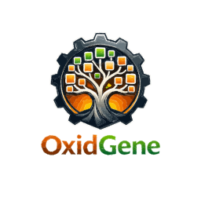

# General — Vision, Users & Features

> Part of the [OxidGene Specifications](index.md).
> See also: [Architecture](architecture.md) · [Data Model](data-model.md) · [API Contract](api.md) · [Roadmap](roadmap.md)

---

## 1. Context and Project Objectives

### 1.1 General Context

The project aims to develop a multiplatform genealogy application, built entirely in Rust, based on:

- a **Dioxus** frontend compiled to WebAssembly (WASM) for web and desktop, and
- a backend powered by **Axum** exposing an API simultaneously in REST (JSON) and GraphQL, with all features available through both protocols.

The application is designed to be:

- compiled as a **desktop client** running on Windows, Linux and macOS (single binary embedding an Axum server + SQLite + Dioxus WebView via Wry), and
- deployable as a **web application** through Docker containers:
    - frontend container (static WASM assets served by a lightweight HTTP server),
    - backend container (Axum server),
    - database container (PostgreSQL),
    - queuing application container (for EPIC F — Asynchronous Pipeline, post-MVP).

For technical details, see [Architecture](architecture.md).

### 1.2 Nature of the Application

OxidGene is a genealogy platform enabling users to create, view, edit, and share family trees and associated genealogical data (individuals, relationships, events, sources, media).

### 1.3 Main Objectives

- Deliver a modern, high-performance, portable genealogy application.
- Provide an open API (REST + GraphQL) aligned with the design principles of the FamilySearch API. → see [API Contract](api.md)
- Ensure a user experience comparable to leading genealogy platforms.
- Allow progressive evolution toward advanced and paid features.

### 1.4 Differentiation

- Made in Rust — performance, safety, and a single language across the entire stack.
- A theme-based UX system reproducing the experience of Geneanet, Filae, Ancestry, or MyHeritage.
- A unified Rust + WASM architecture with a single Dioxus codebase for web and desktop.
- A dual REST/GraphQL API.
- A fully offline-capable desktop client.
- Advanced collaboration and tree-matching features (post-MVP).

---

## 2. Target Users and Roles

### 2.1 Target Users

- Individuals practicing genealogy.
- Genealogy associations.
- Professional or advanced users.
- Paid subscribers (future phases).

### 2.2 User Roles (per tree)

- **Guest**: limited access, contemporary individuals hidden. → see [Settings](ui-settings.md) (privacy section)
- **Full Read-only**: full tree access.
- **Editor**: read + create/modify/delete.

### 2.3 Access Control

- Trees can be private, shared, or public.
- Access rights defined per tree.
- Authentication deferred to EPIC E (not in MVP). → see [Roadmap](roadmap.md)

---

## 3. Core Features

### 3.1 Tree Management

- Create trees from scratch or via GEDCOM import.
- Manage multiple trees.
- → see [Homepage spec](ui-home.md)

### 3.2 GEDCOM Import/Export

- Full import/export using Rust crate `ged_io` (v0.12+). Also Support exporting a subpart of the tree by selecting a root person when exporting.
- Support for GEDCOM 5.5.1 and 7.0 (auto-detected).
- Streaming parser for large files.
- Error logging and normalization.
- → see [API Contract](api.md) (GEDCOM endpoints) · [Settings](ui-settings.md) (export section)

### 3.3 Collaborative Editing (Web) — Post-MVP

- Simultaneous editing (deferred to post-MVP).
- Conflict detection and resolution.

### 3.4 Tree Matching — Post-MVP

- Suggest merges between user trees.

### 3.5 Themes / UX

- Switch between multiple UX themes inspired by major genealogy platforms from the settings.
- → see [Settings](ui-settings.md)

### 3.6 Interface Language

- Configurable UI language, without restart.
- User-level (web) or app-level (desktop).

### 3.7 REST & GraphQL APIs

- Full feature parity between both protocols.
- FamilySearch-inspired structure.
- Available from EPIC A onward.
- → see [API Contract](api.md)

### 3.8 Media Management

- Upload images/PDF/videos.
- Metadata and viewer integration.
- Post-MVP: identify someone in a subpart of an image, the selection will be seen as a media for the identified person.
- Async upload pipeline (post-MVP).
- → see [Person Edit Modal](ui-person-edit-modal.md) (media section)

### 3.9 Statistics & Reports

- Frequent last/first names, frequent occupations, birth distribution by months, parents age at birth, avg date at first union, birth/death stats, demographic pyramid, distribution of marriage days, avg duration of an union, avg children per union, avg duration between two children, avg age difference between first and last child in a couple, age diff between spouses, geographic distribution, last 100 births, last 100 deaths, last 100 unions, top 100 alive oldest, top 100 older...
- Graphs, tables, PDF export.

### 3.10 Visualization & Printing

- Multiple tree layouts (ancestor chart, descendant chart, fan chart).
- Export high-resolution PDFs.
- → see [Tree View spec](ui-genealogy-tree.md)

---

## 4. Security & Privacy

- Mask contemporary individuals (< 100 years old) for guest users. → see [Settings](ui-settings.md) (privacy section)
- Optional last/first name masking.
- Full audit logging.
- Authentication and authorization in EPIC E. → see [Roadmap](roadmap.md)

---

## 5. Performance

- Lazy loading of tree branches.
- Server-side caching.
- Recursive CTE over the family links for ancestor/descendant queries. → see [Data Model](data-model.md) (Ancestry traversal)
- Streaming GEDCOM parser for large files.
- Cursor-based pagination to avoid expensive offset scans. → see [API Contract](api.md) (pagination)

---

## 6. Premium Features — Post-MVP

- Assisted tree matching.
- OCR on scanned documents.
- Image enhancement.
- External data source plugins.

---

## 7. MVP Scope

The MVP covers EPICs A through D (see [Roadmap](roadmap.md)):

- Interactive tree visualization. → [Tree View](ui-genealogy-tree.md)
- Person selection and detail view.
- Full CRUD editing (persons, families, events, sources, media, places, notes). → [Person Edit Modal](ui-person-edit-modal.md)
- GEDCOM import/export.
- Language switching.
- Theme support. → [Settings](ui-settings.md)
- REST + GraphQL API. → [API Contract](api.md)
- Desktop and web deployment. → [Architecture](architecture.md)

**Not in MVP**: authentication, access control, collaborative editing, tree matching, async pipeline.

---

## 8. Consistent Page Layout

All pages share a common layout structure to ensure visual consistency across the application.

### Navbar

A minimal branding bar at the very top of every page. Contains only the logo (linking to homepage) in MVP. See [Topbar](ui-topbar.md) for full specification.

### Page types

The application has two distinct page layout patterns:

#### 1. Homepage (`/`)

Full-page scrollable layout. Content is constrained by `.home-main` (`max-width: 1200px`, centered, responsive padding). No topbar breadcrumb — the page header contains the title and subtitle directly.

#### 2. Tree-scoped pages (`/trees/{id}/...` and `/settings`)

All tree-scoped and app settings pages use the **`sub-page`** layout pattern:

```
+----------------------------------------------------------------------+
| NAVBAR                                                                |
+----------------------------------------------------------------------+
| td-topbar (breadcrumb + optional actions)                            |
+----------------------------------------------------------------------+
|                                                                       |
|   sub-page-content (max-width: 1200px, centered, scrollable)        |
|                                                                       |
|   Page-specific content here                                         |
|                                                                       |
+----------------------------------------------------------------------+
```

**CSS classes:**

| Class | Purpose |
|---|---|
| `.sub-page` | Flex column container, fills available height (`flex: 1`), hides overflow |
| `.td-topbar` | Full-width breadcrumb bar with bottom border. Contains `.td-bc` breadcrumb navigation |
| `.sub-page-content` | Scrollable content area. `max-width: 1200px`, centered with `margin: 0 auto`, `padding: 24px` |

**Exception — Pedigree tree view** (`/trees/{id}`): Uses its own layout with left sidebar (ISB), canvas, and events panel. Does not use `sub-page-content`. See [Tree View](ui-genealogy-tree.md) for details.

### Breadcrumb pattern

All pages (except homepage) display a breadcrumb in the `td-topbar`:

| Page | Breadcrumb |
|---|---|
| Tree view | `logo` tree_name `/` Tree |
| Tree settings | `logo` tree_name `/` Settings |
| Search results | `logo` tree_name `/` Search |
| Person profile | `logo` tree_name `/` Person Name |
| App settings | Home `/` Settings |

### Responsive behavior

| Breakpoint | Behavior |
|---|---|
| >= 1200px | Full layout, content at max-width |
| < 640px | `sub-page-content` padding reduces to `16px 12px`. `td-topbar` padding reduces to `10px 12px`. Homepage padding reduces to `2rem 1rem` |

### Max-width consistency

All content areas use `max-width: 1200px` for a unified reading width across all pages. This applies to:
- Homepage (`.home-main`)
- Tree settings, app settings, person profile, search results (`.sub-page-content`)

---

## 8b. Development Status

> For sprint details see [Roadmap](roadmap.md).

| EPIC | Title | Status |
|------|-------|--------|
| A | Technical Foundation | ✅ Complete |
| B | GEDCOM Engine | ✅ Complete |
| C | Tree Editing (Frontend) | ✅ Complete |
| D | UX, Languages, Performance | ✅ Complete |
| E | Read Projections & Search | ✅ E.9 Complete; 🔄 E.8 (dictionary descent view) planned |
| F | Media Management | ⏳ Next (Sprints F.1–F.4, 8–12 days) |
| G | Security & Deployment | ⏳ Post-Media |
| H | Asynchronous Pipeline | ⏳ Post-MVP |

**Recently shipped (Aug 2026):**
- **Surname particles are structured, and every information type keeps its identity.** `person_name` gained `surname_prefix` (GEDCOM `SPFX`) and `sort_order`. Four problems were fixed at once. (1) The particle used to be glued into `surname`, so "de la Cruz" and "Cruz" were unrelated dictionary entries and the former could only file under D; `SPFX` is now split off, and since `ged_io` had parsed and written it all along, this was OxidGene dropping it on import and never emitting it on export. The particle is **derived, not typed** — the UI keeps one surname field and shows the detected split (`split_surname_particle`, a known-particle list excluding `Mac`/`Mc`/`O'` which bind to their root) so a wrong guess is correctable; GEDCOM and `.gw` import derive it the same way when the file carries no `SPFX`. Display always rejoins the parts, so only *filing* changes, and whether the particle counts when sorting is a per-viewer preference (`/app-settings` → Noms, default "included"). (2) The picker's Alias / Surnom / Sobriquet / Prénom all collapsed onto `AlsoKnownAs` on save, so the user's choice was unrecoverable on reload — each now has its own `NameType` variant (`Alias`, `Byname`, `Sobriquet`, `GivenName`), all exporting as GEDCOM `aka` since `NAME.TYPE` has no finer enumeration. Editing a name also fed the `Debug` spelling back through `parse_name_type`, silently downgrading it to `Other`. (3) `prefix`/`suffix` (`NPFX`/`NSFX`) were hardcoded to `None` in the add form and had no picker entry at all, making them unreachable. (4) Names now carry an explicit order instead of arriving unsorted. The export `NAME` line is unchanged — it still carries the full surname between slashes — with `SPFX` added beside `SURN`. `.gdz` is unaffected: it is a zip wrapper over the same GEDCOM, and export-only. See [Data Model](data-model.md) (PersonName).
- **Note bodies render as HTML, with one canonical line break.** The formats OxidGene imports put markup in their notes, so note bodies are sanitized on write (`ammonia` allowlist in `oxidgene_db::html`, applied at the repo and import persistence layers; pre-existing rows cleaned by migration) and rendered rather than escaped. That exposed a second problem: the *same* note is spelled three ways depending on where it came from — GEDCOM `CONT` lines give `\n`, GeneWeb `.gw` ends its note lines with `<br/>` *and* the file's newline, the app's own textarea gives `\n` — which as HTML rendered as no break, a double break, and no break, for text the author meant identically (both spellings of one real note are visible in `samples/juesce_2026-08-01.ged` line 713 and `.gw` line 1505). The sanitizer now folds every break to a single `\n` — a `<br>` glued to a newline counts once, two `<br>` stay a blank line, runs cap at two, and breaks against a block element or either end of the note are dropped — and the UI turns `\n` back into `<br>` at display. Storing the plain-text form rather than the markup one is what keeps GEDCOM export writing real `CONT` lines instead of a literal `<br>`, keeps the note textarea showing text instead of tags, and gives previews and any future full-text index clean input. The cost: a `<br>` the author genuinely typed is no longer distinguishable from a newline.
- **Tree deletion no longer freezes the app, and the closure table is gone.** Deleting an imported tree used to block the whole UI for ~8 s. Measured cause: 98.6 % of the request sat in `TreeRepo::delete`, because SQLite resolves `ON DELETE CASCADE` one row at a time (~7x the cost of the raw deletes), and in the default `journal_mode=delete` that write transaction takes an EXCLUSIVE lock, so it blocked *readers* too. Three plausible causes were measured and ruled out: the FTS5 search table (25 ms), the missing FK indexes (no measurable effect), and pre-purging the large derived tables (0–12 %); neither `defer_foreign_keys` nor reordering helps, so there is no SQL-level fix. Deletion is now two-stage — the request flips `tree.deleted_at` and returns (8360 ms → **6.2 ms**), a background worker does the cascade. `deleted_at IS NOT NULL` *is* the queue, so a purge interrupted by a crash resumes at the next start; no job table. SQLite switched to **WAL**, which is what actually fixes the freeze (readers no longer wait behind a writer) and is ~22 % faster besides. A router-level guard rejects requests scoped to a deleted or unknown tree, closing the window where a deleted tree's children stayed readable.
- **`person_ancestry` dropped for a recursive CTE.** The closure table held 364k rows and, with its four indexes, **62 % of the database**, to encode 15 704 parent-child edges — while being ~12x *slower* to read than a recursive CTE over the family links (160 ms against 13 ms for a depth-10 pedigree), and needing a rebuild on every re-parenting. `AncestryRepo` now walks `family_child` ⋈ `family_spouse` directly. Validated against the real table on the 200 deepest pedigrees of a 15k-person database: identical ancestor sets at identical depths, no exceptions. Traversal is bounded at 64 generations since the schema does not prevent cycles. Migrations now `VACUUM` when they free real space, which is what returns the reclaimed pages to the filesystem: a real database went **238 MB → 91 MB**. See [Data Model](data-model.md) (Ancestry traversal).
- **GeneWeb `.gw` import.** OxidGene now reads the textual interchange format of [GeneWeb](https://geneweb.tuxfamily.org) (what `gwu` writes), including the `gwplus` extension, via the [`geneweb`](https://github.com/trois-six/rust-geneweb) crate. That crate converts a `.gw` file into the same `ged_io` model the GEDCOM importer already consumes, so the whole domain mapping is shared: `import_gedcom` was split into a parse step and a reusable `import_gedcom_data(&GedcomData)`, and `oxidgene_gedcom::geneweb::import_geneweb` feeds the latter. Reading is lenient — a malformed block is skipped and reported as a warning rather than failing the file. Transport carries raw bytes end to end (`POST /trees/{id}/geneweb/import` takes `application/octet-stream`; the GraphQL `importGeneweb` mutation takes base64) because `.gw` is ISO-8859-1 unless a file opts into UTF-8 mid-stream — decoding it early would mangle accented names. Import is one-way: OxidGene reads `.gw`, it does not write it. Verified against a real 10K-person GeneWeb base (10,254 persons / 2,507 families / 23,201 events, 7 warnings). The import summary type is now format-neutral across both surfaces (`ImportGedcomResponse` → `ImportResponse`, `ImportGedcomResult` → `ImportResult`). See [API Contract](api.md) §3.

**Sprint E.9 (Jul 2026):**
- **The cache layer is gone.** `oxidgene-cache` (~4,100 lines, three storage backends: Redis, DashMap, disk) was deleted and replaced by denormalization in the database: person projections are materialized in a new `person_denorm` table and refreshed on every mutation, and pedigrees are assembled per request from `person_ancestry` ⋈ `person_denorm`. Consequences: no stale reads (the mutation and its projection refresh share one transaction and commit together — a rollback undoes both), no cold start (projections are durable across restarts), one code path for desktop and web, no Redis to deploy, and no disk snapshot to flush when the desktop app closes. The projection types moved to `oxidgene_core::projection`, so `oxidgene-ui` no longer pulls the database layer into the WASM build. REST routes renamed off `/cache/*` → `/profiles*` and `/pedigree/*`, with GraphQL renamed in step so the two surfaces stay symmetric (`cachedPerson` → `personProfile`, `rebuildTreeCache` → `rebuildTreeProfiles`, `invalidateTreeCache` → `dropTreeProfiles`, `GqlCached*` → `GqlPersonProfile`/`GqlProfile*`). See [`read-projections.md`](read-projections.md).

**Sprint E.7 — earlier in Jul 2026:**
- Dictionary page launched ([`ui-dictionary.md`](ui-dictionary.md)): read-only V1 index of family names, sources, places, occupations with usage counts (person/citation/reference drill-down via aggregation endpoints). Search results grid view also shipped: each result is a card embedding a pannable mini-pedigree (self + parents + grandparents, server-side), 20 per page vs 25 list mode. See [`ui-search-results.md` §7](ui-search-results.md).
- SOSA number search: numeric-only family-name queries resolve as SOSA numbers with direct tree navigation (e.g. `search("2")` → `GET /persons/sosa/2`).
- GEDCOM round-trip fidelity: `ADOP` (adoption) now recognized as individual event with nested adoptive-family `FAMC`; 12 new individual-attribute `EventType` variants (education, property, religion, SSN, etc.) map to native GEDCOM tags instead of generic `EVEN`. Event witnesses (`ASSO`/`RELA`) moved from free-text to proper `event_witness` join table (real `Person` references + optional relation text). Exports declare `CHAR UTF-8` in header. Imports capture both Gramps encodings (`ASSO` nested in event AND top-level) and deduplicate.
- DB migrations reconsolidated: all schema in `m20250101_000001_initial.rs`, future changes add new files (no squashing). **Note:** ged_io upstream `main` pinned (breaking change in `Individual.name` → `names`); see [Architecture](architecture.md) §1.
- Multi-profession `OCCU` handling: import now splits a Geneanet-style multi-profession `OCCU` value on `,` (each part trimmed) into one case-normalized `Occupation` event per profession; export gained an opt-in `merge_occupations` option to re-concatenate them into a single `OCCU` tag for Geneanet compatibility. See [API Contract](api.md) §3, [Settings](ui-settings.md) §18.
- Multi-alias `SURN` handling: import now trusts the `NAME` line's surname (not `SURN`) for the primary `PersonName`, and splits a Geneanet-style multi-alias `SURN` value (e.g. `"LE NADEN,NADAM"`) on `,` into one `AlsoKnownAs` `PersonName` per alias instead of dropping the primary surname or importing the raw concatenation; export gained a matching opt-in `merge_names` option to re-concatenate non-primary names back into the primary `NAME`'s `SURN` tag for Geneanet compatibility. See [API Contract](api.md) §3, [Settings](ui-settings.md) §18.
- Compound-name display fix: `SearchEntry`/`CachedFamilyMember` now carry original-cased `surname`/`given_names` fields end-to-end (DB → cache → GraphQL/REST → UI) instead of the UI guessing the split by breaking `display_name` on the first/last space — which mangled compound surnames like Breton "LE NADAN" (e.g. showing surname "NADAN" with "LE" stuck onto the given names). `person_search_fts` gained `surname_display`/`given_names_display` columns (migration `m20260724_000001_search_display_names`, table is rebuilt on demand so no data migration needed). See [API Contract](api.md) §2.
- Reference content (occupation sheets, given-name meanings): new `oxidgene-api::reference` module resolves free-text GEDCOM occupation/given-name values to short fiches, one JSON file per language per data type (gzip-compressed at build time via `build.rs`, decompressed once into an in-memory table). Served read-only at `GET /api/v1/reference/{lang}/occupations?term=...` and `GET /api/v1/reference/{lang}/given-names?term=...` (404 when no fiche exists yet); HTTP responses gzip-compressed via `tower-http::CompressionLayer`. The person profile page shows a hover tooltip (`ReferenceHover`/`ReferenceBubble`, `components/reference_tooltip.rs`) over the occupation and the given name in the header. Seeded with 5 occupations + 5 given names (fr/en) — content data set still needs growing. See [API Contract](api.md) §9.

**Sprint E.6 (desktop cache simplification) — earlier in Jul:**
- Search moved to DB-native `person_search_fts` (SQLite FTS5 on desktop, plain indexed table on PostgreSQL). `GET /cache/search` removed in favour of `GET /persons/search?q=...`. This was the proof of concept for E.9.
- `PersonCache` removed from `MemoryCacheStore`: desktop built persons on demand with targeted queries (~1–9 ms per person). *(The whole store is gone as of E.9.)*
- Benchmarks (20K-person release tree): person load ~9 ms, search ~10 ms, full rebuild ~0.7 s.

**Earlier (Jun 2026):**
- Person edit modal fully implemented (date qualifiers, create mode, couple modal, staged child detach, keyboard shortcuts).
- Desktop binary size: 560 MB (debug) → 13.5 MB (release, via LTO + feature flags).

**Deferred:**
- E.7 media management (binary upload/download endpoints) — not yet implemented.
- E.8 dictionary descent view (nested genealogical list for family names, with SOSA badges) — planned but not started.
- Performance testing with 100K-person trees.

---

## 9. Respect of norms and standards

The project must respect the norms and standards:

- GEDCOM 5.5 and 7.0
- XDG base directories for cache, config...
- REST and GraphQL
- OpenAPI
- OAuth 2.0 / OpenID Connect (eventually SAML if we decide to use it)
